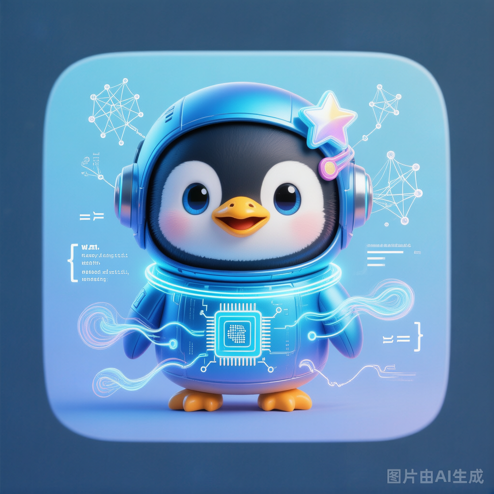

<div align="center">



# 🐧 咕咕嘎嘎 AI VTuber

**GPT-SoVITS 声音克隆 · Live2D/VRM 双模型 · 四层记忆 · 视觉理解 · Function Calling · 10 主题 · 原生桌面**

[](https://www.gnu.org/licenses/gpl-3.0)
[](docs/VERSION.md)
[](https://www.python.org/downloads/release/python-3119/)
[](docs/KNOWN_ISSUES.md)

[功能特性](#-功能特性) · [快速开始](#-快速开始) · [训练声音克隆](#-声音克隆训练) · [配置说明](#-配置说明) · [项目架构](#-项目架构) · [常见问题](#-常见问题) · [贡献指南](#-贡献指南)

</div>

---

## 🌟 项目简介

咕咕嘎嘎是一个功能丰富的 AI 虚拟形象系统，支持**实时语音对话**、**文字聊天**、**声音克隆训练**、**视觉理解**和**Function Calling 工具调用**。内置 Live2D 虚拟形象，拥有三层记忆系统和 10 个 LLM 供应商支持，提供浏览器、桌面、原生三种运行模式。

### 核心亮点

| ✨ 亮点 | 说明 |
|---------|------|
| 🎭 **Live2D + VRM 双模型** | 2D 虚拟形象 + 3D VRM 模型切换，桌面宠物模式，变体换装 |
| 🎤 **GPT-SoVITS 声音克隆** | 内置训练面板，录制音频→一键训练→即用，支持流式 TTS 逐句合成 |
| 🧠 **四层记忆系统** | 工作记忆（对话上下文）+ 情景记忆（摘要压缩）+ 语义记忆（向量检索）+ 事实库（持久知识） |
| 👁️ **视觉理解** | 区域截图 OCR、图片描述、屏幕文字识别，支持 4 种视觉引擎 |
| 🔧 **Function Calling** | LLM 工具调用，内置 7 个伴侣工具（时间/天气/搜索/股票/新闻/计算器/随机） |
| 🎨 **10 种主题** | 暗色/亮色/海洋/森林/樱花/日落/北极/薰衣草/VSCode/Discord，动态切换无闪烁 |
| 🗣️ **实时语音对话** | VAD 智能断句 + 实时 ASR + 流式 LLM + 流式 TTS，800ms 级响应 |
| 🖥️ **原生桌面应用** | PySide6/Qt6 原生窗口，无 CMD 窗口启动，系统托盘，全局快捷键 |
| 🌐 **12 个 LLM 供应商** | DeepSeek / Kimi / 智谱 / 千问 / MiniMax / OpenAI / Anthropic / Ollama / 豆包 / MiMo / Gemini / OpenRouter |
| 🔌 **嵌入式 Python** | 内置独立 Python，拷贝即用无需预装 |
| 🌍 **国内镜像加速** | 全程使用清华/阿里云/HuggingFace 镜像源，无需科学上网 |

---

## ✨ 功能特性

| 模块 | 功能 | 技术选型 |
|------|------|----------|
| **ASR 语音识别** | 实时语音输入，VAD 智能断句 | FunASR / faster-whisper / MiMo ASR |
| **LLM 大语言模型** | 12 个供应商，RAG 记忆注入，Function Calling | DeepSeek / Kimi / 智谱GLM / 通义千问 / MiniMax / OpenAI / Anthropic / Ollama 等 |
| **TTS 语音合成** | 音色克隆 + 多引擎 + 流式逐句合成 | GPT-SoVITS v3（音色克隆）/ ChatTTS / CosyVoice / Edge TTS（备用） |
| **声音训练** | 原生桌面内置训练面板，录制时长可调 | GPT-SoVITS v3 + LoRA |
| **视觉理解** | 区域截图 OCR + 图片描述 + 屏幕识别 | RapidOCR / MiniMax VL / MiniCPM-V2 / MiMo Vision |
| **记忆系统** | 四层架构：工作/情景/语义/事实 | 向量检索 + 时间衰减 + 遗忘机制 + 摘要压缩 |
| **Live2D/VRM** | 双模型切换 + 变体换装 + 桌面宠物 | Live2D: live2d-py + OpenGL · VRM: three.js + QWebEngineView |
| **主题系统** | 10 种预设 + 5 维个性化（圆角/间距/阴影/字体/控件） | PySide6 QSS v5 动态模板 |
| **工具系统** | Function Calling + 沙箱执行 + 伴侣工具 | fc_executor + companion（7 个内置工具） |
| **VAD** | AI 语音活动检测 | Silero VAD |
| **桌面端** | PySide6 原生窗口 + 无 CMD 启动 + 系统托盘 | PySide6/Qt6 + QWebEngineView + QOpenGLWidget |

---

## 🚀 快速开始

### 环境要求

| 项目 | 要求 |
|------|------|
| **操作系统** | Windows 10/11 |
| **Python** | 3.11（安装后可用嵌入式 Python，无需系统 Python） |
| **显卡** | NVIDIA GPU 推荐（CUDA 加速；无 GPU 可用 CPU 模式，但 GPT-SoVITS 训练需 GPU） |
| **内存** | 8GB+（推荐 16GB+） |
| **磁盘** | 首次安装需要约 10GB（模型 + 依赖 + 嵌入式 Python） |

### 安装（2 步）

#### 第 1 步：下载代码

```bash
git clone https://github.com/xzt238/ai-vtuber-fixed.git
cd ai-vtuber-fixed
```

> 也可以直接在 GitHub 页面点击 **Code → Download ZIP** 下载。

#### 第 2 步：一键安装

双击运行 **`scripts\setup.bat`**，它会自动完成：

| 步骤 | 内容 | 说明 |
|------|------|------|
| 1/7 | 下载嵌入式 Python 3.11 | npmmirror 国内源，~10MB |
| 2/7 | 安装全部 Python 依赖包 | 清华镜像源，~2GB |
| 3/7 | 安装 PyTorch CUDA cu124 | 阿里云镜像，GPU 加速 |
| 4/7 | 下载 GPT-SoVITS v3 底模 | HuggingFace 国内镜像，~2.5GB |
| 5/7 | 下载 G2PW 拼音模型 | ModelScope 国内源，~40MB |
| 6/7 | 首次启动自动下载 | ASR 模型 + Embedding 模型 |
| 7/7 | 输出核对报告 | ✅/❌ 标记所有关键项 |

> 💡 全程使用**国内镜像源**（清华/阿里云/HuggingFace 镜像/ModelScope），无需科学上网。
>
> ⏱️ 首次安装约需 20-40 分钟（取决于网速）。
>
> 📋 安装报告保存在 `scripts\setup_report.txt`。

### 启动！

```bash
scripts\go.bat          # 浏览器模式（推荐首次使用）
scripts\desktop.bat     # 桌面模式（pywebview 原生窗口）
scripts\start.bat       # 原生模式（PySide6/Qt6，CMD 一闪即没）
GuguGaga.vbs            # 原生模式（双击无声启动，无 CMD 窗口）
scripts\start_debug.bat # 原生调试模式（CMD 保留查看日志）
```

浏览器访问 `http://localhost:12393` 即可。

### 首次配置

启动后在 WebUI 中：

1. 打开 **API Key 面板**（左下角齿轮图标）— 输入你的 LLM API Key
2. 选择 **LLM Provider + 模型** — 10 个供应商可选（DeepSeek / Kimi / 智谱GLM / 通义千问 / MiniMax / OpenAI / Anthropic / Ollama 等）
3. 选择 **TTS 引擎** — Edge TTS 无需配置即可使用；GPT-SoVITS 需先下载底模；ChatTTS/CosyVoice 需配置 API
4. 开始聊天 🎉

> **使用 Ollama 本地模型**：先安装 [Ollama](https://ollama.com/) 并拉取模型（`ollama pull qwen3:8b`），然后在 WebUI 设置中选择 Provider 为 **OpenAI/Ollama**，Base URL 填 `http://localhost:11434/v1`，API Key 填 `ollama`。无需联网即可对话！

### 脚本说明

| 脚本 | 用途 | 何时使用 |
|------|------|----------|
| **`scripts\setup.bat`** | **一键全安装**（推荐新用户） | 首次安装 |
| `scripts\go.bat` | 启动浏览器模式 | 每次启动 |
| `scripts\desktop.bat` | 启动桌面模式（pywebview） | 每次启动 |
| `scripts\start.bat` | 启动原生模式（PySide6） | 每次启动 |
| `scripts\install_deps.bat` | 单独重装依赖包 | 更新依赖 |
| `scripts\download_models.bat` | 单独下载模型文件 | 重装模型 |

---

## 🎤 声音克隆训练

咕咕嘎嘎内置了 GPT-SoVITS v3 声音克隆训练面板，可以在 WebUI 中一键训练：

1. **录制音频** — 至少 3 分钟干净的人声
2. **上传音频** — 拖拽到训练面板
3. **一键训练** — 自动切片→标注→训练 LoRA
4. **即训练即用** — 训练完成后直接在 TTS 中使用

> 🎯 这是目前同类 AI VTuber 项目中**唯一内置训练面板**的，其他项目需要手动配置命令行训练。

---

## 🧠 记忆系统

四层记忆架构（v3.0），模拟人类记忆过程：

| 层级 | 名称 | 说明 |
|------|------|------|
| L0 | 事实库 | 持久化知识条目（用户教过的事实，不会遗忘） |
| L1 | 工作记忆 | 当前对话上下文（滑动窗口，上限 30 条） |
| L2 | 情景记忆 | 对话摘要（超出阈值触发压缩） |
| L3 | 语义记忆 | 长期知识（向量检索 + 时间衰减 + 遗忘机制） |

**检索权重可配置：**
- 向量相似度 70% — 语义相关
- 关键词匹配 20% — 精确命中
- 时间衰减 10% — 近期优先

---

## ⚙️ 配置说明

主配置文件：`app/config.yaml`

```yaml
# 语音识别
asr:
  provider: "funasr"          # funasr / faster_whisper

# 语音合成
tts:
  provider: "gptsovits"       # gptsovits（音色克隆）/ edge（备用）
  fallback_engines: ["edge"]  # 主引擎失败时自动切换

# 大语言模型
llm:
  provider: "openai"          # minimax / openai / anthropic（Ollama 走 openai）
  max_tokens: 2048
  enable_rag_injection: true  # 注入记忆到上下文
  openai:                     # OpenAI / Ollama 共用此配置段
    api_key: "ollama"         # Ollama 填 "ollama" 即可；OpenAI 填真实 key
    base_url: "http://localhost:11434/v1"  # Ollama 端点；OpenAI 留空用默认
    model: "qwen3:8b"         # Ollama 模型名；OpenAI 用 gpt-4o 等

# 视觉理解
vision:
  default_provider: "minimax_vl"  # minimax_vl / minicpm / rapidocr

# 记忆系统
memory:
  provider: "simple"          # simple / vector（向量检索）
  working_memory_limit: 20    # 工作记忆上限
  forgetting_threshold: 0.3   # 遗忘阈值
  retrieval_weights:
    vector: 0.7               # 向量相似度权重
    keyword: 0.2              # 关键词匹配权重
    recency: 0.1              # 时间衰减权重

# Live2D
live2d:
  enabled: true
  model_path: "./app/web/assets/model/shizuku"

# Web 服务
web:
  port: 12393                 # HTTP 端口
  ws_port: 12394              # WebSocket 端口
```

> 💡 API Key 推荐通过 WebUI 面板输入，不直接写在配置文件中。API Key 保存在本地 `app/cache/api_keys.json`，不会上传到 Git。

---

## 📁 项目架构

```
ai-vtuber-fixed/
├── app/                        # 核心应用
│   ├── main.py                 # 主入口，AIVTuber 类（懒加载架构）
│   ├── version.py              # 🔑 全局版本号（唯一数据源）
│   ├── shared_config.py        # 🔑 共享配置（Provider/音色/表情/互斥体）
│   ├── config.yaml             # 统一配置文件
│   ├── asr/                    # 语音识别（FunASR / faster-whisper）
│   ├── tts/                    # 语音合成
│   │   ├── __init__.py         # TTS 基类 + TTSFactory
│   │   ├── gptsovits.py        # GPT-SoVITS v3（音色克隆）
│   │   ├── chattts.py          # ChatTTS 引擎
│   │   ├── cosyvoice.py        # CosyVoice 引擎
│   │   └── text_enhancer.py    # TTS 文本增强器（语气词/韵律）
│   ├── llm/                    # 大语言模型（10 个供应商）
│   │   ├── __init__.py         # LLM 基类 + 工厂
│   │   └── prompts.py          # 系统提示词管理
│   ├── tools/                  # 工具系统
│   │   ├── fc_executor.py      # Function Calling 执行器
│   │   └── companion.py        # 7 个伴侣工具（时间/天气/搜索/股票/新闻/计算器/随机）
│   ├── vision/                 # 视觉理解（MiniMax VL / MiniCPM-V2 / OCR）
│   ├── memory/                 # 记忆系统（三层：工作/情景/语义）
│   ├── live2d/                 # Live2D 虚拟形象
│   ├── voice/                  # 语音输入
│   ├── trainer/                # GPT-SoVITS 声音训练管理
│   ├── ocr/                    # OCR 文字识别
│   ├── web/                    # HTTP + WebSocket 服务
│   │   └── static/
│   │       ├── index.html      # 单文件前端（面板系统 + Live2D）
│   │       └── libs/           # 前端库（pixi.js, oh-my-live2d, Silero VAD）
│   ├── tts_cache.py            # TTS 语音缓存
│   ├── utils.py                # 工具函数
│   └── logger_new.py           # 日志模块
├── GPT-SoVITS/                 # GPT-SoVITS 声音克隆引擎
│   ├── GPT_SoVITS/             # 核心代码 + 预训练模型（不包含在 Git 中）
│   ├── GPT_weights_v3/         # GPT 模型权重（运行时生成）
│   ├── SoVITS_weights_v3/      # SoVITS 模型权重（运行时生成）
│   ├── api.py                  # TTS API 接口
│   └── webui.py                # 训练 WebUI
├── launcher/                   # pywebview 桌面启动器
│   ├── launcher.py             # pywebview 原生窗口 + 启动画面
│   └── splash.html             # 启动画面（进度条 + 状态）
├── native/                     # PySide6 原生桌面模式
│   ├── main.py                 # 原生模式入口（惰加载 + 启动画面 + 进度提示）
│   ├── build.bat               # PyInstaller 打包脚本
│   └── gugu_native/
│       ├── pages/              # 5 个页面组件
│       │   ├── chat_page.py    # 聊天页（Live2D/VRM + 实时语音 + 视觉理解）
│       │   ├── settings_page.py # 设置页（LLM/TTS/ASR/Vision/主题/关于）
│       │   ├── train_page.py   # 声音训练页（录制+上传+训练+状态监控）
│       │   ├── memory_page.py  # 记忆管理页（四层架构可视化）
│       │   └── model_download_page.py # 模型下载页
│       ├── widgets/            # 20+ 功能组件
│       │   ├── chat_web_display.py   # 聊天 Markdown 渲染
│       │   ├── voice_manager.py      # 实时语音管理（VAD+ASR）
│       │   ├── live2d_widget.py      # Live2D OpenGL 渲染
│       │   ├── vrm_widget.py         # VRM 3D Web 渲染
│       │   ├── splash_debug_window.py # 启动画面（进度提示+调试窗口）
│       │   ├── screenshot_selector.py # 区域截图选择器
│       │   ├── theme_selector.py     # 主题选择器（10 主题卡片）
│       │   ├── session_manager.py    # 多会话管理
│       │   ├── desktop_pet.py        # 桌面宠物
│       │   ├── tray_manager.py       # 系统托盘
│       │   ├── update_manager.py     # 自动更新
│       │   └── ...                   # 更多组件
│       ├── themes/             # 主题系统 v5
│       │   ├── definitions.py  # 主题定义（AppTheme + 5 维风格）
│       │   ├── manager.py      # 主题管理器
│       │   ├── preset/         # 10 个预设主题
│       │   └── style_types.py  # 风格类型 dataclass
│       ├── workers/            # 后台 Worker 线程
│       │   ├── chat_workers.py # StreamChatWorker / TTSWorker / ASRWorker
│       │   └── vision_workers.py # OCRWorker / VisionWorker
│       ├── theme.py            # 全局 QSS 生成器 + 颜色系统
│       └── utils.py            # 共享工具函数
├── scripts/                    # 启动和安装脚本
│   ├── setup.bat               # ⭐ 一键全安装（新用户首选）
│   ├── go.bat                  # 浏览器模式启动
│   ├── desktop.bat             # 桌面模式启动
│   ├── start.bat               # 原生模式启动（CMD 一闪即没）
│   ├── start.vbs               # 原生模式 VBS 启动器（无窗口）
│   ├── start_debug.bat         # 原生调试模式（CMD 保留）
│   ├── install_deps.bat        # 依赖安装器
│   └── download_models.bat     # 模型下载
├── GuguGaga.vbs                # 项目根目录无声启动
├── python/                     # 嵌入式 Python 3.11（不包含在 Git 中，通过脚本下载）
├── docs/                       # 文档
│   ├── README.md               # 文档导航中心
│   ├── VERSION.md              # 版本历史（当前版本）
│   ├── DOCS_SYSTEM.md          # 文档系统元文档
│   ├── KNOWN_ISSUES.md         # 已知问题
│   ├── MODIFICATION_GUIDE.md   # 修改操作手册
│   ├── CONTRIBUTING.md         # 贡献者指南
│   ├── CHANGE_IMPACT_MAP.md    # 修改影响地图
│   ├── guides/                 # 操作指南
│   │   ├── DEVGUIDE.md         # 开发者指南
│   │   ├── NATIVE_DESKTOP.md   # 原生桌面开发指南
│   │   └── BUILD.md            # 构建和打包指南
│   │   └── LIVE2D_NATIVE_RENDER.md  # Live2D 原生渲染方案
│   ├── reference/              # 参考分析
│   │   ├── COMPETITIVE_GAP_ANALYSIS.md
│   │   └── GAP_DETAILED_ANALYSIS.md
│   └── archive/                # 历史归档
│       └── VERSION_ARCHIVE.md  # v1.9.81 及更早版本记录
├── .env.example                # 环境变量模板
└── LICENSE                     # GPL-3.0
```

**Git 仓库不包含的文件**（通过脚本下载或运行时生成）：
- `python/` — 嵌入式 Python 环境（~3GB）
- `GPT-SoVITS/GPT_SoVITS/pretrained_models/` — 预训练底模（~2.5GB）
- `models/` — ASR 模型（~990MB）
- `.cache/` — HuggingFace 模型缓存
- `app/cache/api_keys.json` — API 密钥（隐私）
- `GPT-SoVITS/GPT_SoVITS/memory/` — 聊天记忆（隐私）

---

## 🔧 技术管线

### 技术栈

| 层 | 技术 | 说明 |
|------|------|------|
| **后端** | Python 3.11 + aiohttp | 异步 HTTP + WebSocket 服务 |
| **前端** | 原生 HTML/CSS/JS（单文件） | 面板系统 + Live2D + VAD + 实时语音 |
| **通信** | WebSocket（实时） + HTTP（API） | 前后端实时双向通信 |
| **桌面端** | pywebview（WebView2）/ PySide6（Qt6） | 原生窗口 + 系统托盘 + QWebEngineView / QOpenGLWidget |
| **工具** | Function Calling + 7 个伴侣工具 | fc_executor + companion |
| **打包** | PyInstaller | 单 EXE 启动器 |

### 语音对话流程

```
用户语音 → [ASR 语音识别] → 文字
                              ↓
                         [LLM 大语言模型] ← [记忆系统（RAG注入）]
                              ↓
                    ┌── 普通回复 ──────────────┐
                    │                          │
                    │                [Function Calling] → 工具执行 → 结果返回 LLM
                    │                          │
                    ↓                          ↓
              AI 回复文字              AI 回复文字（含工具结果）
                    ↓                          ↓
           [TTS 文本增强] → [TTS 语音合成] → 语音播放
                    ↓
           [Live2D 口型同步 + 表情 + 动画]
```

**处理步骤：**
1. 浏览器采集音频 → WebSocket 发送到后端
2. VAD 检测语音活动，智能区分停顿和说完
3. ASR 将语音转文字
4. LLM 生成回复（自动注入相关记忆）
5. 若 LLM 请求 Function Calling → 执行工具 → 结果返回 LLM → 生成最终回复
6. TTS 文本增强（添加语气词/韵律标注）→ TTS 将回复合成语音（GPT-SoVITS/ChatTTS/CosyVoice 优先，失败自动降级到 Edge TTS）
7. 前端播放语音 + Live2D 口型同步 + 表情切换

---

## ❓ 常见问题

### Q: 启动报错 "Python 3.11 not found"
确保已安装 Python 3.11 并添加到 PATH，或运行 `scripts\download_models.bat` 下载嵌入式 Python。

### Q: CUDA 不可用
检查 NVIDIA 驱动是否最新，运行 `scripts\install_deps.bat` 会自动安装 CUDA 版 PyTorch。

### Q: 模型下载太慢 / 下载失败
所有模型都使用国内镜像源。如果仍然失败：
- 检查网络连接
- 查看下载报告中的手动下载地址
- 使用代理或更换网络环境重试

### Q: install_deps.bat 安装某些包失败
部分可选包（如 pyopenjtalk、jieba_fast）需要 C++ 编译环境，安装失败不影响核心功能。查看核对报告中的 ❌ 标记，如果都是"可选"则可忽略。

### Q: GPT-SoVITS 训练失败
确保有 NVIDIA GPU 和足够显存（推荐 6GB+）。无 GPU 可使用 Edge TTS。

### Q: 桌面模式闪退
运行 `scripts\desktop.bat`，它会自动检查并安装 pywebview，并解除 DLL 安全标记。

### Q: 如何更换 Live2D 模型
将模型文件放到 `app/web/assets/model/` 下，在 `config.yaml` 中修改 `live2d.model_path`。

### Q: 如何使用向量记忆
将 `config.yaml` 中 `memory.provider` 改为 `"vector"`，首次启动会自动下载 embedding 模型。

### Q: 如何使用 Ollama 本地模型（无需 API Key）
1. 安装 [Ollama](https://ollama.com/) 并启动
2. 拉取模型：`ollama pull qwen3:8b`（推荐 8B Q4_K_M，~5GB 内存）
3. 在 WebUI 设置中：Provider 选 **OpenAI/Ollama**，Base URL 填 `http://localhost:11434/v1`，API Key 填 `ollama`
4. 或直接改 `config.yaml`：
```yaml
llm:
  provider: "openai"
  openai:
    api_key: "ollama"
    base_url: "http://localhost:11434/v1"
    model: "qwen3:8b"
```
> 💡 系统会自动检测 Ollama 端点并切换到原生 API（关闭 Qwen3 思考模式），无需额外配置。

### Q: 我的 API Key 会泄露吗？
不会。API Key 保存在本地 `app/cache/api_keys.json`，该文件已被 `.gitignore` 排除，不会上传到 Git。聊天记录同样不会被上传。

---

## 🤝 贡献指南

欢迎贡献代码！请阅读 [CONTRIBUTING.md](docs/CONTRIBUTING.md) 了解代码规范和 PR 流程。

修改代码前建议先查阅：
- [修改操作手册](docs/MODIFICATION_GUIDE.md) — 10 个常见修改的详细步骤
- [修改影响地图](docs/CHANGE_IMPACT_MAP.md) — 改一个地方会影响哪些文件
- [已知问题](docs/KNOWN_ISSUES.md) — 当前活跃的 15 个已知问题

---

## 📜 许可证

本项目基于 [GNU General Public License v3.0](LICENSE) 开源。衍生作品必须同样开源。

GPT-SoVITS 子模块遵循其自身的开源许可证（`GPT-SoVITS/LICENSE`）。

---

## 🙏 致谢

- [GPT-SoVITS](https://github.com/RVC-Boss/GPT-SoVITS) — 声音克隆引擎
- [ChatTTS](https://github.com/2noise/ChatTTS) — 自然语音合成
- [CosyVoice](https://github.com/FunAudioLLM/CosyVoice) — 阿里语音合成
- [live2d-py](https://github.com/Arkueid/live2d-py) — Live2D Python SDK（原生）
- [FunASR](https://github.com/modelscope/FunASR) — 语音识别
- [Silero VAD](https://github.com/snakers4/silero-vad) — 语音活动检测
- [PySide6](https://doc.qt.io/qtforpython-6/) — Qt6 Python 绑定
- [MiniMax](https://www.minimaxi.com/) — LLM & 视觉理解 API

---

<div align="center">

**Made with ❤️ by XZT**

</div>
