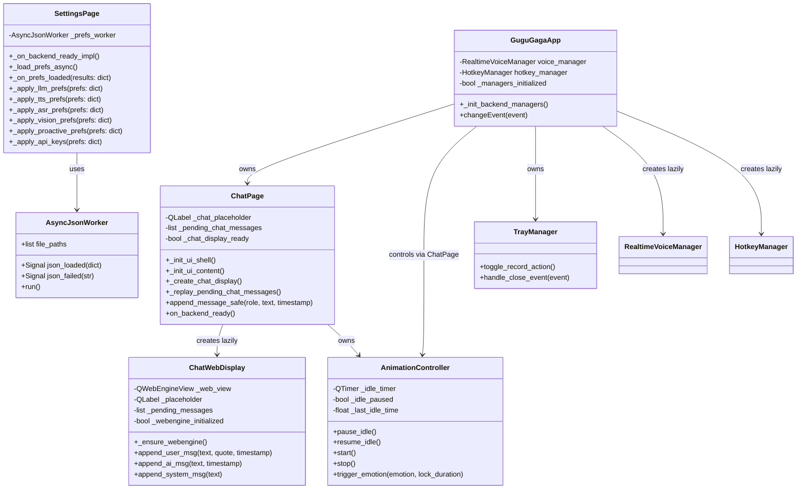
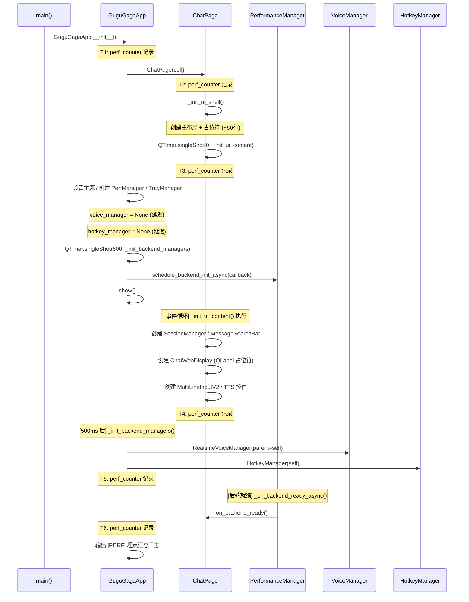
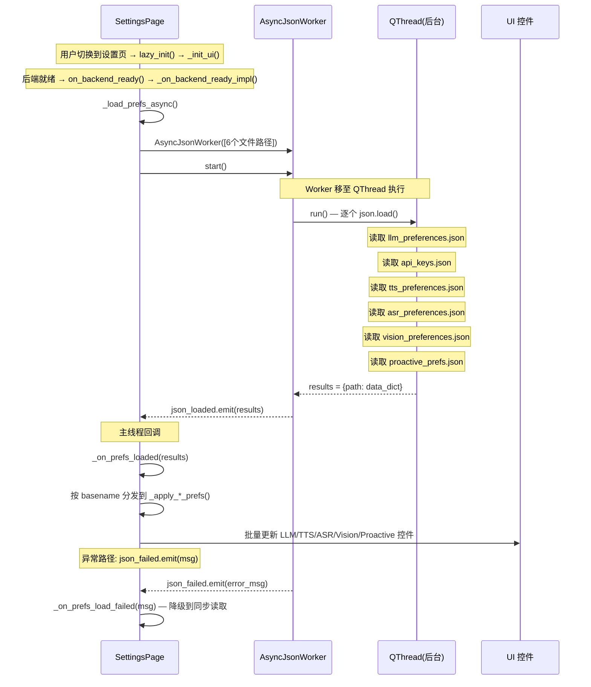
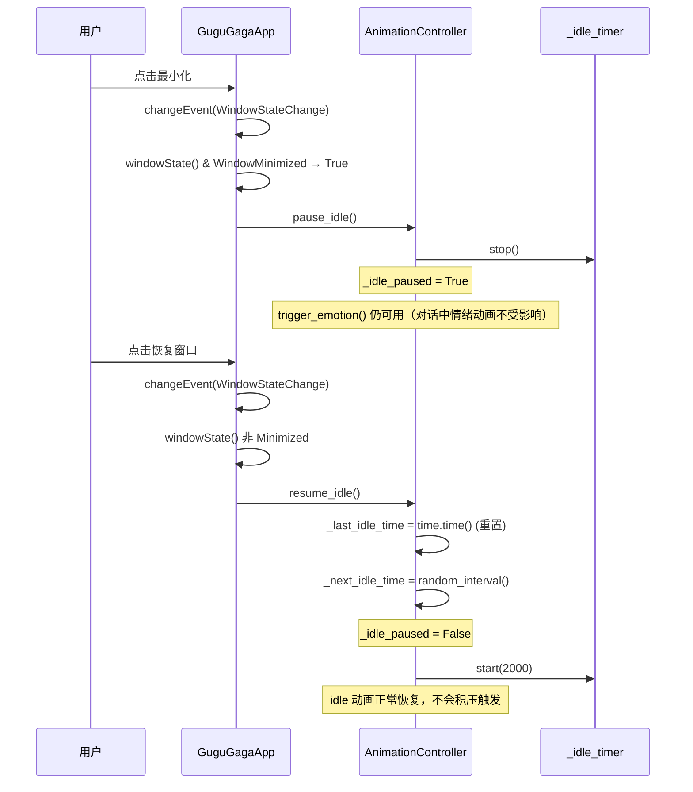
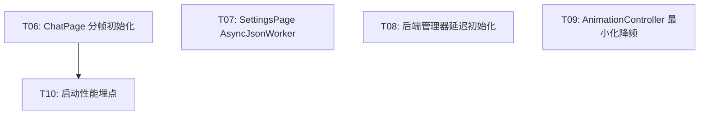

# 架构设计 — 咕咕嘎嘎 AI-VTuber 第二轮性能优化（增量）

| 字段 | 值 |
|---|---|
| 项目 | ai-vtuber-fixed |
| 版本基线 | v1.11.29 |
| 文档类型 | 架构设计（增量，第二轮优化） |
| 技术栈 | PySide6 + QWebEngineView + Python 3.10+ |
| 前置条件 | 第一轮优化（T01-T05）已完成 |
| 约束 | 不引入新依赖包 |

---

## 1. 实现方案概述

### 1.1 纠偏后的现状分析

PRD 中 B1 原描述"ChatWebDisplay 的 QWebEngineView 在首屏同步创建"需要修正：

- **`ChatWebDisplay.__init__` 已经是延迟创建的**：只创建 QLabel 占位符（`chat_web_display.py:891-908`），QWebEngineView 在 `_ensure_webengine()` 中延迟到首条消息时才创建
- **真正的瓶颈是 `ChatPage._init_ui()` 整体**：~400 行同步 UI 构建代码，包括 SessionManager、MessageSearchBar、ChatWebDisplay（即使 QWebEngineView 延迟创建，ChatWebDisplay 本身的 `__init__` 仍有 QWebChannel/Bridge 等初始化开销）、MultiLineInputV2、数十个按钮/滑块/标签、QMediaPlayer 等，总计耗时约 200-400ms

修正后的瓶颈优先级：
1. **B1（修正）**：ChatPage._init_ui() 同步创建 ~400 行 UI 控件
2. **B2（不变）**：SettingsPage 10+ 处同步 json.load()
3. **B3（不变）**：VoiceManager/HotkeyManager 在 __init__ 中同步创建
4. **B4（不变）**：AnimationController 最小化时不暂停
5. **B5（不变）**：无启动性能埋点

### 1.2 核心技术路线

| 任务 | 策略 | 核心机制 |
|---|---|---|
| T06: ChatPage 分帧初始化 | `_init_ui()` 拆分为 shell + content，content 通过 `QTimer.singleShot(0)` 延迟创建 | 框架-内容分离 + 消息缓冲队列 |
| T07: SettingsPage AsyncJsonWorker 集成 | `_on_backend_ready_impl()` 中用 AsyncJsonWorker 批量异步读取 6 个偏好文件 | 已有基础设施复用 |
| T08: 后端管理器延迟初始化 | VoiceManager/HotkeyManager 从 `__init__` 移至 `QTimer.singleShot(500, ...)` | 延迟创建 + None guard |
| T09: AnimationController 最小化降频 | 添加 `pause_idle()`/`resume_idle()` 方法 | 窗口状态监听 |
| T10: 启动性能埋点 | 在关键节点添加 `time.perf_counter()` | 轻量日志输出 |

### 1.3 关键决策

1. **ChatPage 不使用 LazyPageMixin**：它是首屏页面，必须立即创建框架，只是拆分创建过程
2. **ChatWebDisplay 的 `_pending_messages` 队列机制已存在**：延迟创建期间的消息缓冲可直接复用，无需新增队列
3. **AsyncJsonWorker 已存在且功能完备**：直接复用，不重新造轮子
4. **不引入新依赖**：所有优化均基于 PySide6/Python 标准库

---

## 2. 文件列表及相对路径

### 2.1 需修改的文件

| 文件路径 | 修改类型 | 说明 |
|---|---|---|
| `native/gugu_native/pages/chat_page.py` | 修改 | _init_ui 拆分 + 消息缓冲 + 埋点 |
| `native/gugu_native/pages/settings_page.py` | 修改 | AsyncJsonWorker 集成 + _on_backend_ready_impl 重构 |
| `native/main.py` | 修改 | 后端管理器延迟初始化 + changeEvent 监听 + 埋点 |
| `native/gugu_native/widgets/animation_controller.py` | 修改 | 添加 pause_idle/resume_idle 方法 |
| `native/gugu_native/widgets/tray_manager.py` | 修改 | 托盘操作添加 None guard |

### 2.2 无新增文件

本轮优化不引入新文件，所有修改在现有文件上增量进行。

---

## 3. 数据结构和接口设计

### 3.1 类图



### 3.2 关键接口变更

#### ChatPage._init_ui() 拆分

```python
# === 之前 ===
class ChatPage:
    def _init_ui(self):
        # ~400 行代码，同步创建所有控件
        ...

# === 之后 ===
class ChatPage:
    def _init_ui(self):
        """入口方法 — 只调用 shell + 调度 content"""
        self._init_ui_shell()
        QTimer.singleShot(0, self._init_ui_content)

    def _init_ui_shell(self):
        """创建主布局框架 + 占位符（~50 行，必须同步完成）"""
        # 1. 主布局 self.main_layout
        # 2. 左侧 Live2D 占位符（已有）
        # 3. 右侧对话区占位符 QLabel("⏳ 正在加载对话...")
        # 4. 基础样式设置
        self._chat_placeholder = QLabel("⏳ 正在加载对话...")
        self._chat_display_ready = False
        self._pending_chat_messages = []

    def _init_ui_content(self):
        """延迟创建具体控件（~350 行，通过 singleShot 调度）"""
        # 1. SessionManager
        # 2. MessageSearchBar
        # 3. ChatWebDisplay（替换占位符）
        # 4. MultiLineInputV2
        # 5. TTS 控制栏
        # 6. QMediaPlayer
        # 7. 重放 _pending_chat_messages
```

#### ChatPage 消息缓冲接口

```python
def append_message_safe(self, role: str, text: str, timestamp: str = None):
    """安全追加消息 — 如果 ChatWebDisplay 未就绪，缓冲到队列"""
    if self._chat_display_ready and self.chat_display:
        if role == "user":
            self.chat_display.append_user_msg(text, timestamp=timestamp)
        elif role == "assistant":
            self.chat_display.append_ai_msg(text, timestamp=timestamp)
        else:
            self.chat_display.append_system_msg(text)
    else:
        self._pending_chat_messages.append((role, text, timestamp))

def _replay_pending_chat_messages(self):
    """重放缓冲消息 — 在 ChatWebDisplay 创建后调用"""
    for role, text, timestamp in self._pending_chat_messages:
        if role == "user":
            self.chat_display.append_user_msg(text, timestamp=timestamp)
        elif role == "assistant":
            self.chat_display.append_ai_msg(text, timestamp=timestamp)
        else:
            self.chat_display.append_system_msg(text)
    self._pending_chat_messages.clear()
```

#### SettingsPage AsyncJsonWorker 集成

```python
def _load_prefs_async(self):
    """异步批量加载所有偏好文件"""
    from gugu_native.widgets.async_json_worker import AsyncJsonWorker

    file_paths = [
        os.path.join(_CACHE_DIR, "llm_preferences.json"),
        os.path.join(_CACHE_DIR, "api_keys.json"),
        os.path.join(_CACHE_DIR, "tts_preferences.json"),
        os.path.join(_CACHE_DIR, "asr_preferences.json"),
        os.path.join(_CACHE_DIR, "vision_preferences.json"),
        os.path.join(_CACHE_DIR, "proactive_prefs.json"),
    ]

    self._prefs_worker = AsyncJsonWorker(file_paths, parent=self)
    self._prefs_worker.json_loaded.connect(self._on_prefs_loaded)
    self._prefs_worker.json_failed.connect(self._on_prefs_load_failed)
    self._prefs_worker.start()

def _on_prefs_loaded(self, results: dict):
    """所有偏好文件加载完成 — 批量更新 UI"""
    # results: {file_path: data_dict_or_None}
    for file_path, data in results.items():
        if data is None:
            continue
        basename = os.path.basename(file_path)
        if basename == "llm_preferences.json":
            self._apply_llm_prefs(data)
        elif basename == "api_keys.json":
            self._apply_api_keys(data)
        elif basename == "tts_preferences.json":
            self._apply_tts_prefs(data)
        elif basename == "asr_preferences.json":
            self._apply_asr_prefs(data)
        elif basename == "vision_preferences.json":
            self._apply_vision_prefs(data)
        elif basename == "proactive_prefs.json":
            self._apply_proactive_prefs(data)
```

#### AnimationController 扩展

```python
class AnimationController:
    def pause_idle(self):
        """暂停 idle 动画定时器（窗口最小化时调用）"""
        if self._idle_timer.isActive():
            self._idle_timer.stop()
        self._idle_paused = True

    def resume_idle(self):
        """恢复 idle 动画定时器（窗口恢复显示时调用）"""
        self._idle_paused = False
        self._last_idle_time = time.time()  # 重置，避免积压触发
        self._next_idle_time = self._random_idle_interval()
        if self._is_active and not self._idle_timer.isActive():
            self._idle_timer.start(2000)
```

#### GuguGagaApp 延迟初始化管理器

```python
class GuguGagaApp:
    def __init__(self, ...):
        # ...
        # 延迟创建后端管理器
        self.voice_manager = None
        self.hotkey_manager = None
        self._managers_initialized = False
        QTimer.singleShot(500, self._init_backend_managers)

    def _init_backend_managers(self):
        """延迟创建 VoiceManager 和 HotkeyManager"""
        from gugu_native.widgets.voice_manager import RealtimeVoiceManager
        from gugu_native.widgets.hotkey_manager import HotkeyManager

        self.voice_manager = RealtimeVoiceManager(parent=self)
        self.voice_manager.vad_state_changed.connect(self._on_vad_state_changed)
        self.voice_manager.error_occurred.connect(self._on_voice_error)

        self.hotkey_manager = HotkeyManager(self)
        self.hotkey_manager.hotkey_triggered.connect(self._on_hotkey_triggered)
        self.hotkey_manager.start()

        self.perf_manager.register_cleanup_target("voice_manager", self.voice_manager)
        self.perf_manager.register_cleanup_target("hotkey_manager", self.hotkey_manager)

        self._managers_initialized = True

    def changeEvent(self, event):
        """监听窗口状态变化 — 最小化时暂停 idle 动画"""
        super().changeEvent(event)
        if event.type() == event.Type.WindowStateChange:
            if self.windowState() & Qt.WindowState.WindowMinimized:
                # 最小化 → 暂停 idle 动画
                if hasattr(self.chat_page, '_animation_controller') and self.chat_page._animation_controller:
                    self.chat_page._animation_controller.pause_idle()
            else:
                # 恢复 → 恢复 idle 动画
                if hasattr(self.chat_page, '_animation_controller') and self.chat_page._animation_controller:
                    self.chat_page._animation_controller.resume_idle()
```

---

## 4. 程序调用流程

### 4.1 启动流程（含 T06 分帧 + T08 延迟初始化 + T10 埋点）



### 4.2 SettingsPage 异步 JSON 加载流程（T07）



### 4.3 窗口最小化动画暂停流程（T09）



---

## 5. 任务列表

| 编号 | 任务描述 | 涉及文件 | 前置依赖 | 优先级 | 工作量 |
|---|---|---|---|---|---|
| T06 | ChatPage 分帧初始化 | `chat_page.py`, `chat_web_display.py` | 无 | P0 | 3h |
| T07 | SettingsPage AsyncJsonWorker 集成 | `settings_page.py`, `async_json_worker.py` | 无 | P0 | 2h |
| T08 | 后端管理器延迟初始化 | `main.py`, `tray_manager.py`, `voice_manager.py`, `hotkey_manager.py` | 无 | P1 | 1.5h |
| T09 | AnimationController 最小化降频 | `animation_controller.py`, `main.py` | 无 | P1 | 1h |
| T10 | 启动性能埋点 | `main.py`, `chat_page.py` | T06 | P2 | 1h |

**依赖关系说明**：
- T06/T07/T08/T09 之间无强依赖，可并行开发
- T10 依赖 T06（因为 ChatPage 分帧后埋点位置需要对应新的 shell/content 分界）
- T08 需要同时修改 `tray_manager.py` 添加 None guard，确保延迟期间托盘操作不崩溃

### 5.1 任务依赖图



---

## 6. 依赖包列表

本轮优化**不引入任何新的第三方包**。所有优化均基于现有依赖：

| 包 | 版本 | 用途 |
|---|---|---|
| PySide6 | 6.x | Qt 框架，QTimer.singleShot / changeEvent / QThread |
| Python stdlib | 3.10+ | time.perf_counter() / json / os |
| qfluentwidgets | 已有 | Fluent UI 组件（无新增使用） |

---

## 7. 共享知识

### 7.1 跨文件约定

1. **None Guard 模式**：所有引用 `self.voice_manager` / `self.hotkey_manager` 的地方，必须先检查 `if self.voice_manager is not None`，因为两者在窗口显示后 500ms 才创建
2. **消息缓冲模式**：`ChatPage._pending_chat_messages` 使用 `(role, text, timestamp)` 三元组存储，在 `ChatWebDisplay` 就绪后一次性重放
3. **异步 JSON 加载结果映射**：`AsyncJsonWorker` 返回 `{file_path: data_dict}`，通过 `os.path.basename()` 匹配文件名分发到对应的 `_apply_*_prefs()` 方法
4. **性能埋点格式**：`[PERF] T1→T2: 描述 0.123s | T2→T3: 描述 0.456s | ...`，使用 `logger.info()` 输出
5. **idle 暂停不影响情绪动画**：`AnimationController.pause_idle()` 只停止 `_idle_timer`，`trigger_emotion()` 和 `set_mouth_open()` 不受影响

### 7.2 已有基础设施复用

| 基础设施 | 路径 | 复用场景 |
|---|---|---|
| `AsyncJsonWorker` | `widgets/async_json_worker.py` | T07: SettingsPage 异步加载偏好文件 |
| `ChatWebDisplay._pending_messages` | `widgets/chat_web_display.py:883` | T06: QWebEngineView 延迟创建期间的消息缓冲 |
| `PerformanceManager` | `widgets/perf_manager.py` | T08: register_cleanup_target 延迟注册 |
| `QTimer.singleShot` | PySide6 内置 | T06/T08: 延迟创建调度 |

### 7.3 不变约束

- ChatWebDisplay 的 `_pending_messages` 队列机制已存在且工作正常，T06 的 `_pending_chat_messages` 是 ChatPage 层面的缓冲（在 ChatWebDisplay 对象尚未创建时使用），两者互补而非冲突
- 保存路径的同步 `json.load()` 暂不修改（保存是用户主动操作，不构成启动瓶颈）
- 问候动画定时器 `_greet_timer` 在最小化时不暂停（一次性定时器，未触发则保留，恢复后问候体验更好）

---

## 8. 待明确事项

| # | 问题 | 影响范围 | 建议处理 |
|---|---|---|---|
| Q1 | ChatPage 分帧后，`_load_chat_history()`（在 `__init__` 中调用）引用 `self.chat_display`，如果 content 尚未创建，历史消息无法显示 | T06 | 将 `_load_chat_history()` 移至 `_init_ui_content()` 末尾执行，确保 ChatWebDisplay 已创建 |
| Q2 | `_on_backend_ready_impl()` 中除了偏好文件读取，还有从 `backend.config.config` 同步配置的逻辑，异步加载偏好文件与 config.yaml 的优先级关系需确认 | T07 | 保持现有优先级逻辑：偏好文件存在时用偏好文件，否则从 config.yaml 读取。异步回调中仍需保留 config.yaml fallback 逻辑 |
| Q3 | VoiceManager 延迟创建后，`_on_backend_init_done()` 中 `if hasattr(main_window, 'voice_manager') and main_window.voice_manager:` 的检查需要考虑 manager 可能为 None | T08 | `perf_manager.py:206` 已有 None 检查，无需额外修改 |
| Q4 | 桌面宠物模式下的 Live2D 渲染控制 — `_pause_main_live2d()` 中调用 `controller.stop()`，但 T09 添加的 `pause_idle()` 是否更合适？ | T09 | 保持 `stop()` — 宠物模式下主窗口完全隐藏，停止整个动画控制器更合理（而非仅暂停 idle），因为主窗口 Live2D 不可见 |
| Q5 | 性能埋点的 T4（ChatWebDisplay 创建前/后）在分帧后实际测量的是 `_init_ui_content()` 中 ChatWebDisplay 构造的时间，但 ChatWebDisplay.__init__ 本身很轻（只有 QLabel 占位符），QWebEngineView 在首条消息时才创建 | T10 | T4 改为测量 `_init_ui_content()` 整体耗时，而非单独测 ChatWebDisplay；QWebEngineView 的创建耗时可在 `_ensure_webengine()` 中单独埋点 |
