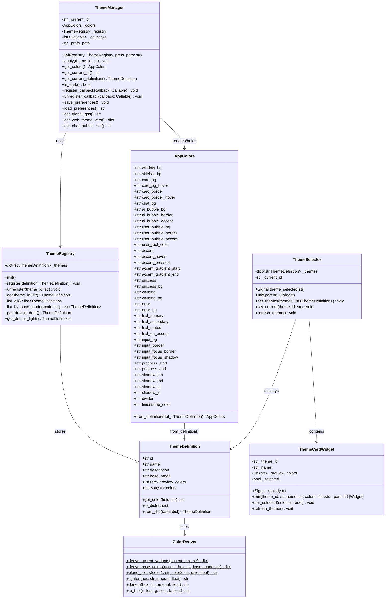
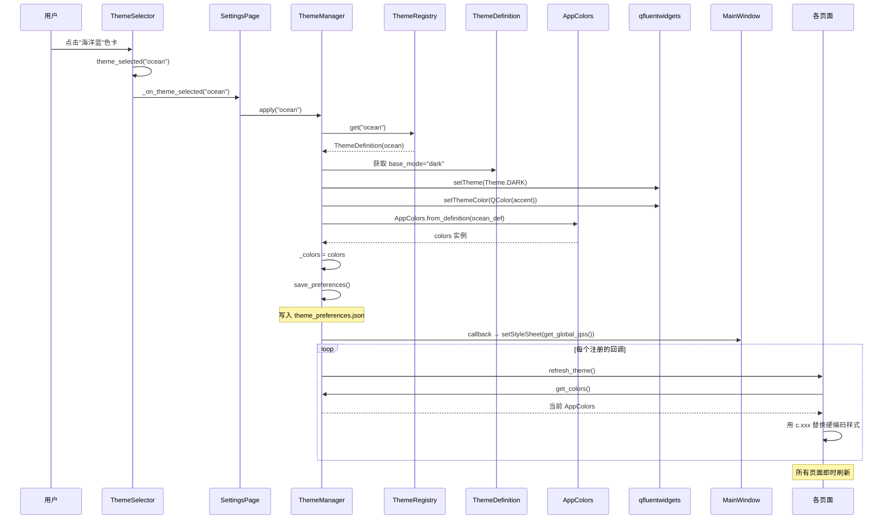
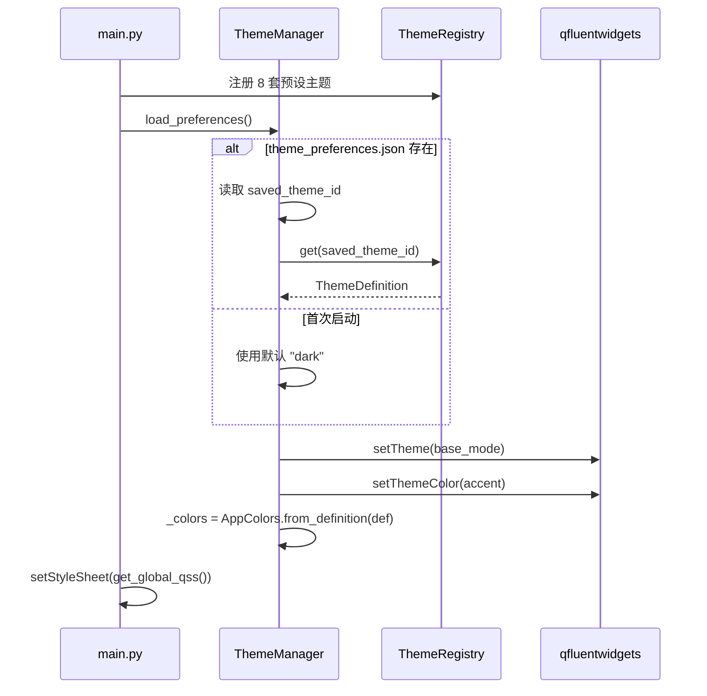
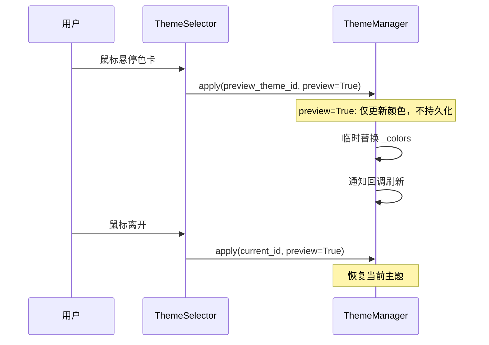
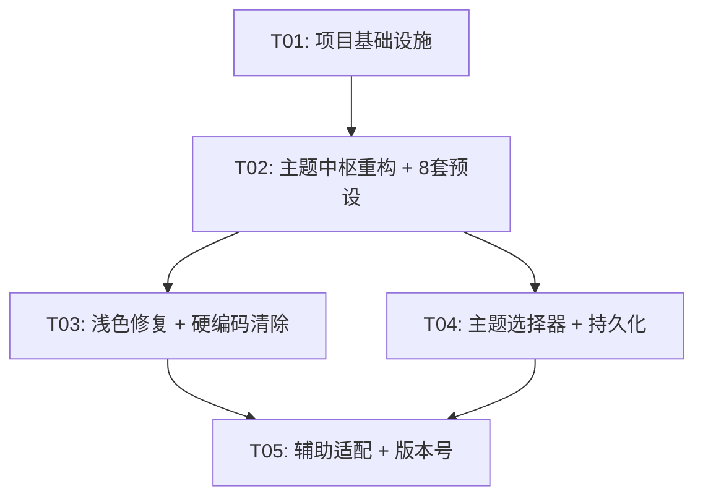

# 主题系统增强 — 系统架构设计

> 项目：AI VTuber 桌面应用（PySide6 + qfluentwidgets）  
> 版本：v1.11.15 → v1.12.0  
> 架构师：Bob  
> 日期：2025-07-14

---

## 目录

1. [实现方案 + 框架选型](#1-实现方案--框架选型)
2. [文件列表](#2-文件列表)
3. [数据结构和接口（类图）](#3-数据结构和接口类图)
4. [程序调用流程（时序图）](#4-程序调用流程时序图)
5. [任务列表](#5-任务列表)
6. [依赖包列表](#6-依赖包列表)
7. [共享知识](#7-共享知识)
8. [待明确事项](#8-待明确事项)

---

## 1. 实现方案 + 框架选型

### 1.1 核心技术挑战

| 挑战 | 分析 | 方案 |
|------|------|------|
| **二元→多主题过渡** | 现有 `AppColors`/`LightColors` 继承结构只支持暗/亮两套，无法扩展 | 引入 `ThemeDefinition` dataclass + `ThemeRegistry` 注册表，保留 `AppColors` 作为接口但数据来源改为 `ThemeDefinition` |
| **qfluentwidgets DARK/LIGHT 映射** | `setTheme()` 只接受 DARK/LIGHT/AUTO，不支持自定义基底 | 每个主题定义 `base_mode: Theme.DARK/LIGHT`，切换时同时调用 `setTheme(base_mode)` + `setThemeColor(accent)` |
| **颜色衍生算法** | 当前 accent_hover/accent_pressed 等手动定义，新增主题时工作量大 | 基于 `colorsys` 实现 HSL 变调：从 accent 自动衍生 hover（亮度+10%）和 pressed（亮度-10%、饱和度+5%） |
| **硬编码颜色清除** | 30+ 处硬编码 `#4263eb`/`#5c7cfa` 等 | 强制规则：所有颜色必须通过 `get_colors()` 获取，lint 检查禁止 `#[0-9a-fA-F]{6}` 出现在非 theme.py 文件 |
| **浅色主题视觉缺陷** | 很多颜色在浅色下对比度不足、按钮文字不可见 | LightColors 中全面重审，所有颜色需满足 WCAG 2.0 AA 对比度标准 |
| **主题切换即时生效** | 不能要求重启 | `apply_theme()` → `_theme_change_callbacks` → 各页面 `refresh_theme()` 链路已存在，需增强覆盖范围 |
| **主题预览与持久化** | 需要选择器 UI + JSON 持久化 + 启动恢复 | 网格色卡 UI + `theme_preferences.json` + 启动时读取恢复 |

### 1.2 架构模式

采用 **注册表模式（Registry Pattern）** + **观察者模式（Observer Pattern）**：

- **ThemeRegistry**：集中管理所有主题定义（预设 + 自定义），提供按 ID 查找
- **ThemeManager**：单例，持有当前主题状态，协调 `apply_theme()` + 通知回调
- **ThemeDefinition**：值对象，描述一个完整主题的所有颜色 + 元信息
- **观察者**：现有 `_theme_change_callbacks` 机制继续使用，无需引入 Qt Signal

### 1.3 主题注册表架构设计

```
┌──────────────────────────────────────────────────────┐
│                   ThemeRegistry                      │
│  ┌─────────┐ ┌─────────┐ ┌─────────┐ ┌─────────┐   │
│  │  dark   │ │  light  │ │ ocean   │ │lavender │   │
│  └─────────┘ └─────────┘ └─────────┘ └─────────┘   │
│  ┌─────────┐ ┌─────────┐ ┌─────────┐               │
│  │ sakura  │ │ forest  │ │ sunset  │               │
│  └─────────┘ └─────────┘ └─────────┘               │
│                                                      │
│  register(theme_def) / get(id) / list_all()          │
└──────────────────────┬───────────────────────────────┘
                       │
                       ▼
┌──────────────────────────────────────────────────────┐
│                   ThemeManager                       │
│  _current_id: str                                    │
│  _colors: AppColors                                  │
│  apply(theme_id) → setTheme + setThemeColor + notify │
│  get_colors() → AppColors                            │
│  save_preferences() / load_preferences()             │
└──────────────────────┬───────────────────────────────┘
                       │ 通知
          ┌────────────┼────────────┐
          ▼            ▼            ▼
    ChatPage     SettingsPage   TrainPage ...
    refresh()    refresh()      refresh()
```

### 1.4 主题定义数据结构

```python
@dataclass
class ThemeDefinition:
    """一个完整主题的定义"""
    # --- 元信息 ---
    id: str                    # 唯一标识，如 "ocean"
    name: str                  # 显示名，如 "海洋蓝"
    description: str           # 主题描述
    base_mode: str             # "dark" 或 "light"，映射到 qfluentwidgets Theme
    preview_colors: list[str]  # 色卡预览用 2-3 个代表色

    # --- 颜色方案（全部字段，覆盖 AppColors 60+ 属性）---
    colors: dict[str, str]     # {field_name: hex_color}
```

**设计理由**：使用 `dict[str, str]` 而非 60+ 个字段，因为：
1. 新增主题只需覆盖需要变化的颜色，其余自动从 base 主题继承
2. 便于 JSON 序列化/反序列化（自定义主题导入/导出）
3. 颜色衍生算法可以只基于 `accent` 字段自动填充

### 1.5 颜色衍生算法

```python
import colorsys

def derive_accent_variants(accent_hex: str) -> dict[str, str]:
    """从强调色自动衍生 hover/pressed/gradient 变体"""
    r, g, b = int(accent_hex[1:3], 16) / 255, int(accent_hex[3:5], 16) / 255, int(accent_hex[5:7], 16) / 255
    h, l, s = colorsys.rgb_to_hls(r, g, b)

    return {
        "accent":              accent_hex,
        "accent_hover":        _to_hex(colorsys.hls_to_rgb(h, min(l + 0.08, 1.0), s)),
        "accent_pressed":      _to_hex(colorsys.hls_to_rgb(h, max(l - 0.10, 0.0), min(s + 0.05, 1.0))),
        "accent_gradient_start": _to_hex(colorsys.hls_to_rgb(h, min(l + 0.06, 1.0), s)),
        "accent_gradient_end":   accent_hex,
    }

def derive_base_colors(accent_hex: str, base_mode: str) -> dict[str, str]:
    """基于 accent + base_mode 自动衍生所有颜色"""
    variants = derive_accent_variants(accent_hex)
    # 从 accent 的色相衍生 user_bubble_bg, input_focus_border 等
    r, g, b = int(accent_hex[1:3], 16) / 255, int(accent_hex[3:5], 16) / 255, int(accent_hex[5:7], 16) / 255
    h, l, s = colorsys.rgb_to_hls(r, g, b)

    if base_mode == "dark":
        base = _dark_base(h)
    else:
        base = _light_base(h)

    return {**base, **variants}
```

### 1.6 主题与 qfluentwidgets DARK/LIGHT 映射策略

| 主题 | base_mode | `setTheme()` | `setThemeColor()` |
|------|-----------|-------------|-------------------|
| Dark（默认暗色） | dark | `Theme.DARK` | `#4263eb` |
| Light（默认亮色） | light | `Theme.LIGHT` | `#4263eb` |
| Ocean（海洋蓝） | dark | `Theme.DARK` | `#1971c2` |
| Lavender（薰衣草紫） | dark | `Theme.DARK` | `#7048e8` |
| Sakura（樱花粉） | light | `Theme.LIGHT` | `#e64980` |
| Forest（森林绿） | dark | `Theme.DARK` | `#2b8a3e` |
| Sunset（落日橙） | dark | `Theme.DARK` | `#e8590c` |
| Arctic（极地白） | light | `Theme.LIGHT` | `#1098ad` |

**映射原则**：
- `base_mode = "dark"` → 背景深色系，文字浅色系，映射 `Theme.DARK`
- `base_mode = "light"` → 背景浅色系，文字深色系，映射 `Theme.LIGHT`
- qfluentwidgets 组件（如 NavigationInterface、HeaderCardWidget）的深浅适配由 `setTheme()` 控制
- 自定义颜色通过 `setThemeColor(accent)` 控制组件强调色

---

## 2. 文件列表

### 2.1 新增文件

| 文件路径 | 说明 |
|---------|------|
| `native/gugu_native/themes/__init__.py` | 主题包入口，导出 ThemeManager/ThemeRegistry |
| `native/gugu_native/themes/definitions.py` | ThemeDefinition dataclass + 8 套预设主题定义 |
| `native/gugu_native/themes/registry.py` | ThemeRegistry 注册表 + 颜色衍生算法 |
| `native/gugu_native/themes/manager.py` | ThemeManager 单例 + 持久化 + 回调通知 |
| `native/gugu_native/themes/presets/dark.py` | Dark 主题颜色完整定义 |
| `native/gugu_native/themes/presets/light.py` | Light 主题颜色完整定义 |
| `native/gugu_native/themes/presets/ocean.py` | Ocean 海洋蓝主题 |
| `native/gugu_native/themes/presets/lavender.py` | Lavender 薰衣草紫主题 |
| `native/gugu_native/themes/presets/sakura.py` | Sakura 樱花粉主题 |
| `native/gugu_native/themes/presets/forest.py` | Forest 森林绿主题 |
| `native/gugu_native/themes/presets/sunset.py` | Sunset 落日橙主题 |
| `native/gugu_native/themes/presets/arctic.py` | Arctic 极地白主题 |
| `native/gugu_native/themes/presets/__init__.py` | 预设包入口，汇总注册 |
| `native/gugu_native/widgets/theme_selector.py` | 主题选择器网格色卡组件 |

### 2.2 修改文件

| 文件路径 | 修改范围 |
|---------|---------|
| `native/gugu_native/theme.py` | 重构：`AppColors` 改为从 `ThemeManager` 动态获取；删除 `LightColors` 子类；`apply_theme()` 委托给 `ThemeManager`；保留 `get_colors()` / `get_global_qss()` / `get_web_theme_vars()` 等公共 API 不变 |
| `native/gugu_native/pages/settings_page.py` | 替换 `ComboBox` 为 `ThemeSelector` 网格色卡；`_on_theme_changed()` 改用 `theme_id` |
| `native/gugu_native/pages/chat_page.py` | 清除 `#4263eb`/`#e03131`/`#c92a2a` 等硬编码；`refresh_theme()` 补充遗漏 |
| `native/gugu_native/pages/train_page.py` | 清除 `#40c057`/`#2f9e44`/`#f03e3e` 等硬编码；`refresh_theme()` 改用 `get_colors()` |
| `native/gugu_native/pages/memory_page.py` | 清除 `#ff6b6b` 等硬编码；`refresh_theme()` 改用 `get_colors()` |
| `native/gugu_native/pages/model_download_page.py` | 清除 `#37b24d`/`#2f9e44` 等硬编码；`refresh_theme()` 改用 `get_colors()` |
| `native/gugu_native/widgets/chat_web_display.py` | 清除 HTML 模板中 `#7c3aed`/`#4263eb` 硬编码；`refresh_theme()` 传递 accent 相关变量 |
| `native/gugu_native/widgets/desktop_pet.py` | 添加 `refresh_theme()` 方法（P1-5） |
| `native/main.py` | 启动时调用 `ThemeManager.load_preferences()` 恢复主题 |
| `app/web/static/css/main.css` | Web 端 CSS 变量化（P1-4） |
| `app/version.py` | 版本号更新 |

---

## 3. 数据结构和接口（类图）



### 关键接口说明

#### `ThemeDefinition`

- `id`: 唯一标识符，如 `"dark"`, `"ocean"`, `"sakura"`
- `colors`: 完整的颜色映射，键名与 `AppColors` 的字段名一一对应
- `from_dict()` / `to_dict()`: 支持自定义主题的 JSON 导入/导出

#### `ThemeRegistry`

- 启动时自动注册 8 套预设主题
- 后续可通过 `register()` 添加自定义主题
- `list_by_base_mode("dark")` 返回所有暗色基底主题

#### `ThemeManager`

- 核心单例，替代现有 `theme.py` 中的全局变量
- `apply(theme_id)` 是核心方法：查找定义 → 构建 AppColors → 调用 qfluentwidgets API → 通知回调
- `save_preferences()` 写入 `theme_preferences.json`
- `load_preferences()` 在启动时调用，返回应使用的 theme_id

#### `ThemeSelector`

- 网格色卡 UI，替代现有 `ComboBox`
- 每个色卡显示主题名 + 2-3 个代表色圆形
- 选中态用 accent 边框高亮

---

## 4. 程序调用流程（时序图）

### 4.1 主题切换流程（用户点击色卡 → 全局刷新）



### 4.2 应用启动恢复主题



### 4.3 主题预览（P1-2 实时预览）



---

## 5. 任务列表

### 任务概览

| Task ID | 任务名 | 源文件 | 依赖 | 优先级 |
|---------|-------|--------|------|--------|
| T01 | 项目基础设施 | themes/__init__.py, definitions.py, registry.py, manager.py, presets/*.py | 无 | P0 |
| T02 | 主题中枢重构 + 预设主题 | theme.py, definitions.py, presets/*.py, manager.py | T01 | P0 |
| T03 | 浅色主题全面修复 + 硬编码清除 | settings_page.py, chat_page.py, train_page.py, memory_page.py, model_download_page.py, chat_web_display.py | T02 | P0 |
| T04 | 主题选择器 UI + 持久化 + 刷新机制 | theme_selector.py, settings_page.py, main.py | T02 | P0 |
| T05 | 辅助组件主题适配 + Web端 + 桌面宠物 + 版本号 | desktop_pet.py, main.css, main.py, version.py | T03, T04 | P1 |

### T01: 项目基础设施

**目标**：搭建主题系统新架构的基础骨架

**源文件**：
- `native/gugu_native/themes/__init__.py` — 包入口
- `native/gugu_native/themes/definitions.py` — ThemeDefinition dataclass
- `native/gugu_native/themes/registry.py` — ThemeRegistry + ColorDeriver
- `native/gugu_native/themes/manager.py` — ThemeManager 单例骨架
- `native/gugu_native/themes/presets/__init__.py` — 预设包入口

**详细工作**：
1. 创建 `themes/` 包目录结构
2. 实现 `ThemeDefinition` dataclass（id, name, description, base_mode, preview_colors, colors）
3. 实现 `ColorDeriver` 颜色衍生算法（derive_accent_variants / derive_base_colors / lighten / darken）
4. 实现 `ThemeRegistry`（register / get / list_all / list_by_base_mode）
5. 实现 `ThemeManager` 骨架（apply / get_colors / register_callback / save_preferences / load_preferences）
6. 实现 `AppColors.from_definition()` 工厂方法

---

### T02: 主题中枢重构 + 8 套预设主题

**目标**：将 theme.py 从二元结构重构为多主题注册表架构，定义 8 套预设主题

**源文件**：
- `native/gugu_native/theme.py` — 重构，委托给 ThemeManager
- `native/gugu_native/themes/presets/dark.py` — Dark 主题（现有 AppColors）
- `native/gugu_native/themes/presets/light.py` — Light 主题（现有 LightColors，含修复）
- `native/gugu_native/themes/presets/ocean.py` — Ocean 海洋蓝
- `native/gugu_native/themes/presets/lavender.py` — Lavender 薰衣草紫
- `native/gugu_native/themes/presets/sakura.py` — Sakura 樱花粉
- `native/gugu_native/themes/presets/forest.py` — Forest 森林绿
- `native/gugu_native/themes/presets/sunset.py` — Sunset 落日橙
- `native/gugu_native/themes/presets/arctic.py` — Arctic 极地白
- `native/gugu_native/themes/definitions.py` — 补充完整
- `native/gugu_native/themes/registry.py` — 预设注册
- `native/gugu_native/themes/manager.py` — 完整实现

**详细工作**：
1. 将现有 `AppColors` 的 60+ 默认值提取为 `presets/dark.py`
2. 将现有 `LightColors` 的覆盖值提取为 `presets/light.py`
3. 基于 `ColorDeriver` 设计 6 套新主题的颜色方案：
   - **Ocean**: accent=#1971c2, 深海蓝背景系, base_mode=dark
   - **Lavender**: accent=#7048e8, 紫罗兰背景系, base_mode=dark
   - **Sakura**: accent=#e64980, 浅粉背景系, base_mode=light
   - **Forest**: accent=#2b8a3e, 深绿背景系, base_mode=dark
   - **Sunset**: accent=#e8590c, 暖橙背景系, base_mode=dark
   - **Arctic**: accent=#1098ad, 冰蓝浅色背景系, base_mode=light
4. 在 `ThemeRegistry.__init__()` 中注册全部 8 套
5. 重构 `theme.py`：
   - 删除 `LightColors` 子类
   - 删除全局 `_colors` / `_current_theme` 变量
   - `get_colors()` 委托给 `ThemeManager.get_colors()`
   - `apply_theme()` 委托给 `ThemeManager.apply()`
   - 保留 `get_global_qss()` / `get_web_theme_vars()` / `get_chat_bubble_css()` 等公共 API 不变
   - `get_user_avatar_svg()` 中 `#4263eb` 改为 `c.user_bubble_bg`

---

### T03: 浅色主题全面修复 + 硬编码清除

**目标**：修复浅色主题所有视觉缺陷，清除所有硬编码颜色

**源文件**：
- `native/gugu_native/pages/settings_page.py` — 5 处按钮渐变硬编码
- `native/gugu_native/pages/chat_page.py` — 录音/停止/模型切换按钮硬编码
- `native/gugu_native/pages/train_page.py` — 训练/停止按钮硬编码
- `native/gugu_native/pages/memory_page.py` — 重要性颜色硬编码
- `native/gugu_native/pages/model_download_page.py` — 下载/删除按钮硬编码
- `native/gugu_native/widgets/chat_web_display.py` — HTML 模板中 avatar 颜色硬编码

**详细工作**：
1. **settings_page.py**：
   - 4 个"保存"按钮的 `#5c7cfa→#4263eb` 渐变 → `c.accent_gradient_start→c.accent_gradient_end`
   - 按下态 `#3549c6` → `c.accent_pressed`
   - "检查更新"按钮 `#37b24d→#2f9e44` → `c.success` 渐变
   - 添加 `refresh_theme()` 方法

2. **chat_page.py**：
   - `_btn_live2d` 的 `#4263eb` → `c.accent`
   - `_btn_vrm` 的 `#7c3aed` → `c.ai_bubble_accent`
   - `stop_btn` 的 `#e03131→#c92a2a` → `c.error` 渐变（已部分使用，补充完整）
   - VRM 变体按钮的 `#7c3aed` → `c.ai_bubble_accent`
   - VRM 导入按钮的 `rgba(124,58,237,...)` → 动态
   - Live2D 导入按钮的 `rgba(59,130,246,...)` → 动态
   - `refresh_theme()` 补充遗漏的按钮刷新

3. **train_page.py**：
   - `#40c057→#2f9e44` → `c.success` 渐变
   - `#f03e3e→#e03131→#c92a2a` → `c.error` 渐变
   - `refresh_theme()` 改用 `get_colors()` 获取 success/error

4. **memory_page.py**：
   - `#ff6b6b` → `c.error`
   - 添加 `refresh_theme()` 覆盖

5. **model_download_page.py**：
   - `#37b24d→#2f9e44` → `c.success` 渐变
   - `#f03e3e→#e03131→#c92a2a` → `c.error` 渐变

6. **chat_web_display.py**：
   - `.avatar.ai { background-color: #7c3aed }` → CSS 变量 `--ai-avatar-bg`
   - `.avatar.user { background-color: #4263eb }` → CSS 变量 `--user-avatar-bg`
   - `refresh_theme()` 增加 `ai_avatar_bg` / `user_avatar_bg` 变量注入

7. **浅色主题专项修复**：
   - 检查所有浅色下的按钮文字对比度
   - 修复浅色下输入框 focus 边框颜色
   - 修复浅色下 system_msg 可见性

---

### T04: 主题选择器 UI + 持久化 + 全局刷新机制增强

**目标**：替换 ComboBox 为网格色卡选择器，实现主题偏好持久化和全局刷新

**源文件**：
- `native/gugu_native/widgets/theme_selector.py` — 新增色卡选择器组件
- `native/gugu_native/pages/settings_page.py` — 替换主题选择 UI
- `native/main.py` — 启动恢复主题

**详细工作**：
1. **ThemeSelector 组件**：
   - 使用 `QGridLayout` 排列 `ThemeCardWidget`
   - 每个色卡：主题名 + 2-3 个圆形颜色预览 + 选中边框
   - 点击 → `theme_selected` 信号
   - 支持 `refresh_theme()` 随主题刷新自身样式
   - 分组显示：暗色主题 / 亮色主题

2. **ThemeCardWidget**：
   - 60×60 圆角卡片
   - 顶部 3 个小圆形显示 preview_colors
   - 底部显示主题名
   - 选中态：2px accent 边框
   - 悬停态：轻微放大 + 阴影

3. **settings_page.py 修改**：
   - 删除 `self.theme_combo = ComboBox()` 和 `addItems(["深色", "浅色"])`
   - 替换为 `self.theme_selector = ThemeSelector()`
   - `_on_theme_changed()` → `_on_theme_selected(theme_id: str)`
   - 调用 `ThemeManager.apply(theme_id)`

4. **theme_preferences.json 格式**：
   ```json
   {
     "theme_id": "ocean",
     "custom_accent": null,
     "version": 1
   }
   ```

5. **main.py 启动恢复**：
   - `GuguGagaApp.__init__()` 中调用 `ThemeManager.load_preferences()`
   - 用返回的 theme_id 替代硬编码的 `apply_theme(Theme.DARK)`

6. **全局刷新机制增强**：
   - 确保 `_theme_change_callbacks` 通知所有页面
   - `SettingsPage._on_theme_selected()` 中遍历所有页面调用 `refresh_theme()`
   - 新增 `MainWindow.refresh_theme()` 统一入口

---

### T05: 辅助组件主题适配 + Web 端 + 桌面宠物 + 版本号更新

**目标**：完善边缘组件的主题适配，更新版本号

**源文件**：
- `native/gugu_native/widgets/desktop_pet.py` — 添加 refresh_theme
- `app/web/static/css/main.css` — CSS 变量化
- `native/main.py` — 启动画面主题适配
- `app/version.py` — 版本号更新

**详细工作**：
1. **desktop_pet.py**：
   - 添加 `refresh_theme()` 方法
   - 右键菜单颜色随主题刷新

2. **Web 端 main.css**：
   - 将硬编码颜色替换为 CSS 变量
   - 变量由 Python 端 `get_web_theme_vars()` 注入
   - 补充 accent 相关变量

3. **启动画面**：
   - SplashScreen 背景色跟随主题 base_mode
   - 使用 `get_colors().window_bg` 设置背景

4. **版本号更新**：
   - `app/version.py` → `1.12.0`
   - 检查 `docs/CHANGE_IMPACT_MAP.md` 中列出的 9 个版本文件同步更新

---

## 6. 依赖包列表

无需新增 pip 包。所有功能均基于现有依赖实现：

| 包 | 版本 | 用途 |
|---|------|------|
| `PySide6` | 已有 | Qt6 GUI 框架 |
| `qfluentwidgets` | 已有 | Fluent Design 组件库 |
| `colorsys` | Python 标准库 | HSL 颜色空间转换，用于颜色衍生算法 |
| `json` | Python 标准库 | 主题偏好持久化 |

> **注**：`colorsys` 是 Python 标准库，无需安装。

---

## 7. 共享知识

### 7.1 颜色获取约定

```python
# ✅ 正确：通过 get_colors() 动态获取
from gugu_native.theme import get_colors
c = get_colors()
btn.setStyleSheet(f"background: {c.accent};")

# ❌ 禁止：硬编码颜色
btn.setStyleSheet("background: #4263eb;")
```

### 7.2 主题 ID 命名规范

- 格式：全小写英文，下划线分隔，如 `"ocean"`, `"dark"`, `"sakura"`
- 预设主题 ID 前缀 `_preset_` 内部使用，对外暴露无前缀
- 自定义主题 ID 格式：`custom_<name>`

### 7.3 主题切换流程约定

1. 所有页面/组件必须在 `__init__` 中调用 `register_theme_callback(self.refresh_theme)`
2. `refresh_theme()` 必须覆盖该组件的所有动态样式
3. 主题切换由 `ThemeManager.apply()` 统一触发，页面不应直接调用 `setTheme()`
4. 新增颜色字段在 `AppColors` 中添加默认值，确保旧主题兼容

### 7.4 AppColors 字段命名规范

- 背景：`xxx_bg`（如 `window_bg`, `card_bg`）
- 边框：`xxx_border`（如 `card_border`, `input_border`）
- 悬停：`xxx_hover`（如 `card_bg_hover`, `card_border_hover`）
- 强调色变体：`accent` / `accent_hover` / `accent_pressed` / `accent_gradient_start` / `accent_gradient_end`
- 语义色：`success` / `warning` / `error` / `info` + 对应 `_bg`

### 7.5 持久化文件约定

- 路径：`<PROJECT_DIR>/app/cache/theme_preferences.json`
- 格式：`{"theme_id": "ocean", "custom_accent": null, "version": 1}`
- 读写：仅通过 `ThemeManager.save_preferences()` / `load_preferences()`
- 严禁直接修改 `config.yaml` 中的主题设置

### 7.6 qfluentwidgets 兼容约定

- `setTheme()` 仅使用 `Theme.DARK` / `Theme.LIGHT`
- `setThemeColor()` 传入当前主题的 `accent` 颜色
- 使用 `setCustomStyleSheet(widget, light_qss, dark_qss)` 处理深浅差异样式
- qfluentwidgets 组件的主题感知通过 `isDarkTheme()` 判断

### 7.7 版本号更新约定

- 完成后更新 `app/version.py` → `1.12.0`
- 检查 `docs/CHANGE_IMPACT_MAP.md` 中列出的 9 个文件同步更新

---

## 8. 待明确事项

| # | 问题 | 假设 | 影响范围 |
|---|------|------|---------|
| 1 | 主题预览（P1-2）是否需要鼠标悬停即预览，还是点击"预览"按钮？ | 暂定点击色卡即切换（不做悬停预览），P1-2 独立实现时加预览按钮 | ThemeSelector |
| 2 | 强调色自定义（P1-1）的 UI 形式：颜色选择器还是预设色板？ | 预留 `custom_accent` 字段，P1-1 时用 QColorDialog 实现 | theme_preferences.json |
| 3 | 8 套主题的颜色方案是否需要设计师审核？ | 暂由开发者基于 Material Design 色彩体系设计，后续可迭代 | presets/*.py |
| 4 | 现有 `_theme_change_callbacks` 是否需要改为 Qt Signal？ | 保持现有回调列表机制，避免大规模重构 | ThemeManager |
| 5 | Web 端（main.css）硬编码颜色修复范围？ | P1-4 仅将现有硬编码变量化，不做 CSS 重构 | main.css |
| 6 | 是否需要支持用户删除/隐藏预设主题？ | 暂不支持，预设主题始终可见 | ThemeSelector |
| 7 | 主题导入/导出（P2-5）的文件格式？ | 使用 ThemeDefinition 的 JSON 序列化格式，与 `from_dict()` 兼容 | definitions.py |
| 8 | 自动跟随系统主题（P2-3）检测间隔？ | 暂不实现，P2-3 时用 QSysInfo 检测 + 定时器轮询 | ThemeManager |

---

## 附录：任务依赖图


