# 咕咕嘎嘎 AI VTuber 移动端应用系统架构设计

| 字段 | 值 |
|---|---|
| 项目 | ai-vtuber-fixed |
| 文档类型 | 移动端系统架构设计 |
| 技术栈 | React Native 0.73.4 + TypeScript 5.3 |
| 目标平台 | iOS 15+ / Android 10+ |
| 版本 | v1.0.0 |
| 设计者 | 高见远（Gao）· 软件架构师 |

---

## 1. 架构设计概述

### 1.1 设计目标

基于"咕咕嘎嘎 AI VTuber"项目现状，移动端架构设计需满足以下核心目标：

1. **低延迟交互**：端侧推理 + 云端协同，确保用户交互响应 < 200ms
2. **功耗优化**：动态功耗调度，确保长时间运行不发热
3. **内存效率**：适配移动端内存限制（4-8GB），优化模型加载策略
4. **离线能力**：核心功能离线可用，云端增强体验
5. **跨设备连续性**：会话状态无缝同步

### 1.2 核心技术决策

| 决策点 | 方案 | 理由 |
|---|---|---|
| 状态管理 | Zustand + 本地持久化 | 轻量、高性能、支持离线 |
| 网络通信 | REST API + WebSocket | 兼容现有后端，支持实时通信 |
| 本地 AI | ONNX Runtime Mobile | 跨平台、高性能、社区活跃 |
| 语音处理 | 端侧 VAD + 云端 ASR/TTS | 平衡延迟与质量 |
| 渲染引擎 | React Native Reanimated 3 | 60fps 流畅动画 |
| 数据同步 | CRDT + 增量同步 | 解决冲突、节省带宽 |

---

## 2. 整体架构图

### 2.1 三层架构

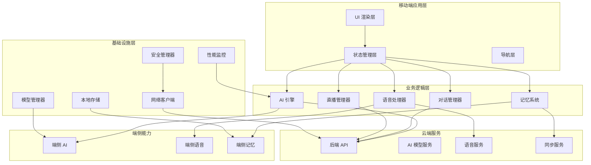

### 2.2 模块依赖图

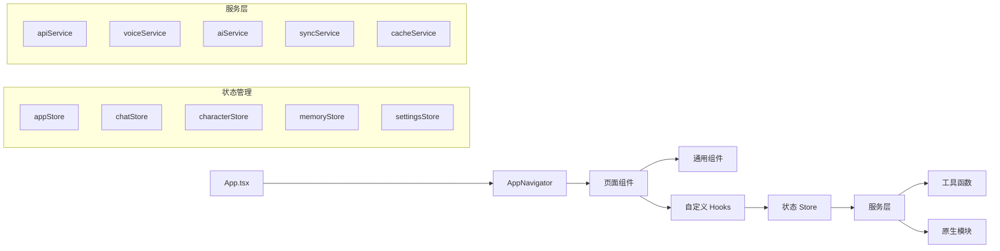

---

## 3. 模块详细设计

### 3.1 AI 引擎模块

#### 3.1.1 端云协同架构

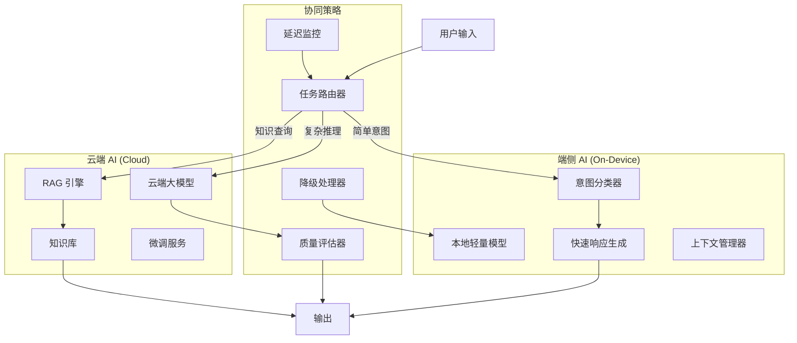

#### 3.1.2 任务路由策略

```typescript
// src/services/ai/taskRouter.ts
interface TaskRouterConfig {
  latencyThreshold: number;  // 延迟阈值 (ms)
  complexityThreshold: number;  // 复杂度阈值
  offlineMode: boolean;  // 离线模式
}

class TaskRouter {
  async route(userInput: string): Promise<'local' | 'cloud' | 'hybrid'> {
    // 1. 检查网络状态
    if (!this.isOnline()) return 'local';

    // 2. 分析任务复杂度
    const complexity = this.analyzeComplexity(userInput);

    // 3. 检查延迟要求
    const latencyRequirement = this.getLatencyRequirement(userInput);

    // 4. 路由决策
    if (complexity < this.config.complexityThreshold) {
      return 'local';
    }

    if (latencyRequirement < this.config.latencyThreshold) {
      return 'cloud';
    }

    return 'hybrid';
  }
}
```

### 3.2 语音处理模块

#### 3.2.1 语音处理流水线

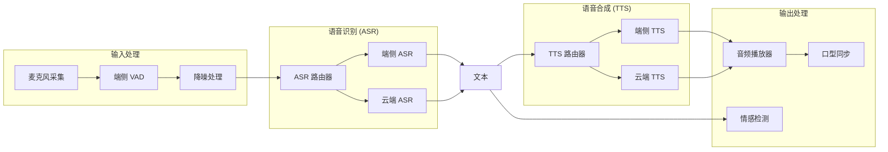

#### 3.2.2 VAD (Voice Activity Detection) 实现

```typescript
// src/services/voice/vad.ts
interface VADConfig {
  threshold: number;  // 检测阈值
  minSpeechDuration: number;  // 最小语音时长 (ms)
  silenceTimeout: number;  // 静音超时 (ms)
}

class VoiceActivityDetector {
  private audioContext: AudioContext;
  private analyser: AnalyserNode;
  private isSpeaking: boolean = false;

  async start(): Promise<void> {
    const stream = await navigator.mediaDevices.getUserMedia({ audio: true });
    this.audioContext = new AudioContext();
    const source = this.audioContext.createMediaStreamSource(stream);
    this.analyser = this.audioContext.createAnalyser();
    source.connect(this.analyser);

    this.detect();
  }

  private detect(): void {
    const dataArray = new Uint8Array(this.analyser.frequencyBinCount);
    this.analyser.getByteFrequencyData(dataArray);

    const volume = this.calculateVolume(dataArray);
    const isSpeech = volume > this.config.threshold;

    if (isSpeech && !this.isSpeaking) {
      this.isSpeaking = true;
      this.onSpeechStart();
    } else if (!isSpeech && this.isSpeaking) {
      this.isSpeaking = false;
      this.onSpeechEnd();
    }

    requestAnimationFrame(() => this.detect());
  }
}
```

### 3.3 记忆系统模块

#### 3.3.1 多层记忆架构

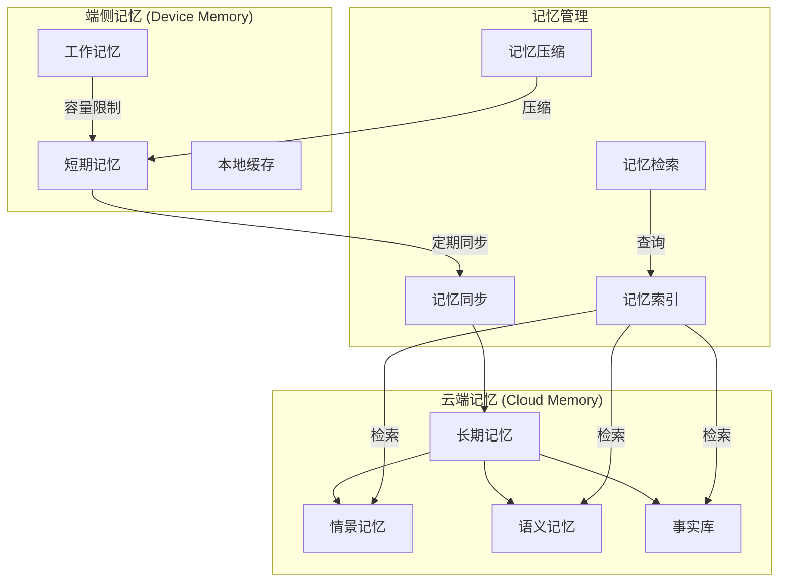

#### 3.3.2 记忆同步协议

```typescript
// src/services/memory/syncProtocol.ts
interface MemorySyncProtocol {
  // 增量同步
  syncIncremental(lastSyncTimestamp: number): Promise<MemoryDelta>;

  // 全量同步（冲突解决）
  syncFull(): Promise<MemorySnapshot>;

  // CRDT 合并
  merge(memories: MemoryItem[]): MemoryItem[];
}

interface MemoryDelta {
  added: MemoryItem[];
  updated: MemoryItem[];
  deleted: string[];
  timestamp: number;
}

class CRDTMemoryMerger {
  merge(local: MemoryItem, remote: MemoryItem): MemoryItem {
    // 基于时间戳的冲突解决
    if (local.timestamp > remote.timestamp) {
      return local;
    }

    // 基于优先级的冲突解决
    if (local.priority > remote.priority) {
      return local;
    }

    // 合并内容
    return {
      ...remote,
      content: this.mergeContent(local.content, remote.content),
      timestamp: Math.max(local.timestamp, remote.timestamp),
    };
  }
}
```

### 3.4 UI 渲染模块

#### 3.4.1 渲染架构

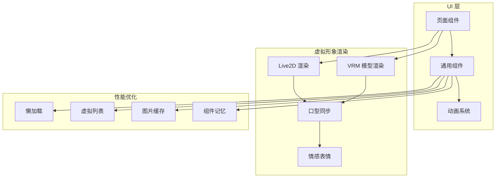

#### 3.4.2 虚拟形象渲染方案

```typescript
// src/components/avatar/renderer.ts
interface AvatarRenderer {
  // 加载模型
  loadModel(modelPath: string): Promise<void>;

  // 更新口型
  updateLipSync(viseme: string): void;

  // 更新表情
  updateEmotion(emotion: string): void;

  // 更新动作
  updateAnimation(animation: string): void;

  // 渲染帧
  render(): void;
}

class Live2DRenderer implements AvatarRenderer {
  private model: Live2DModel;
  private motionManager: MotionManager;

  async loadModel(modelPath: string): Promise<void> {
    this.model = await Live2DModel.from(modelPath);
    this.motionManager = new MotionManager(this.model);
  }

  updateLipSync(viseme: string): void {
    // 映射音素到口型参数
    const lipSyncParam = this.mapVisemeToParam(viseme);
    this.model.coreModel.setParameterValueById(
      'ParamMouthOpenY',
      lipSyncParam
    );
  }
}
```

### 3.5 网络通信模块

#### 3.5.1 通信架构

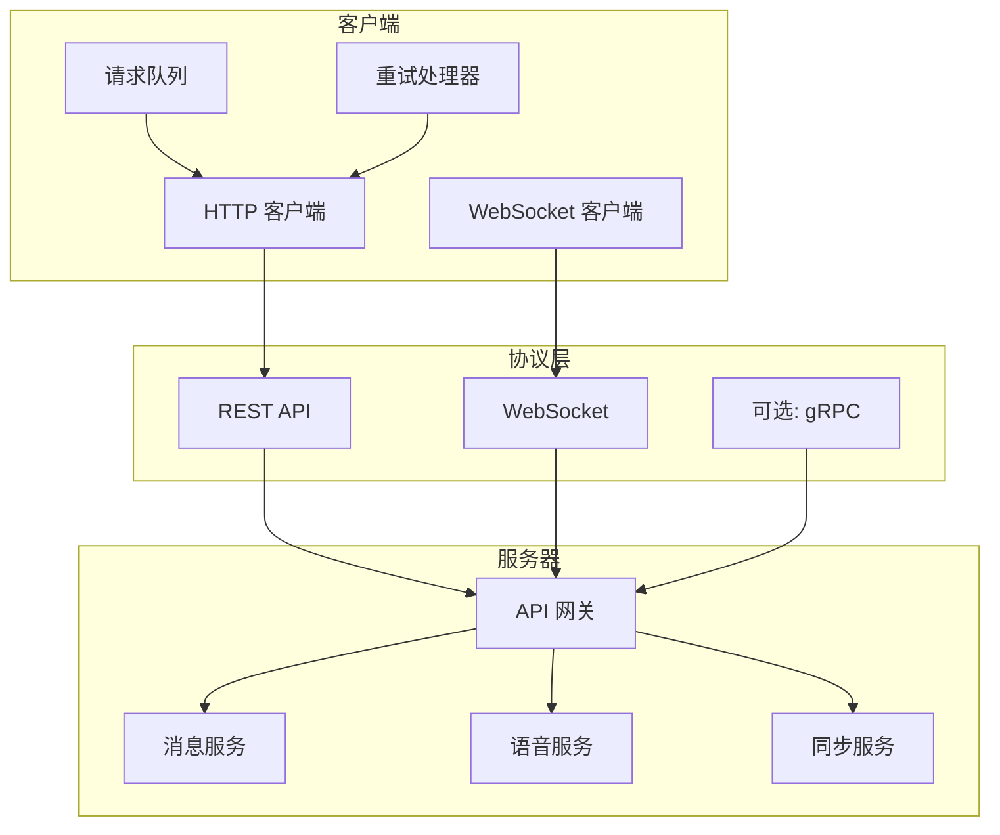

#### 3.5.2 网络状态管理

```typescript
// src/services/network/networkManager.ts
interface NetworkState {
  isOnline: boolean;
  connectionType: 'wifi' | 'cellular' | 'none';
  latency: number;
  bandwidth: number;
}

class NetworkManager {
  private state: NetworkState;
  private listeners: Set<(state: NetworkState) => void>;

  async checkConnection(): Promise<boolean> {
    try {
      const start = Date.now();
      await fetch('/api/v1/status', { method: 'HEAD' });
      const latency = Date.now() - start;

      this.updateState({
        isOnline: true,
        latency,
        connectionType: this.detectConnectionType(),
      });

      return true;
    } catch {
      this.updateState({ isOnline: false });
      return false;
    }
  }

  // 自适应请求策略
  getOptimalStrategy(): 'immediate' | 'batch' | 'deferred' {
    if (!this.state.isOnline) return 'deferred';
    if (this.state.connectionType === 'cellular') return 'batch';
    return 'immediate';
  }
}
```

---

## 4. 数据流设计

### 4.1 用户输入 → AI 处理 → 输出 完整流程

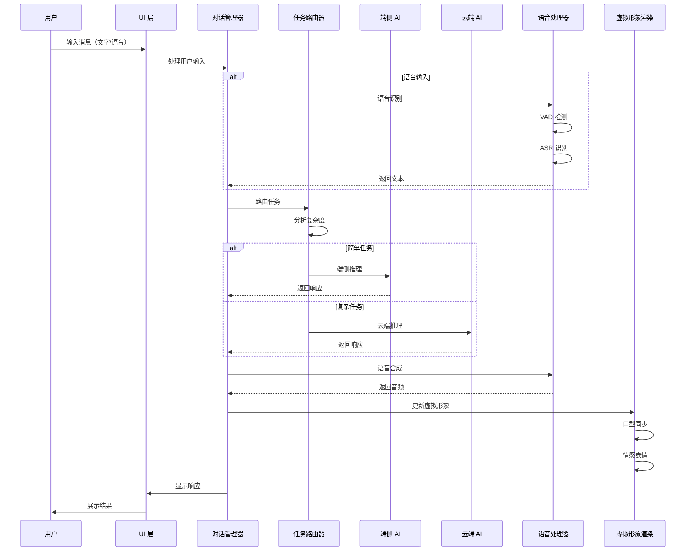

### 4.2 离线数据同步流程

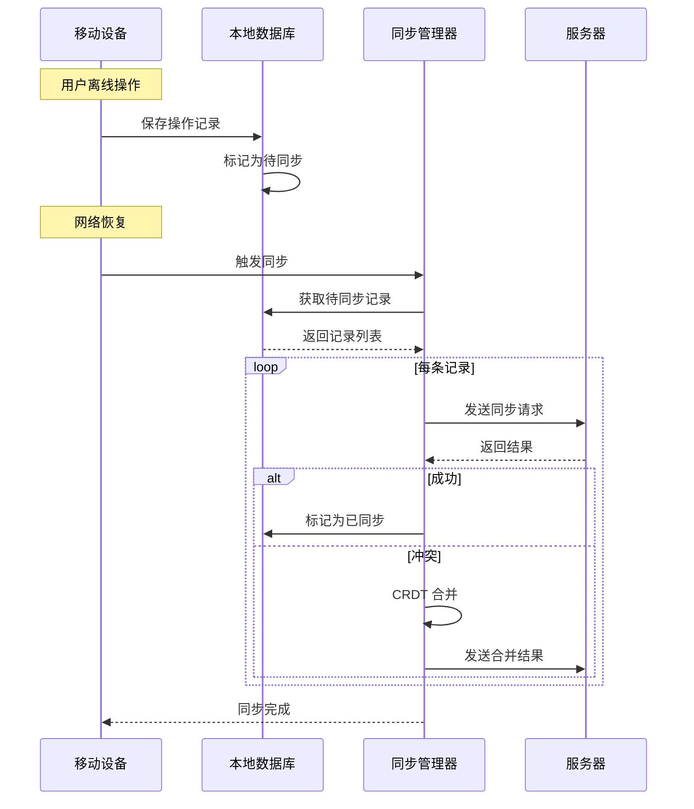

---

## 5. 端云协同策略

### 5.1 计算任务分配

| 任务类型 | 端侧处理 | 云端处理 | 决策依据 |
|---|---|---|---|
| 意图分类 | ✅ | ❌ | 低延迟要求，模型小 |
| 简单问答 | ✅ | ❌ | 常见问题，本地缓存 |
| 复杂推理 | ❌ | ✅ | 需要大模型能力 |
| 知识查询 | ❌ | ✅ | 需要大知识库 |
| 语音识别 | ✅ (简单) | ✅ (复杂) | 端侧处理简单语音，复杂语音上云 |
| 语音合成 | ✅ (基础) | ✅ (高质量) | 端侧生成基础语音，云端生成高质量语音 |
| 情感分析 | ✅ | ❌ | 低延迟，模型小 |
| 记忆检索 | ✅ (本地) | ✅ (全量) | 本地检索近期记忆，云端检索全量 |

### 5.2 智能路由算法

```typescript
// src/services/ai/smartRouter.ts
interface RoutingDecision {
  target: 'local' | 'cloud' | 'hybrid';
  confidence: number;
  reason: string;
}

class SmartRouter {
  async decide(input: string): Promise<RoutingDecision> {
    // 1. 检查网络状态
    const networkState = await this.networkManager.getState();
    if (!networkState.isOnline) {
      return { target: 'local', confidence: 1.0, reason: 'offline' };
    }

    // 2. 检查电池状态
    const batteryLevel = await this.getBatteryLevel();
    if (batteryLevel < 20) {
      return { target: 'local', confidence: 0.9, reason: 'low_battery' };
    }

    // 3. 分析任务复杂度
    const complexity = this.analyzeComplexity(input);

    // 4. 检查本地模型能力
    const localCapability = await this.checkLocalCapability(input);

    // 5. 路由决策
    if (complexity < 0.3 && localCapability > 0.8) {
      return { target: 'local', confidence: 0.95, reason: 'simple_task' };
    }

    if (complexity > 0.7 || localCapability < 0.5) {
      return { target: 'cloud', confidence: 0.9, reason: 'complex_task' };
    }

    return { target: 'hybrid', confidence: 0.8, reason: 'mixed_task' };
  }
}
```

### 5.3 模型动态加载策略

```typescript
// src/services/ai/modelManager.ts
interface ModelConfig {
  name: string;
  size: number;  // MB
  priority: number;
  capabilities: string[];
}

class ModelManager {
  private loadedModels: Map<string, Model> = new Map();
  private modelConfigs: ModelConfig[];

  async loadModel(config: ModelConfig): Promise<void> {
    // 检查内存限制
    const availableMemory = await this.getAvailableMemory();
    if (config.size > availableMemory * 0.3) {
      throw new Error('Insufficient memory');
    }

    // 检查是否已加载
    if (this.loadedModels.has(config.name)) {
      return;
    }

    // 懒加载模型
    const model = await this.loadModelFromStorage(config.name);
    this.loadedModels.set(config.name, model);

    // 清理低优先级模型
    await this.cleanupLowPriorityModels();
  }

  private async cleanupLowPriorityModels(): Promise<void> {
    const totalSize = this.calculateTotalModelSize();
    const memoryLimit = await this.getMemoryLimit();

    if (totalSize > memoryLimit * 0.8) {
      // 按优先级排序，卸载低优先级模型
      const sortedModels = Array.from(this.loadedModels.entries())
        .sort((a, b) => {
          const configA = this.getModelConfig(a[0]);
          const configB = this.getModelConfig(b[0]);
          return configA.priority - configB.priority;
        });

      for (const [name, model] of sortedModels) {
        if (totalSize <= memoryLimit * 0.6) break;
        await this.unloadModel(name);
      }
    }
  }
}
```

---

## 6. 性能优化方案

### 6.1 功耗优化

#### 6.1.1 动态功耗调度

```typescript
// src/services/performance/powerManager.ts
interface PowerProfile {
  cpuFrequency: number;
  gpuFrequency: number;
  networkInterval: number;
  aiInferenceMode: 'aggressive' | 'balanced' | 'conservative';
}

class PowerManager {
  private currentProfile: PowerProfile;
  private batteryLevel: number;
  private isCharging: boolean;

  async updateProfile(): Promise<void> {
    const battery = await this.getBatteryStatus();
    this.batteryLevel = battery.level;
    this.isCharging = battery.isCharging;

    if (this.isCharging) {
      this.currentProfile = this.getAggressiveProfile();
    } else if (this.batteryLevel > 50) {
      this.currentProfile = this.getBalancedProfile();
    } else if (this.batteryLevel > 20) {
      this.currentProfile = this.getConservativeProfile();
    } else {
      this.currentProfile = this.getPowerSaveProfile();
    }

    await this.applyProfile(this.currentProfile);
  }

  private getConservativeProfile(): PowerProfile {
    return {
      cpuFrequency: 0.6,
      gpuFrequency: 0.5,
      networkInterval: 60000,  // 60 秒
      aiInferenceMode: 'conservative',
    };
  }
}
```

#### 6.1.2 后台任务管理

```typescript
// src/services/background/taskManager.ts
interface BackgroundTask {
  id: string;
  type: 'sync' | 'cleanup' | 'precompute';
  priority: number;
  interval: number;
  lastRun: number;
}

class BackgroundTaskManager {
  private tasks: BackgroundTask[] = [];
  private isAppForeground: boolean = true;

  registerTask(task: BackgroundTask): void {
    this.tasks.push(task);
    this.scheduleTask(task);
  }

  private scheduleTask(task: BackgroundTask): void {
    const delay = this.isAppForeground
      ? task.interval
      : task.interval * 3;  // 后台降低频率

    setTimeout(() => {
      this.executeTask(task);
    }, delay);
  }

  onAppStateChanged(isForeground: boolean): void {
    this.isAppForeground = isForeground;

    if (isForeground) {
      // 前台：恢复正常频率
      this.tasks.forEach(task => this.scheduleTask(task));
    } else {
      // 后台：降低频率，暂停非关键任务
      this.pauseNonCriticalTasks();
    }
  }
}
```

### 6.2 延迟优化

#### 6.2.1 请求合并与批处理

```typescript
// src/services/network/requestBatcher.ts
interface BatchRequest {
  id: string;
  endpoint: string;
  data: any;
  resolve: (value: any) => void;
  reject: (error: Error) => void;
}

class RequestBatcher {
  private queue: BatchRequest[] = [];
  private batchTimer: NodeJS.Timeout | null = null;
  private readonly BATCH_DELAY = 50;  // ms
  private readonly MAX_BATCH_SIZE = 10;

  async addRequest(request: BatchRequest): Promise<any> {
    return new Promise((resolve, reject) => {
      this.queue.push({ ...request, resolve, reject });

      if (this.queue.length >= this.MAX_BATCH_SIZE) {
        this.flushBatch();
      } else if (!this.batchTimer) {
        this.batchTimer = setTimeout(() => this.flushBatch(), this.BATCH_DELAY);
      }
    });
  }

  private async flushBatch(): Promise<void> {
    if (this.batchTimer) {
      clearTimeout(this.batchTimer);
      this.batchTimer = null;
    }

    const batch = this.queue.splice(0, this.MAX_BATCH_SIZE);
    if (batch.length === 0) return;

    try {
      const response = await this.sendBatch(batch);
      batch.forEach((req, index) => req.resolve(response[index]));
    } catch (error) {
      batch.forEach(req => req.reject(error as Error));
    }
  }
}
```

#### 6.2.2 预测性预加载

```typescript
// src/services/cache/predictiveLoader.ts
class PredictiveLoader {
  private userPatterns: Map<string, number[]> = new Map();

  async predictNextAction(currentAction: string): Promise<string[]> {
    const patterns = this.userPatterns.get(currentAction) || [];
    const sortedPatterns = patterns
      .sort((a, b) => b - a)
      .slice(0, 3);

    return sortedPatterns.map(pattern => this.getActionByPattern(pattern));
  }

  async preloadResources(actions: string[]): Promise<void> {
    for (const action of actions) {
      const resources = await this.getResourcesForAction(action);
      await this.cacheResources(resources);
    }
  }

  recordAction(action: string): void {
    const pattern = this.getActionPattern(action);
    const patterns = this.userPatterns.get(action) || [];
    patterns.push(pattern);
    this.userPatterns.set(action, patterns);
  }
}
```

### 6.3 内存优化

#### 6.3.1 内存监控与清理

```typescript
// src/services/performance/memoryManager.ts
interface MemoryStats {
  usedJSHeapSize: number;
  totalJSHeapSize: number;
  jsHeapSizeLimit: number;
}

class MemoryManager {
  private memoryThreshold = 0.8;  // 80%
  private cleanupCallbacks: (() => void)[] = [];

  registerCleanupCallback(callback: () => void): void {
    this.cleanupCallbacks.push(callback);
  }

  async checkMemory(): Promise<boolean> {
    const stats = await this.getMemoryStats();
    const usage = stats.usedJSHeapSize / stats.jsHeapSizeLimit;

    if (usage > this.memoryThreshold) {
      await this.performCleanup();
      return false;
    }

    return true;
  }

  private async performCleanup(): Promise<void> {
    console.log('[MemoryManager] Performing cleanup');

    // 1. 清理图片缓存
    await this.clearImageCache();

    // 2. 清理模型缓存
    await this.clearModelCache();

    // 3. 执行注册的清理回调
    for (const callback of this.cleanupCallbacks) {
      try {
        callback();
      } catch (error) {
        console.error('[MemoryManager] Cleanup callback failed:', error);
      }
    }

    // 4. 触发垃圾回收
    if (global.gc) {
      global.gc();
    }
  }
}
```

#### 6.3.2 图片懒加载与缓存

```typescript
// src/components/common/LazyImage.tsx
import React, { useState, useEffect } from 'react';
import { Image, View, ActivityIndicator } from 'react-native';

interface LazyImageProps {
  source: { uri: string };
  style: any;
  placeholder?: React.ReactNode;
}

export const LazyImage: React.FC<LazyImageProps> = ({
  source,
  style,
  placeholder,
}) => {
  const [loading, setLoading] = useState(true);
  const [error, setError] = useState(false);
  const [cachedUri, setCachedUri] = useState<string | null>(null);

  useEffect(() => {
    loadImage();
  }, [source.uri]);

  const loadImage = async () => {
    try {
      // 检查缓存
      const cached = await ImageCache.get(source.uri);
      if (cached) {
        setCachedUri(cached);
        setLoading(false);
        return;
      }

      // 下载并缓存
      const uri = await ImageCache.set(source.uri);
      setCachedUri(uri);
    } catch (err) {
      setError(true);
    } finally {
      setLoading(false);
    }
  };

  if (loading) {
    return placeholder || <ActivityIndicator />;
  }

  if (error) {
    return <View style={style} />;
  }

  return (
    <Image
      source={{ uri: cachedUri || source.uri }}
      style={style}
    />
  );
};
```

---

## 7. 安全设计

### 7.1 数据安全

```typescript
// src/services/security/securityManager.ts
class SecurityManager {
  // 数据加密
  async encryptData(data: string): Promise<string> {
    const key = await this.getEncryptionKey();
    const encrypted = await this.encrypt(data, key);
    return encrypted;
  }

  // 数据解密
  async decryptData(encryptedData: string): Promise<string> {
    const key = await this.getEncryptionKey();
    const decrypted = await this.decrypt(encryptedData, key);
    return decrypted;
  }

  // 安全存储
  async secureStore(key: string, value: string): Promise<void> {
    const encrypted = await this.encryptData(value);
    await AsyncStorage.setItem(key, encrypted);
  }

  // 安全读取
  async secureRetrieve(key: string): Promise<string | null> {
    const encrypted = await AsyncStorage.getItem(key);
    if (!encrypted) return null;
    return await this.decryptData(encrypted);
  }

  // Token 管理
  async refreshToken(): Promise<string> {
    const refreshToken = await this.secureRetrieve('refresh_token');
    const response = await fetch('/api/v1/auth/refresh', {
      method: 'POST',
      headers: { 'Authorization': `Bearer ${refreshToken}` },
    });

    const { access_token } = await response.json();
    await this.secureStore('access_token', access_token);
    return access_token;
  }
}
```

### 7.2 网络安全

```typescript
// src/services/security/networkSecurity.ts
class NetworkSecurity {
  // 证书固定
  private pinnedCertificates: string[] = [
    'sha256/AAAAAAAAAAAAAAAAAAAAAAAAAAAAAAAAAAAAAAAAAAA=',
  ];

  // 请求签名
  async signRequest(request: Request): Promise<Request> {
    const timestamp = Date.now().toString();
    const nonce = this.generateNonce();
    const signature = await this.generateSignature(
      request.url,
      timestamp,
      nonce
    );

    request.headers.set('X-Timestamp', timestamp);
    request.headers.set('X-Nonce', nonce);
    request.headers.set('X-Signature', signature);

    return request;
  }

  // 防重放攻击
  private generateNonce(): string {
    return Math.random().toString(36).substring(2, 15);
  }
}
```

---

## 8. 文件结构与依赖

### 8.1 完整文件列表

```
mobile/
├── src/
│   ├── App.tsx                          # 应用入口
│   ├── navigation/
│   │   └── AppNavigator.tsx             # 导航配置
│   │
│   ├── screens/                         # 页面组件
│   │   ├── ChatScreen.tsx               # 对话页面
│   │   ├── CharacterScreen.tsx          # 角色页面
│   │   ├── MemoryScreen.tsx             # 记忆页面
│   │   ├── LiveScreen.tsx               # 直播页面
│   │   └── SettingsScreen.tsx           # 设置页面
│   │
│   ├── components/                      # 通用组件
│   │   ├── common/
│   │   │   ├── Button.tsx
│   │   │   ├── Input.tsx
│   │   │   ├── Card.tsx
│   │   │   ├── Modal.tsx
│   │   │   ├── Loading.tsx
│   │   │   └── LazyImage.tsx
│   │   ├── chat/
│   │   │   ├── ChatBubble.tsx
│   │   │   ├── ChatInput.tsx
│   │   │   ├── VoiceButton.tsx
│   │   │   └── MessageList.tsx
│   │   ├── avatar/
│   │   │   ├── AvatarView.tsx
│   │   │   ├── LipSync.tsx
│   │   │   └── EmotionIndicator.tsx
│   │   └── memory/
│   │       ├── MemoryCard.tsx
│   │       ├── MemoryTimeline.tsx
│   │       └── MemorySearch.tsx
│   │
│   ├── hooks/                           # 自定义 Hooks
│   │   ├── useChat.ts
│   │   ├── useVoice.ts
│   │   ├── useMemory.ts
│   │   ├── useNetwork.ts
│   │   ├── useBattery.ts
│   │   └── usePerformance.ts
│   │
│   ├── store/                           # 状态管理
│   │   ├── appStore.ts
│   │   ├── chatStore.ts
│   │   ├── characterStore.ts
│   │   ├── memoryStore.ts
│   │   └── settingsStore.ts
│   │
│   ├── services/                        # 服务层
│   │   ├── api/
│   │   │   ├── apiClient.ts
│   │   │   ├── endpoints.ts
│   │   │   └── types.ts
│   │   ├── ai/
│   │   │   ├── aiEngine.ts
│   │   │   ├── taskRouter.ts
│   │   │   ├── localModel.ts
│   │   │   └── cloudModel.ts
│   │   ├── voice/
│   │   │   ├── voiceProcessor.ts
│   │   │   ├── vad.ts
│   │   │   ├── asr.ts
│   │   │   └── tts.ts
│   │   ├── memory/
│   │   │   ├── memoryManager.ts
│   │   │   ├── syncProtocol.ts
│   │   │   └── crdtMerger.ts
│   │   ├── network/
│   │   │   ├── networkManager.ts
│   │   │   ├── requestBatcher.ts
│   │   │   └── offlineQueue.ts
│   │   ├── security/
│   │   │   ├── securityManager.ts
│   │   │   ├── encryption.ts
│   │   │   └── tokenManager.ts
│   │   └── performance/
│   │       ├── powerManager.ts
│   │       ├── memoryManager.ts
│   │       └── performanceMonitor.ts
│   │
│   ├── utils/                           # 工具函数
│   │   ├── constants.ts
│   │   ├── helpers.ts
│   │   ├── validators.ts
│   │   └── formatters.ts
│   │
│   └── types/                           # 类型定义
│       ├── index.ts
│       ├── api.ts
│       ├── ai.ts
│       ├── voice.ts
│       └── memory.ts
│
├── android/                             # Android 原生代码
│   └── app/
│       └── src/
│           └── main/
│               └── java/
│                   └── com/guguai/
│                       └── mobile/
│                           ├── MainActivity.java
│                           ├── modules/
│                           │   ├── AIModule.java
│                           │   ├── VoiceModule.java
│                           │   └── PerformanceModule.java
│                           └── utils/
│                               └── DeviceUtils.java
│
├── ios/                                 # iOS 原生代码
│   └── GuguMobile/
│       ├── AppDelegate.mm
│       ├── modules/
│       │   ├── AIModule.m
│       │   ├── VoiceModule.m
│       │   └── PerformanceModule.m
│       └── utils/
│           └── DeviceUtils.m
│
├── assets/                              # 静态资源
│   ├── models/                          # AI 模型
│   │   ├── intent_classifier.onnx
│   │   ├── sentiment_analyzer.onnx
│   │   └── quick_response.onnx
│   ├── sounds/                          # 音频资源
│   └── images/                          # 图片资源
│
├── package.json                         # 项目配置
├── tsconfig.json                        # TypeScript 配置
├── babel.config.js                      # Babel 配置
├── metro.config.js                      # Metro 配置
└── jest.config.js                       # 测试配置
```

### 8.2 依赖包列表

```json
{
  "dependencies": {
    "react": "18.2.0",
    "react-native": "0.73.4",
    "@react-navigation/native": "^6.1.9",
    "@react-navigation/native-stack": "^6.9.17",
    "zustand": "^4.5.0",
    "axios": "^1.6.7",
    "@react-native-async-storage/async-storage": "^1.21.0",
    "react-native-reanimated": "^3.6.1",
    "react-native-gesture-handler": "^2.14.0",
    "react-native-screens": "^3.29.0",
    "react-native-safe-area-context": "^4.8.2",
    "react-native-vector-icons": "^10.0.3",
    "react-native-video": "^5.2.1",
    "react-native-sound": "^0.11.2",
    "react-native-fs": "^2.20.0",
    "react-native-device-info": "^10.12.0",
    "react-native-netinfo": "^11.2.1",
    "react-native-background-timer": "^2.4.1",
    "react-native-keep-awake": "^4.0.0",
    "react-native-haptic-feedback": "^2.2.0",
    "react-native-localize": "^3.0.4",
    "react-native-i18n": "^2.0.15",
    "date-fns": "^3.3.1",
    "lodash": "^4.17.21",
    "uuid": "^9.0.0",
    "zod": "^3.22.4"
  },
  "devDependencies": {
    "@types/react": "^18.2.48",
    "@types/react-native": "^0.73.0",
    "@types/lodash": "^4.14.202",
    "@types/uuid": "^9.0.7",
    "typescript": "^5.3.3",
    "jest": "^29.7.0",
    "@testing-library/react-native": "^12.4.3",
    "eslint": "^8.56.0",
    "prettier": "^3.2.4"
  }
}
```

### 8.3 依赖图

```mermaid
graph TB
    subgraph "核心依赖"
        React[React 18.2]
        ReactNative[React Native 0.73.4]
        TypeScript[TypeScript 5.3]
    end

    subgraph "导航"
        ReactNavigation[React Navigation 6]
        ReactNavigationNative[@react-navigation/native]
        ReactNavigationStack[@react-navigation/native-stack]
    end

    subgraph "状态管理"
        Zustand[Zustand 4.5]
        AsyncStorage[AsyncStorage]
    end

    subgraph "网络"
        Axios[Axios 1.6]
        NetInfo[NetInfo]
    end

    subgraph "UI"
        Reanimated[Reanimated 3.6]
        GestureHandler[Gesture Handler 2.14]
        Screens[Screens 3.29]
        SafeArea[SafeArea Context 4.8]
        VectorIcons[Vector Icons 10.0]
    end

    subgraph "媒体"
        Video[react-native-video]
        Sound[react-native-sound]
        FS[react-native-fs]
    end

    subgraph "设备"
        DeviceInfo[Device Info 10.12]
        BackgroundTimer[Background Timer]
        KeepAwake[Keep Awake]
        HapticFeedback[Haptic Feedback]
        Localize[Localize 3.0]
    end

    subgraph "工具"
        DateFns[date-fns 3.3]
        Lodash[Lodash 4.17]
        UUID[UUID 9.0]
        Zod[Zod 3.22]
    end

    React --> ReactNative
    ReactNative --> ReactNavigation
    ReactNavigation --> ReactNavigationNative
    ReactNavigation --> ReactNavigationStack

    ReactNative --> Zustand
    Zustand --> AsyncStorage

    ReactNative --> Axios
    Axios --> NetInfo

    ReactNative --> Reanimated
    Reanimated --> GestureHandler
    ReactNative --> Screens
    ReactNative --> SafeArea
    ReactNative --> VectorIcons

    ReactNative --> Video
    ReactNative --> Sound
    ReactNative --> FS

    ReactNative --> DeviceInfo
    ReactNative --> BackgroundTimer
    ReactNative --> KeepAwake
    ReactNative --> HapticFeedback
    ReactNative --> Localize

    ReactNative --> DateFns
    ReactNative --> Lodash
    ReactNative --> UUID
    ReactNative --> Zod
```

---

## 9. 实现顺序

### 9.1 阶段划分

#### 阶段一：基础架构（2 周）

1. **项目初始化**
   - 配置 TypeScript、ESLint、Prettier
   - 配置 Metro bundler
   - 配置原生项目

2. **核心框架**
   - 实现导航系统
   - 实现状态管理基础
   - 实现网络客户端

3. **基础 UI 组件**
   - Button、Input、Card、Modal
   - Loading、ErrorBoundary
   - LazyImage

#### 阶段二：核心功能（3 周）

4. **对话系统**
   - 实现 ChatScreen
   - 实现 ChatBubble、ChatInput
   - 实现消息列表

5. **AI 引擎**
   - 实现任务路由器
   - 实现本地模型加载
   - 实现云端 API 集成

6. **语音处理**
   - 实现 VAD 检测
   - 实现 ASR 集成
   - 实现 TTS 集成

#### 阶段三：高级功能（3 周）

7. **记忆系统**
   - 实现记忆管理器
   - 实现同步协议
   - 实现 CRDT 合并

8. **虚拟形象**
   - 实现 AvatarView
   - 实现口型同步
   - 实现情感表情

9. **性能优化**
   - 实现功耗管理
   - 实现内存管理
   - 实现预测性加载

#### 阶段四：完善与发布（2 周）

10. **安全加固**
    - 实现数据加密
    - 实现网络安全
    - 实现 Token 管理

11. **测试与优化**
    - 单元测试
    - 集成测试
    - 性能测试

12. **发布准备**
    - 应用签名
    - 商店截图
    - 文档完善

### 9.2 详细任务分解

| 阶段 | 任务 | 优先级 | 预计工时 |
|---|---|---|---|
| 1.1 | 项目初始化 | P0 | 2 天 |
| 1.2 | 导航系统 | P0 | 2 天 |
| 1.3 | 状态管理基础 | P0 | 2 天 |
| 1.4 | 网络客户端 | P0 | 2 天 |
| 1.5 | 基础 UI 组件 | P0 | 4 天 |
| 2.1 | ChatScreen | P0 | 3 天 |
| 2.2 | AI 引擎 | P0 | 5 天 |
| 2.3 | 语音处理 | P0 | 5 天 |
| 3.1 | 记忆系统 | P1 | 5 天 |
| 3.2 | 虚拟形象 | P1 | 5 天 |
| 3.3 | 性能优化 | P1 | 5 天 |
| 4.1 | 安全加固 | P1 | 3 天 |
| 4.2 | 测试 | P1 | 5 天 |
| 4.3 | 发布准备 | P2 | 4 天 |

---

## 10. 共享知识（跨文件约定）

### 10.1 命名规范

| 类型 | 规范 | 示例 |
|---|---|---|
| 文件名 | PascalCase (组件), camelCase (其他) | `ChatScreen.tsx`, `apiClient.ts` |
| 组件名 | PascalCase | `ChatBubble`, `VoiceButton` |
| 函数名 | camelCase | `sendMessage`, `loadModel` |
| 变量名 | camelCase | `isLoading`, `userInput` |
| 常量名 | UPPER_SNAKE_CASE | `API_BASE_URL`, `MAX_RETRY_COUNT` |
| 类型名 | PascalCase | `UserProfile`, `ChatMessage` |
| 接口名 | PascalCase (无 I 前缀) | `ApiResponse`, `MemoryItem` |

### 10.2 文件组织规范

```typescript
// 文件结构顺序
// 1. 导入语句
import React from 'react';
import { View, Text } from 'react-native';
import { useChat } from '../hooks/useChat';
import { COLORS } from '../utils/constants';

// 2. 类型定义
interface ChatBubbleProps {
  message: string;
  isUser: boolean;
  timestamp: Date;
}

// 3. 常量
const BUBBLE_MAX_WIDTH = '80%';

// 4. 组件实现
export const ChatBubble: React.FC<ChatBubbleProps> = ({
  message,
  isUser,
  timestamp,
}) => {
  // Hooks
  const { formatTime } = useChat();

  // 渲染
  return (
    <View style={[styles.container, isUser && styles.userBubble]}>
      <Text style={styles.message}>{message}</Text>
      <Text style={styles.time}>{formatTime(timestamp)}</Text>
    </View>
  );
};

// 5. 样式
const styles = StyleSheet.create({
  container: {
    maxWidth: BUBBLE_MAX_WIDTH,
    padding: 12,
    borderRadius: 16,
  },
  userBubble: {
    alignSelf: 'flex-end',
    backgroundColor: COLORS.primary,
  },
  message: {
    fontSize: 16,
    color: COLORS.text,
  },
  time: {
    fontSize: 12,
    color: COLORS.textLight,
    marginTop: 4,
  },
});
```

### 10.3 状态管理约定

```typescript
// store 模板
import { create } from 'zustand';
import { persist, createJSONStorage } from 'zustand/middleware';
import AsyncStorage from '@react-native-async-storage/async-storage';

interface ExampleState {
  // 状态
  data: any[];
  isLoading: boolean;
  error: string | null;

  // 操作
  fetchData: () => Promise<void>;
  clearError: () => void;
}

export const useExampleStore = create<ExampleState>()(
  persist(
    (set, get) => ({
      // 初始状态
      data: [],
      isLoading: false,
      error: null,

      // 操作实现
      fetchData: async () => {
        set({ isLoading: true, error: null });
        try {
          const data = await api.getData();
          set({ data, isLoading: false });
        } catch (error) {
          set({
            error: error instanceof Error ? error.message : 'Unknown error',
            isLoading: false,
          });
        }
      },

      clearError: () => set({ error: null }),
    }),
    {
      name: 'example-storage',
      storage: createJSONStorage(() => AsyncStorage),
    }
  )
);
```

### 10.4 API 调用约定

```typescript
// services/api/apiClient.ts
import axios, { AxiosInstance, AxiosError } from 'axios';
import { SecurityManager } from '../security/securityManager';

class ApiClient {
  private client: AxiosInstance;
  private securityManager: SecurityManager;

  constructor() {
    this.client = axios.create({
      baseURL: API_BASE_URL,
      timeout: 30000,
      headers: {
        'Content-Type': 'application/json',
      },
    });

    this.setupInterceptors();
  }

  private setupInterceptors(): void {
    // 请求拦截器
    this.client.interceptors.request.use(
      async (config) => {
        // 添加认证 token
        const token = await this.securityManager.getToken();
        if (token) {
          config.headers.Authorization = `Bearer ${token}`;
        }

        // 添加设备信息
        config.headers['X-Device-ID'] = await this.getDeviceId();
        config.headers['X-App-Version'] = APP_VERSION;

        return config;
      },
      (error) => Promise.reject(error)
    );

    // 响应拦截器
    this.client.interceptors.response.use(
      (response) => response,
      async (error: AxiosError) => {
        if (error.response?.status === 401) {
          // Token 过期，尝试刷新
          await this.securityManager.refreshToken();
          // 重试原请求
          return this.client.request(error.config!);
        }
        return Promise.reject(error);
      }
    );
  }

  // 通用请求方法
  async get<T>(url: string, params?: any): Promise<T> {
    const response = await this.client.get<T>(url, { params });
    return response.data;
  }

  async post<T>(url: string, data?: any): Promise<T> {
    const response = await this.client.post<T>(url, data);
    return response.data;
  }
}

export const apiClient = new ApiClient();
```

### 10.5 错误处理约定

```typescript
// utils/errors.ts
export class AppError extends Error {
  constructor(
    message: string,
    public code: string,
    public statusCode?: number,
    public details?: any
  ) {
    super(message);
    this.name = 'AppError';
  }
}

export class NetworkError extends AppError {
  constructor(message: string, details?: any) {
    super(message, 'NETWORK_ERROR', undefined, details);
    this.name = 'NetworkError';
  }
}

export class ValidationError extends AppError {
  constructor(message: string, details?: any) {
    super(message, 'VALIDATION_ERROR', 400, details);
    this.name = 'ValidationError';
  }
}

// 错误处理 Hook
export const useErrorHandler = () => {
  const handleError = (error: unknown) => {
    if (error instanceof AppError) {
      // 根据错误类型处理
      switch (error.code) {
        case 'NETWORK_ERROR':
          showNetworkErrorToast();
          break;
        case 'VALIDATION_ERROR':
          showValidationErrorToast(error.message);
          break;
        default:
          showGenericErrorToast(error.message);
      }
    } else {
      // 未知错误
      console.error('Unknown error:', error);
      showGenericErrorToast('An unexpected error occurred');
    }
  };

  return { handleError };
};
```

---

## 11. 测试策略

### 11.1 测试层次

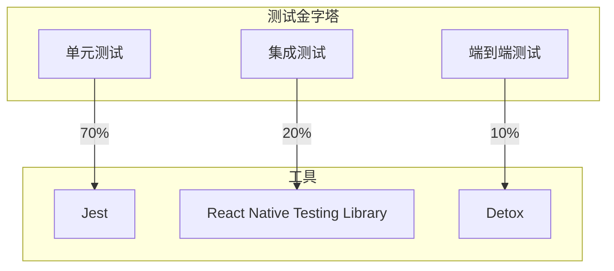

### 11.2 测试示例

```typescript
// __tests__/components/ChatBubble.test.tsx
import React from 'react';
import { render, fireEvent } from '@testing-library/react-native';
import { ChatBubble } from '../../src/components/chat/ChatBubble';

describe('ChatBubble', () => {
  it('renders user message correctly', () => {
    const { getByText } = render(
      <ChatBubble
        message="Hello, AI!"
        isUser={true}
        timestamp={new Date()}
      />
    );

    expect(getByText('Hello, AI!')).toBeTruthy();
  });

  it('renders AI message correctly', () => {
    const { getByText } = render(
      <ChatBubble
        message="Hello, human!"
        isUser={false}
        timestamp={new Date()}
      />
    );

    expect(getByText('Hello, human!')).toBeTruthy();
  });

  it('calls onPress when tapped', () => {
    const onPress = jest.fn();
    const { getByTestId } = render(
      <ChatBubble
        message="Test"
        isUser={true}
        timestamp={new Date()}
        onPress={onPress}
      />
    );

    fireEvent.press(getByTestId('chat-bubble'));
    expect(onPress).toHaveBeenCalled();
  });
});
```

---

## 12. 部署与监控

### 12.1 CI/CD 流程

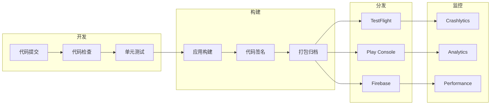

### 12.2 监控指标

| 指标 | 目标 | 监控工具 |
|---|---|---|
| 崩溃率 | < 0.1% | Crashlytics |
| ANR 率 | < 0.5% | Play Console |
| 启动时间 | < 2s | Performance |
| 内存使用 | < 200MB | Performance |
| 网络请求成功率 | > 99% | Analytics |
| AI 响应延迟 | < 500ms | Custom Metrics |

---

## 13. 总结

本架构设计针对"咕咕嘎嘎 AI VTuber"移动端应用，采用端云协同的混合架构，在保证性能的同时提供丰富的 AI 能力。主要特点：

1. **智能任务路由**：根据任务复杂度、网络状态、电池电量动态选择端侧或云端处理
2. **多层记忆系统**：端侧快速访问 + 云端持久化，支持离线使用
3. **性能优先**：功耗管理、内存优化、预测性加载，确保流畅体验
4. **安全可靠**：数据加密、网络安全、Token 管理，保护用户隐私
5. **可扩展性**：模块化设计，便于后续功能扩展

通过分阶段实现，预计 10 周完成核心功能开发，为用户提供高质量的 AI VTuber 移动体验。

---

**文档版本**: v1.0.0  
**创建日期**: 2026-06-06  
**作者**: 高见远（Gao）· 软件架构师
