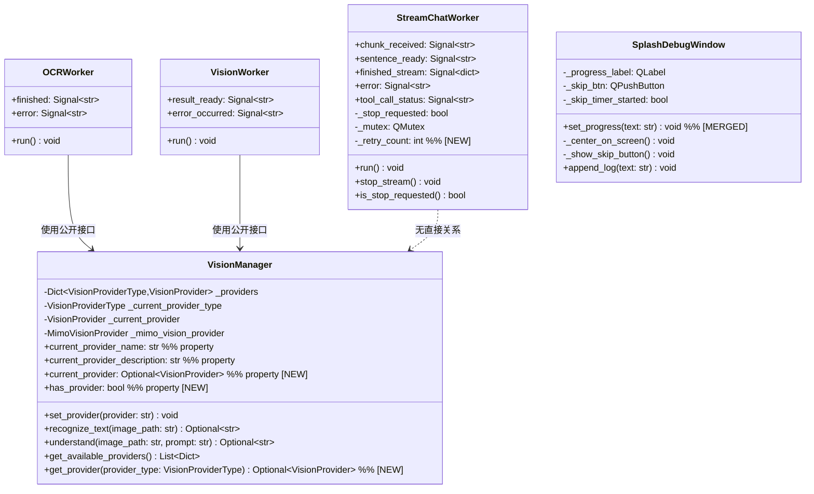
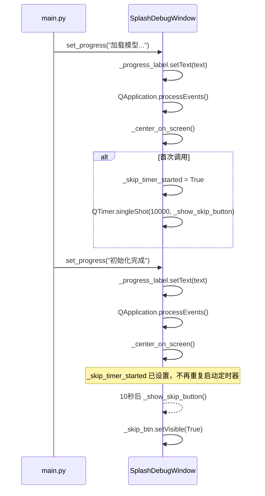
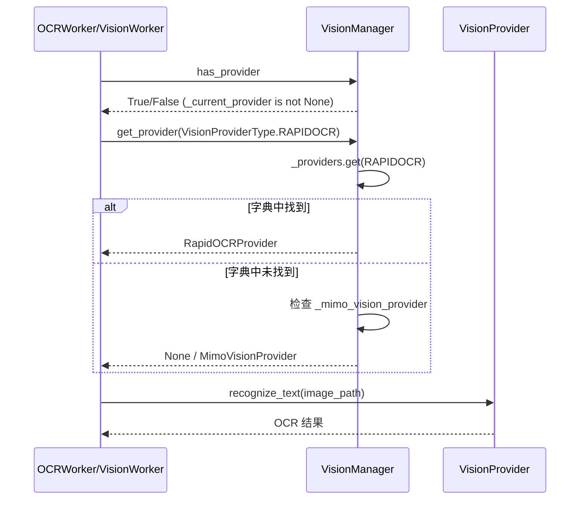
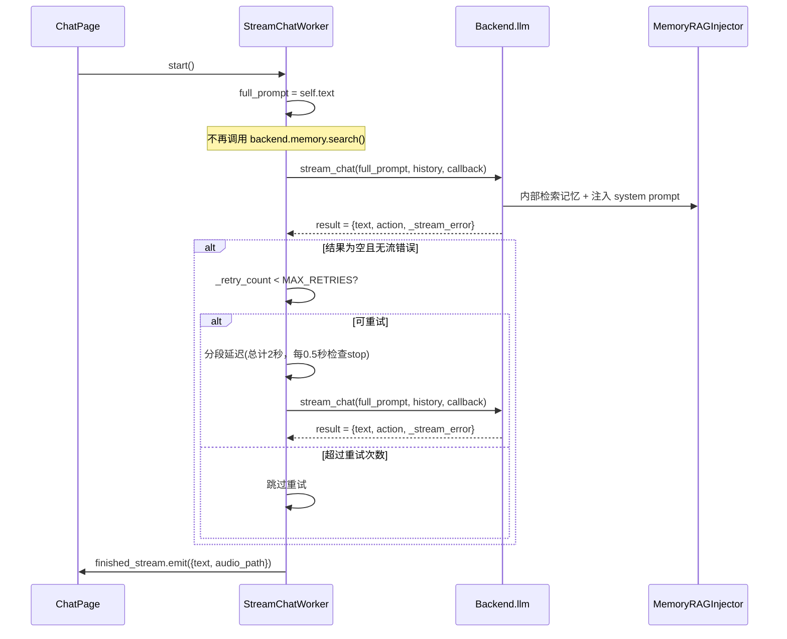

# GuguGaga AI-VTuber 修复架构设计

> **版本**: v1.0
> **日期**: 2025-05
> **项目路径**: `F:\ai-vtuber-fixed`
> **基于 PRD**: `docs/pr-fix-2025-05.md`

---

## A. 系统设计

### 1. 实现方案

本次修复涉及 5 个独立问题，均属于**存量代码修复**，不引入新功能模块。核心实现思路如下：

#### 1.1 技术难点分析

| 编号 | 难点 | 应对策略 |
|------|------|----------|
| BUG-1 | 两个同名方法在同一类中定义，后者覆盖前者；需合并时保留全部功能且不遗漏 | 逐行对比两个 `set_progress()` 的逻辑，合并为一个方法体 |
| ARCH-1 | VisionManager 内部 `_mimo_vision_provider` 独立于 `_providers` 字典存储，`get_provider()` 需同时处理两种存储 | 在 `get_provider()` 内部分两步查询：先查 `_providers` 字典，再查 `_mimo_vision_provider` |
| ARCH-2 | Worker 层记忆检索与 LLM 内部 MemoryRAGInjector 功能重叠，删除 Worker 层后需确认 LLM 侧兜底 | MemoryRAGInjector 已有完整的记忆检索+截断+优先级控制，Worker 层仅做简单拼接，删除是安全的 |
| ARCH-3 | 重试延迟期间 `stop_stream` 机制需能及时退出 | 在延迟循环中周期性检查 `is_stop_requested()`，而非不可中断的 `time.sleep()` |
| MINOR-1 | 纯注释删除，无技术难点 | 直接删除重复注释块 |

#### 1.2 框架/库选型

本次修复不引入新框架或第三方库。所有修改均在现有 PySide6 + Python 技术栈内完成。

- `time.sleep()` → 用于 ARCH-3 重试延迟（分段执行以支持 stop 检查）
- `QTimer.singleShot` → BUG-1 已有，保持不变
- `QApplication.processEvents()` → BUG-1 已有，保持不变

#### 1.3 架构模式

不改变现有架构模式（MVC + Worker 线程）。修复内容仅涉及：
- 方法合并（BUG-1）
- 接口封装（ARCH-1）
- 逻辑删除（ARCH-2）
- 逻辑增强（ARCH-3）
- 注释清理（MINOR-1）

---

### 2. 文件列表

| # | 文件相对路径 | 修改类型 | 涉及编号 |
|---|-------------|----------|----------|
| 1 | `native/gugu_native/widgets/splash_debug_window.py` | 合并方法 | BUG-1 |
| 2 | `app/vision/__init__.py` | 新增公开属性/方法 | ARCH-1 |
| 3 | `native/gugu_native/workers/vision_workers.py` | 改用公开接口 | ARCH-1 |
| 4 | `native/gugu_native/workers/chat_workers.py` | 删除记忆检索 + 添加重试退避 | ARCH-2, ARCH-3 |
| 5 | `native/gugu_native/pages/chat_page.py` | 删除重复注释 | MINOR-1 |

---

### 3. 数据结构与接口变更

#### 3.1 类图



#### 3.2 接口变更详情

**VisionManager — 新增 3 个公开接口**：

| 接口 | 类型 | 签名 | 说明 |
|------|------|------|------|
| `current_provider` | property | `@property def current_provider(self) -> Optional[VisionProvider]` | 只读访问当前活跃 Provider |
| `has_provider` | property | `@property def has_provider(self) -> bool` | 是否已配置任意 Provider（`_current_provider is not None`） |
| `get_provider` | method | `def get_provider(self, provider_type: VisionProviderType) -> Optional[VisionProvider]` | 按类型获取 Provider，先查 `_providers` 字典，再查 `_mimo_vision_provider` |

**SplashDebugWindow — 方法合并**：

| 变更 | 说明 |
|------|------|
| 删除行 320-326 的第一个 `set_progress()` | 被 merge 后的方法替代 |
| 删除行 388-394 的第二个 `set_progress()` | 被 merge 后的方法替代 |
| 新增合并后的 `set_progress()` | 包含 `processEvents()` + `_center_on_screen()` + 跳过按钮计时器 |

**StreamChatWorker — 逻辑变更**：

| 变更 | 说明 |
|------|------|
| 删除行 78-87 记忆检索代码 | ARCH-2：移除 Worker 层双记忆检索 |
| 新增 `_retry_count` 实例变量 | ARCH-3：重试计数器 |
| 修改行 112-121 重试逻辑 | ARCH-3：添加 2 秒延迟 + 最多重试 1 次 + stop 检查 |

---

### 4. 程序调用流程

#### 4.1 BUG-1：启动画面进度更新流程



#### 4.2 ARCH-1：Vision 公开接口调用流程



#### 4.3 ARCH-2 + ARCH-3：StreamChatWorker 修复后流程



---

### 5. 待明确事项

| # | 事项 | 当前假设 | 建议 |
|---|------|----------|------|
| 1 | ARCH-3 重试延迟期间 `stop_stream` 的响应时间要求 | 0.5 秒内响应 | 分段 sleep（每段 0.5 秒检查一次 stop 标志） |
| 2 | ARCH-3 是否应复用 LLM 模块已有的 `RetryStrategy`（指数退避） | 不复用，先用简单方案 | 当前用固定 2 秒延迟 + 最多 1 次重试；后续版本可统一 |
| 3 | ARCH-1 `get_provider()` 对 MiMo Vision 的特殊处理是否需要在 docstring 中说明 | 需要 | 已在接口设计中注明 MiMo 的特殊查询路径 |
| 4 | BUG-1 合并后 `_skip_timer_started` 属性使用 `hasattr` 检查 | 沿用原有 `hasattr` 方式 | 建议改为 `__init__` 中初始化为 `False`，更规范 |
| 5 | ARCH-2 删除 Worker 层记忆后 `full_prompt` 从 `"用户问题: {text}{context}"` 变为纯 `text` | MemoryRAGInjector 已兜底 | 需回归测试验证 LLM 理解质量不下降 |

---

## B. 任务分解

### 6. 依赖包

本次修复不引入新依赖。现有依赖保持不变：

```
PySide6>=6.5.0: Qt GUI 框架（BUG-1 使用 QApplication.processEvents / QTimer）
无新增第三方包
```

---

### 7. 任务列表

#### T01: 修复 P0 Bug — 合并 SplashDebugWindow.set_progress() 重复定义

| 字段 | 内容 |
|------|------|
| **任务 ID** | T01 |
| **优先级** | P0 |
| **依赖** | 无 |
| **修改文件** | `native/gugu_native/widgets/splash_debug_window.py` |
| **修改内容** | 1. 删除行 320-326 的第一个 `set_progress()` 方法<br>2. 删除行 388-394 的第二个 `set_progress()` 方法<br>3. 在原第一个方法位置插入合并后的 `set_progress()`：包含 `setText()` + `processEvents()` + `_center_on_screen()` + 跳过按钮计时器逻辑 |
| **验收标准** | 文件中 `def set_progress` 仅出现一次；合并方法包含 `processEvents()`、`_center_on_screen()`、跳过按钮计时器 |

---

#### T02: VisionManager 封装修复 — 添加公开接口 + Worker 改用公开接口

| 字段 | 内容 |
|------|------|
| **任务 ID** | T02 |
| **优先级** | P1 |
| **依赖** | 无（与 T01 独立） |
| **修改文件** | `app/vision/__init__.py`, `native/gugu_native/workers/vision_workers.py` |
| **修改内容** | 1. 在 `VisionManager` 类中添加 `current_provider` property、`has_provider` property、`get_provider()` 方法<br>2. 修改 `vision_workers.py` 的 `OCRWorker.run()`：将 `vision._current_provider is None` → `not vision.has_provider`；将 `hasattr(vision, '_providers')` + `vision._providers.get(...)` → `vision.get_provider(VisionProviderType.RAPIDOCR)`<br>3. 修改 `vision_workers.py` 的 `VisionWorker.run()`：同上替换 |
| **验收标准** | `vision_workers.py` 中不再出现 `_current_provider` 和 `_providers` 直接访问；VisionManager 新增 3 个公开接口 |

---

#### T03: StreamChatWorker 修复 — 删除双记忆检索 + 添加重试退避

| 字段 | 内容 |
|------|------|
| **任务 ID** | T03 |
| **优先级** | P1 |
| **依赖** | 无（与 T01/T02 独立） |
| **修改文件** | `native/gugu_native/workers/chat_workers.py` |
| **修改内容** | 1. **ARCH-2**：删除 `run()` 方法中行 78-87 的记忆检索代码（`backend.memory.search()` + `context` 拼接），将 `full_prompt` 直接赋值为 `self.text`<br>2. **ARCH-3**：在重试逻辑（行 112-121）前添加延迟和计数检查：<br>   - 在 `__init__` 中添加 `self._retry_count = 0`<br>   - 重试前：检查 `_retry_count < MAX_RETRIES(1)`<br>   - 分段延迟 2 秒（每 0.5 秒检查 `is_stop_requested()`）<br>   - 延迟后若未停止，执行重试 |
| **验收标准** | `chat_workers.py` 中无 `backend.memory.search()` 调用；重试前有 2 秒延迟；最多重试 1 次；stop_stream 在延迟期间可及时退出 |

---

#### T04: 代码整洁 — 删除 chat_page.py 重复注释 + 全局验证

| 字段 | 内容 |
|------|------|
| **任务 ID** | T04 |
| **优先级** | P2 |
| **依赖** | T01, T02, T03（先完成所有功能修复，最后做整洁+验证） |
| **修改文件** | `native/gugu_native/pages/chat_page.py` |
| **修改内容** | 1. **MINOR-1**：删除行 90-92 的重复注释块，保留行 87-89 的注释<br>2. 全局验证：确认所有修改文件的代码一致性（无残留私有属性访问、无重复方法定义等） |
| **验收标准** | `chat_page.py` 中 `ChatPage — 对话页面主控件` 注释仅出现一次；所有修复文件无遗留问题 |

---

### 8. 共享知识

以下信息供工程师实现时参考：

```
- VisionManager._mimo_vision_provider 不在 _providers 字典中，而是独立实例变量
- VisionManager.get_provider() 需两步查询：先 _providers.get()，再检查 _mimo_vision_provider
- StreamChatWorker 的 stop_stream 使用 QMutex 保护 _stop_requested 标志，重试延迟中需使用 is_stop_requested() 检查
- 延迟实现采用分段 time.sleep(0.5) 循环（4 次 = 2 秒），每段检查 is_stop_requested()
- MemoryRAGInjector 在 LLM 内部的 build_messages() 中工作，Worker 层删除记忆检索后不影响记忆功能
- SplashDebugWindow._skip_timer_started 使用 hasattr 检查，合并后保持该方式（或改为 __init__ 初始化更佳）
- 所有修改文件编码为 UTF-8，行尾为 LF
- Python 版本要求：3.10+
```

---

### 9. 任务依赖图

```mermaid
graph TD
    T01[T01: BUG-1 合并 set_progress<br/>P0 | splash_debug_window.py]
    T02[T02: ARCH-1 VisionManager 封装<br/>P1 | vision/__init__.py + vision_workers.py]
    T03[T03: ARCH-2+3 记忆+重试修复<br/>P1 | chat_workers.py]
    T04[T04: MINOR-1 注释清理+验证<br/>P2 | chat_page.py]

    T01 --> T04
    T02 --> T04
    T03 --> T04

    style T01 fill:#ff6b6b,color:#fff
    style T02 fill:#ffd93d,color:#333
    style T03 fill:#ffd93d,color:#333
    style T04 fill:#6bcb77,color:#fff
```

**说明**：
- T01、T02、T03 互相独立，可并行实现
- T04 依赖前三项全部完成，作为最终清理和验证步骤
