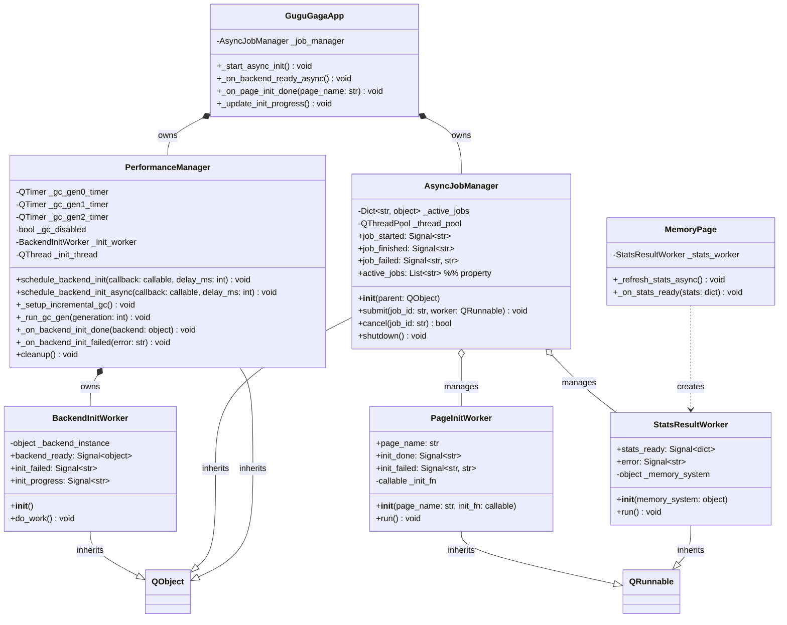
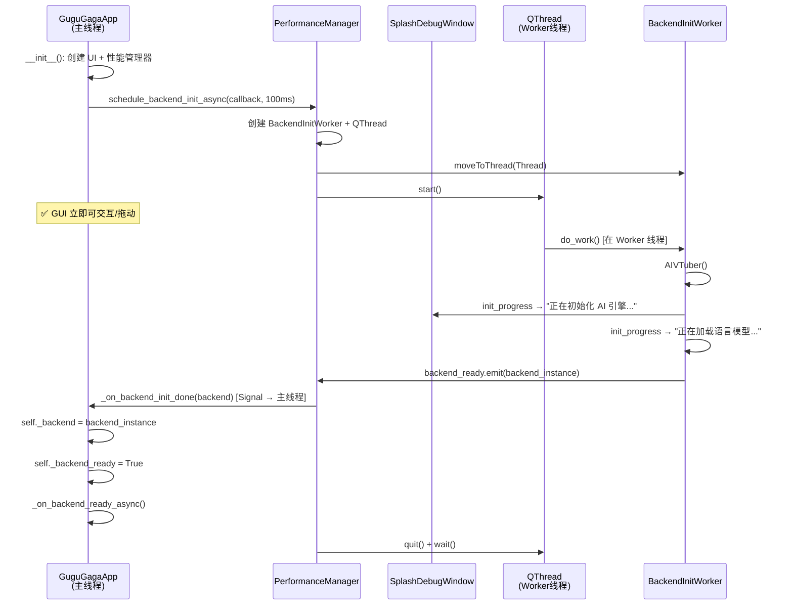
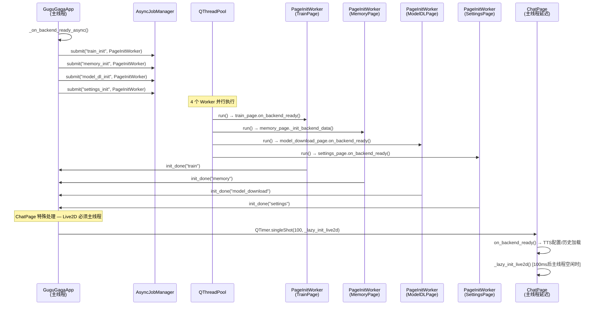
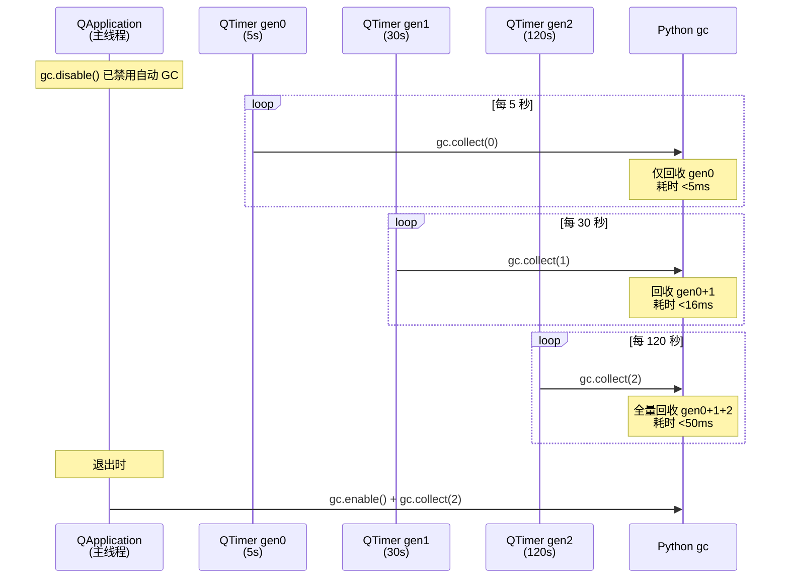
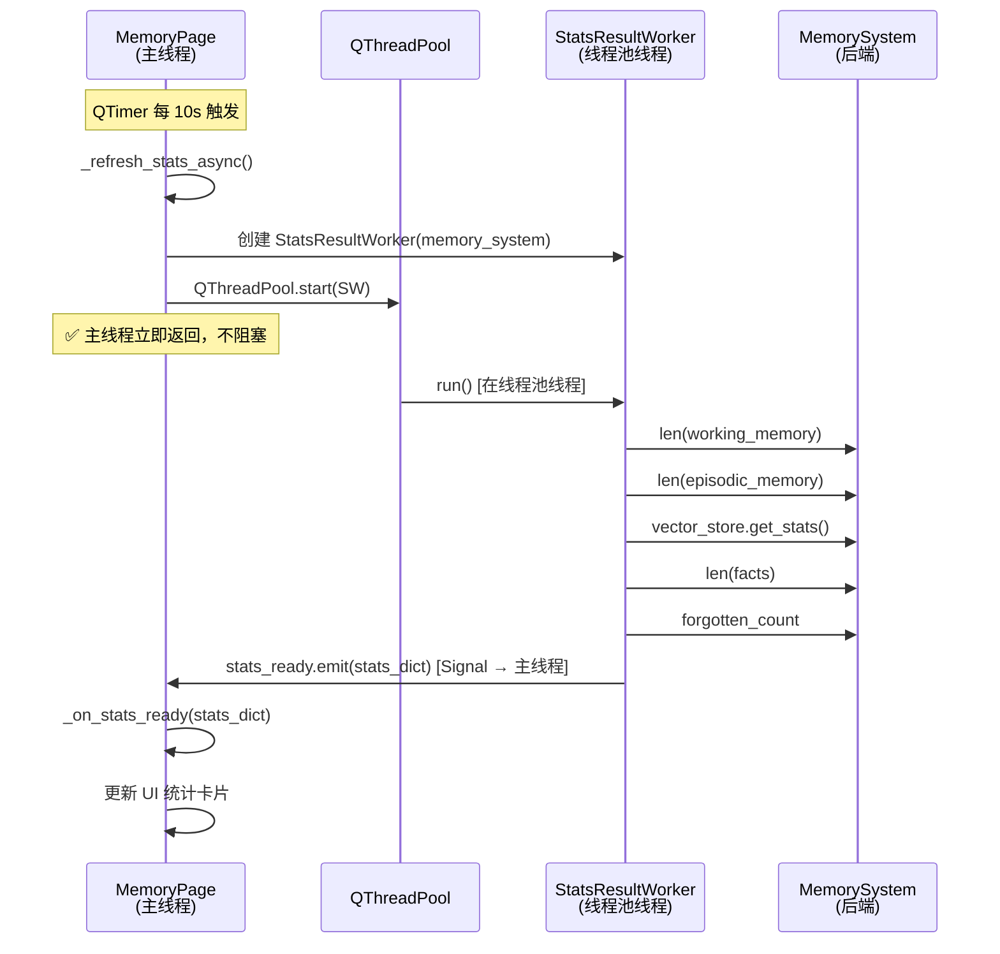
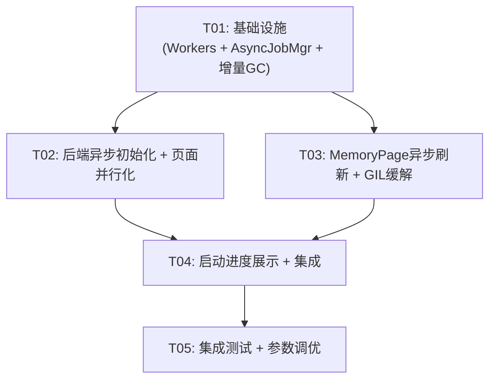

# GuguGaga AI-VTuber GUI 主线程卡顿优化 — 架构设计

> **版本**: v1.0
> **日期**: 2025-05
> **项目路径**: `F:\ai-vtuber-fixed`
> **基于 PRD**: `docs/pr-gui-opt-2025-05.md`
> **架构师**: 高见远

---

## A. 系统设计

### 1. 实现方案

#### 1.1 本轮范围界定

| PRD ID | 需求 | 优先级 | 本轮实现 | 理由 |
|--------|------|--------|----------|------|
| P0-1 | 后端初始化异步化 | P0 | ✅ | 核心阻塞源，5-15s 冻结 |
| P0-2 | 页面 on_backend_ready 并行化 | P0 | ✅ | 串行 3-8s，并行化收益显著 |
| P0-3 | GC 优化（增量 GC 定时器） | P0 | ✅ | 100-500ms 周期性卡顿 |
| P0-4 | MemoryPage 异步刷新 | P0 | ✅ | 10s 定时器同步读取 |
| P0-5 | 拖动窗口帧率保障 | P0 | ✅ | P0-1~P0-4 的综合效果 |
| P1-1 | GIL 争抢缓解 | P1 | ✅ | 降低后台线程优先级，改动小收益大 |
| P1-2 | 统一异步任务框架 | P1 | ✅ | 为后续开发建立基础设施，防止新代码引入阻塞 |
| P1-3 | 页面懒加载 | P1 | ❌ 延后 | 改动面大，需重构页面创建流程 |
| P1-4 | 启动进度展示 | P1 | ✅ | 改动小，用户体验提升显著 |
| P1-5 | Live2D 渲染独立线程 | P1 | ❌ 延后 | QWebEngineView 必须主线程操作，改动大 |

#### 1.2 技术难点分析

| # | 难点 | 应对策略 |
|---|------|----------|
| 1 | AIVTuber() 在 QThread 中构造后，主线程的 `backend` property 需安全返回同一实例 | 使用 `_backend_assigned` 标志位 + 锁：Worker 线程构造实例后，通过 Signal 传回主线程赋值，后续 property 直接返回 |
| 2 | 5 个页面的 `on_backend_ready()` 串行调用，其中 ChatPage 的 Live2D 初始化必须在主线程 | 使用 QThreadPool 并行执行非 UI 初始化，ChatPage 的 Live2D 初始化仍走 `QTimer.singleShot` 延迟到主线程空闲时执行 |
| 3 | 全量 `gc.collect()` 在主线程 100-500ms 阻塞 | 自实现增量 GC：分代定时器，gen0 每 5s / gen1 每 30s / gen2 每 120s，每次 <16ms |
| 4 | MemoryPage `_refresh_stats()` 同步读 vector_store | 使用 QRunnable + Signal 异步读取，结果通过 Signal 回主线程更新 UI |
| 5 | GIL 争抢导致间歇性卡顿 | 降低 TTS 预热/ASR 预加载线程优先级，使用 `os.nice()` 或 `threading.Thread(daemon=True)` |

#### 1.3 框架/库选型

| 组件 | 选型 | 理由 |
|------|------|------|
| 后端初始化异步 | QThread + MoveToThread | AIVTuber 构造耗时 5-15s，需独立线程；后续可能接收命令，需事件循环 |
| 页面并行初始化 | QThreadPool + QRunnable | 一次性短任务，线程池复用效率高 |
| 异步数据读取 | QThreadPool + QRunnable + Signal | 投递即忘模式，QThreadPool 全局实例 |
| 增量 GC | 自实现 QTimer 分代定时器 | 不引入 qtpygc，更可控；3 个定时器分别对应 gen0/gen1/gen2 |
| 异步任务框架 | AsyncJobManager + Signal Hub | 借鉴 Calibre JobManager，统一管理后台任务 |
| 进度展示 | SplashDebugWindow 现有接口 | 复用 `set_progress()` + 托盘 `update_progress()` |

#### 1.4 架构模式

保持现有 MVC + Worker 线程模式不变，新增以下分层：

```
┌─────────────────────────────────────────────────┐
│                   GUI 主线程                      │
│  ┌──────────┐  ┌──────────┐  ┌───────────────┐  │
│  │ Pages    │  │ Widgets  │  │ AsyncJobMgr  │  │
│  └────┬─────┘  └────┬─────┘  └───────┬───────┘  │
│       │              │               │           │
│  ┌────▼──────────────▼───────────────▼───────┐  │
│  │            Signal / Slot 层               │  │
│  └────┬──────────────┬───────────────┬───────┘  │
└───────┼──────────────┼───────────────┼──────────┘
        │              │               │
┌───────▼──────┐ ┌─────▼──────┐ ┌─────▼───────┐
│ BackendInit  │ │ PageInit   │ │ AsyncStats  │
│ Worker       │ │ Workers    │ │ Worker      │
│ (QThread)    │ │ (QRunnable)│ │ (QRunnable) │
└──────────────┘ └────────────┘ └─────────────┘
```

---

### 2. 文件列表

| # | 文件相对路径 | 修改类型 | 说明 |
|---|-------------|----------|------|
| 1 | `native/gugu_native/workers/init_workers.py` | **新增** | BackendInitWorker + PageInitWorker |
| 2 | `native/gugu_native/workers/async_job_manager.py` | **新增** | AsyncJobManager 统一异步任务框架 |
| 3 | `native/gugu_native/workers/__init__.py` | 修改 | 导出新的 Worker 类 |
| 4 | `native/gugu_native/widgets/perf_manager.py` | 修改 | 增量 GC 定时器 + 后端异步初始化调度 |
| 5 | `native/main.py` | 修改 | 异步初始化流程 + 并行页面回调 + 启动进度展示 |
| 6 | `native/gugu_native/pages/memory_page.py` | 修改 | 异步 _refresh_stats + StatsResultWorker |
| 7 | `native/gugu_native/pages/chat_page.py` | 修改 | on_backend_ready 适配并行初始化 |
| 8 | `native/gugu_native/widgets/splash_debug_window.py` | 修改 | 增加进度阶段指示 |

---

### 3. 数据结构与接口

#### 3.1 类图



#### 3.2 关键接口定义

##### 3.2.1 BackendInitWorker

```python
class BackendInitWorker(QObject):
    """后端异步初始化 Worker — 在 QThread 中构造 AIVTuber 实例

    使用 MoveToThread 模式，支持事件循环（未来可接收命令）。
    """
    backend_ready = Signal(object)   # AIVTuber 实例
    init_failed = Signal(str)       # 错误信息
    init_progress = Signal(str)     # 进度描述（如"正在加载语言模型..."）

    def __init__(self):
        super().__init__()
        self._backend_instance = None

    @Slot()
    def do_work(self):
        """在 Worker 线程中执行后端初始化"""
        try:
            from app.main import AIVTuber
            self.init_progress.emit("正在初始化 AI 引擎...")
            self._backend_instance = AIVTuber()
            self.backend_ready.emit(self._backend_instance)
        except Exception as e:
            self.init_failed.emit(str(e))
```

##### 3.2.2 PageInitWorker

```python
class PageInitWorker(QRunnable):
    """页面初始化 Worker — 在 QThreadPool 中执行页面的 on_backend_ready()

    注意：只执行非 UI 操作的数据初始化，UI 操作（如 Live2D 创建）
    仍需通过 Signal 回到主线程执行。
    """
    init_done = Signal(str)              # page_name
    init_failed = Signal(str, str)       # page_name, error

    def __init__(self, page_name: str, init_fn: callable):
        super().__init__()
        self.page_name = page_name
        self._init_fn = init_fn
        self.setAutoDelete(True)

        # QRunnable 不支持 Signal，需要桥接
        self._bridge = _SignalBridge()
        self.init_done = self._bridge.init_done
        self.init_failed = self._bridge.init_failed

    def run(self):
        try:
            self._init_fn()
            self.init_done.emit(self.page_name)
        except Exception as e:
            self.init_failed.emit(self.page_name, str(e))

class _SignalBridge(QObject):
    """QRunnable 的 Signal 桥接 — QRunnable 不是 QObject，无法直接定义 Signal"""
    init_done = Signal(str)
    init_failed = Signal(str, str)
```

##### 3.2.3 StatsResultWorker

```python
class StatsResultWorker(QRunnable):
    """记忆统计异步读取 Worker — 在 QThreadPool 中读取记忆数据"""
    stats_ready = Signal(dict)
    error = Signal(str)

    def __init__(self, memory_system):
        super().__init__()
        self._memory_system = memory_system
        self.setAutoDelete(True)
        self._bridge = _SignalBridge2()
        self.stats_ready = self._bridge.stats_ready
        self.error = self._bridge.error

    def run(self):
        try:
            mem = self._memory_system
            result = {
                "working_count": len(mem.working_memory),
                "episodic_count": len(mem.episodic_memory),
                "semantic_stats": mem.vector_store.get_stats(),
                "facts_count": len(mem.facts),
                "forgotten_count": mem.forgotten_count,
            }
            self.stats_ready.emit(result)
        except Exception as e:
            self.error.emit(str(e))

class _SignalBridge2(QObject):
    stats_ready = Signal(dict)
    error = Signal(str)
```

##### 3.2.4 AsyncJobManager

```python
class AsyncJobManager(QObject):
    """统一异步任务管理器 — 借鉴 Calibre JobManager

    职责:
    1. 提交 QRunnable 任务到 QThreadPool
    2. 追踪活跃任务状态
    3. 统一 Signal 通知（job_started / job_finished / job_failed）
    4. 支持任务取消（通过 QRunnable 标志位）
    """
    job_started = Signal(str)          # job_id
    job_finished = Signal(str)         # job_id
    job_failed = Signal(str, str)      # job_id, error

    def __init__(self, parent=None):
        super().__init__(parent)
        self._active_jobs: Dict[str, QObject] = {}
        self._thread_pool = QThreadPool.globalInstance()

    def submit(self, job_id: str, worker: QRunnable) -> None:
        """提交异步任务"""
        ...

    def cancel(self, job_id: str) -> bool:
        """取消任务（设置标志位，由 Worker 自行检查退出）"""
        ...

    @property
    def active_jobs(self) -> List[str]:
        """当前活跃任务 ID 列表"""
        ...

    def shutdown(self) -> None:
        """关闭管理器，等待所有任务完成"""
        ...
```

##### 3.2.5 PerformanceManager 增量 GC

```python
# 新增属性和方法
class PerformanceManager:
    # 增量 GC 定时器配置
    GC_GEN0_INTERVAL_MS = 5000    # gen0: 每 5s
    GC_GEN1_INTERVAL_MS = 30000   # gen1: 每 30s
    GC_GEN2_INTERVAL_MS = 120000  # gen2: 每 120s

    def _setup_incremental_gc(self):
        """初始化增量 GC — 禁用自动 GC，设置分代定时器"""
        gc.disable()
        self._gc_disabled = True

        self._gc_gen0_timer = QTimer(self)
        self._gc_gen0_timer.timeout.connect(lambda: self._run_gc_gen(0))
        self._gc_gen0_timer.start(self.GC_GEN0_INTERVAL_MS)

        self._gc_gen1_timer = QTimer(self)
        self._gc_gen1_timer.timeout.connect(lambda: self._run_gc_gen(1))
        self._gc_gen1_timer.start(self.GC_GEN1_INTERVAL_MS)

        self._gc_gen2_timer = QTimer(self)
        self._gc_gen2_timer.timeout.connect(lambda: self._run_gc_gen(2))
        self._gc_gen2_timer.start(self.GC_GEN2_INTERVAL_MS)

    def _run_gc_gen(self, generation: int):
        """分代 GC — 仅回收指定代及更年轻的对象"""
        collected = gc.collect(generation)
        if collected > 0:
            logger.debug(f"GC gen{generation} collected {collected} objects")
```

---

### 4. 程序调用流程

#### 4.1 优化后的启动初始化流程



#### 4.2 页面并行初始化流程



#### 4.3 增量 GC 执行流程



#### 4.4 MemoryPage 异步刷新流程



---

### 5. 待明确事项

| # | 事项 | 假设/处理方式 | 影响范围 |
|---|------|-------------|----------|
| 1 | AIVTuber() 构造过程中是否有隐式的 Qt 依赖（如信号连接到主线程） | 已确认：AIVTuber 是纯 Python Facade，无 Qt 依赖，可在 QThread 中安全构造 | P0-1 |
| 2 | vector_store.get_stats() 与写操作并发安全性 | 假设安全（只读操作），但需注意写操作不应与读并发。当前场景是后台刷新只读，写操作仅在用户主动触发时，时序上不重叠 | P0-4 |
| 3 | 增量 GC 的 gen0/gen1/gen2 间隔参数是否需要根据实际内存压力调优 | 初始值基于 PRD 建议（5s/30s/120s），需在 QA 阶段实测微调 | P0-3 |
| 4 | PageInitWorker 中调用 on_backend_ready() 时，页面方法内部是否安全地不操作 UI | 需逐个审查各页面的 on_backend_ready() 实现。ChatPage 的 Live2D 初始化已延迟，MemoryPage 的 _refresh_all() 将改为异步，其他页面需确认 | P0-2 |
| 5 | force_cleanup() 中的 gc.collect() 是否也需要改为增量模式 | 是，force_cleanup() 应改为 gc.collect(2)（全量但显式调用），不再由定时器触发 | P0-3 |
| 6 | 退出时需恢复 gc.enable() 防止影响其他代码 | 在 PerformanceManager.cleanup() 中 gc.enable() + gc.collect(2) | P0-3 |

---

## B. 任务分解

### 6. 依赖包列表

本轮优化不引入新的第三方依赖。全部基于 Python 标准库 + PySide6 现有依赖实现。

| 包 | 版本 | 用途 |
|----|------|------|
| PySide6 | >=6.5 (现有) | QThread, QRunnable, QThreadPool, Signal, QTimer |
| gc | 标准库 (现有) | 增量 GC：gc.disable() / gc.collect(generation) |
| threading | 标准库 (现有) | TTS/ASR 预加载线程优先级调整 |
| os | 标准库 (现有) | os.nice() / threading.Thread(daemon=True) |

---

### 7. 任务列表（按依赖顺序）

| Task ID | 任务名 | 源文件 | 依赖 | 优先级 | 说明 |
|---------|--------|--------|------|--------|------|
| T01 | 项目基础设施：Worker 类 + AsyncJobManager + 增量 GC 配置 | `workers/init_workers.py` (新增)<br/>`workers/async_job_manager.py` (新增)<br/>`workers/__init__.py` (修改)<br/>`widgets/perf_manager.py` (修改增量GC) | 无 | P0 | 创建 BackendInitWorker、PageInitWorker、StatsResultWorker、AsyncJobManager；在 perf_manager 中实现增量 GC 替换全量 GC |
| T02 | 后端初始化异步化 + 页面并行初始化 | `native/main.py` (修改)<br/>`widgets/perf_manager.py` (修改schedule方法)<br/>`widgets/splash_debug_window.py` (修改进度展示) | T01 | P0 | 改造 schedule_backend_init 为异步模式；_on_backend_ready 改为并行调度；splash 增加阶段进度 |
| T03 | MemoryPage 异步刷新 + GIL 缓解 | `pages/memory_page.py` (修改)<br/>`pages/chat_page.py` (修改适配)<br/>`native/main.py` (TTS/ASR优先级) | T01 | P0 | MemoryPage 使用 StatsResultWorker 异步刷新；ChatPage on_backend_ready 适配并行模式；TTS/ASR 线程降低优先级 |
| T04 | 启动进度展示 + 集成调试 | `native/main.py` (修改)<br/>`widgets/splash_debug_window.py` (修改)<br/>`widgets/perf_manager.py` (完善cleanup) | T02, T03 | P1 | 启动各阶段进度展示；退出时恢复 gc.enable()；全流程联调 |
| T05 | 集成测试 + 参数调优 | 全部涉及文件 | T04 | P1 | 端到端测试：启动/拖动/刷新/GC 暂停；GC 间隔参数微调；验收 P0 指标 |

---

### 8. 共享知识（跨文件约定）

```
1. 线程安全规则:
   - 所有 UI 操作（QWidget 操作、QWebEngineView 操作）必须在主线程执行
   - 后台线程通过 Signal.emit() 将数据传回主线程，主线程在 Slot 中更新 UI
   - Signal 必须定义为类变量（非实例变量），Qt 元对象系统要求
   - @Slot() 装饰器标注槽函数，提升跨线程调用性能

2. QRunnable Signal 桥接模式:
   - QRunnable 不是 QObject，无法直接定义 Signal
   - 使用内部 _SignalBridge(QObject) 持有 Signal，外部通过 bridge 访问
   - Bridge 对象必须保持引用（防止 GC 回收），由调用方持有

3. 增量 GC 约定:
   - 应用启动时 gc.disable()，退出时 gc.enable() + gc.collect(2)
   - GC 定时器只在主线程运行（QTimer 天然保证）
   - force_cleanup() 中的 gc.collect() 改为 gc.collect(2)（显式全量）
   - 新代码不应直接调用 gc.collect()，通过 PerformanceManager 统一管理

4. 后端初始化约定:
   - AIVTuber() 构造在 Worker 线程中执行，构造完成后通过 Signal 传回主线程
   - 主线程的 backend property 赋值在 Slot 中执行（主线程安全）
   - 后端初始化期间 GUI 必须可交互（拖动、最小化）

5. 页面初始化约定:
   - 非首屏页面(Train/Memory/ModelDL/Settings)的 on_backend_ready() 在 QThreadPool 中并行执行
   - ChatPage 特殊处理：TTS配置/历史加载可在后台准备，Live2D 初始化延迟到主线程空闲
   - 页面 on_backend_ready() 中不应有阻塞 UI 的操作

6. 错误处理:
   - Worker 中的异常通过 error Signal 传回主线程，在 Slot 中记录日志
   - 不在 Worker 中直接弹 QMessageBox / InfoBar
   - 初始化失败时 GUI 仍可使用（显示错误提示，不崩溃）

7. 内存数据读取:
   - MemoryPage _refresh_stats() 异步化后，读操作在工作线程，写操作仍在主线程
   - 读操作（len / get_stats）是纯只读，与写操作不并发（写由用户触发，时序分离）
```

---

### 9. 任务依赖图



---

## 附录：优化效果预估

| 阻塞源 | 当前阻塞时长 | 优化后 | 优化方法 |
|--------|------------|--------|----------|
| 后端初始化 | 5-15s（主线程冻结） | 0ms（移至 Worker 线程） | BackendInitWorker |
| 页面串行加载 | 3-8s（串行阻塞） | <2s（并行，非 UI 部分后台执行） | PageInitWorker + QThreadPool |
| 全量 GC | 100-500ms/次 | <16ms/次（gen0 <5ms, gen1 <16ms） | 增量 GC 分代定时器 |
| MemoryPage 刷新 | 50-200ms/10s | 0ms（异步，Signal 回传） | StatsResultWorker |
| GIL 争抢 | 间歇性卡顿 | 频率降低 ~80% | 降低后台线程优先级 |
