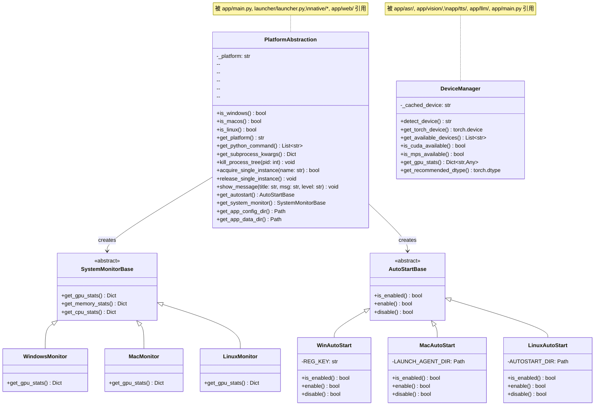
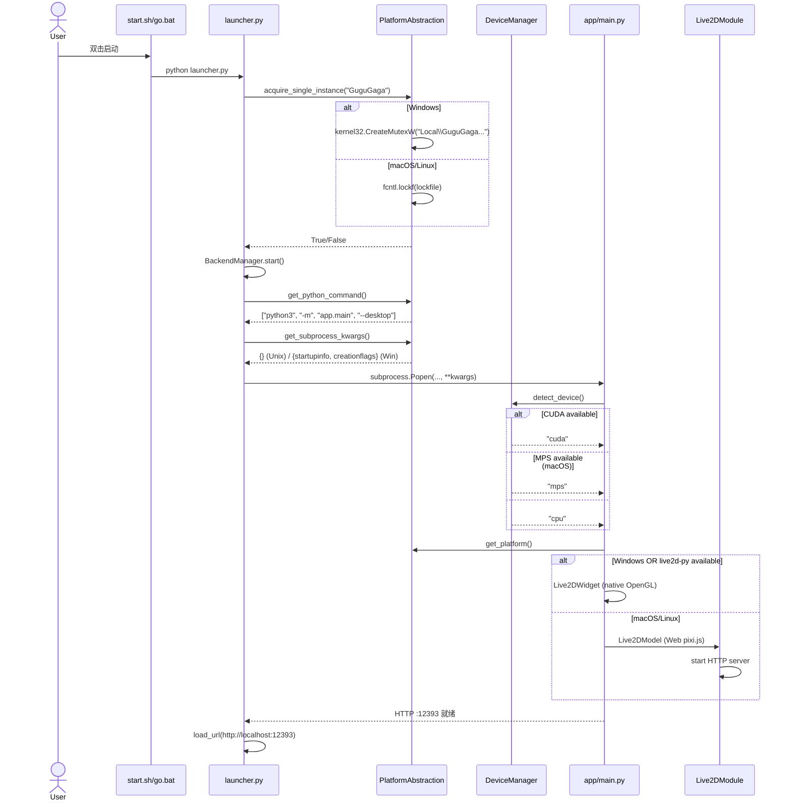
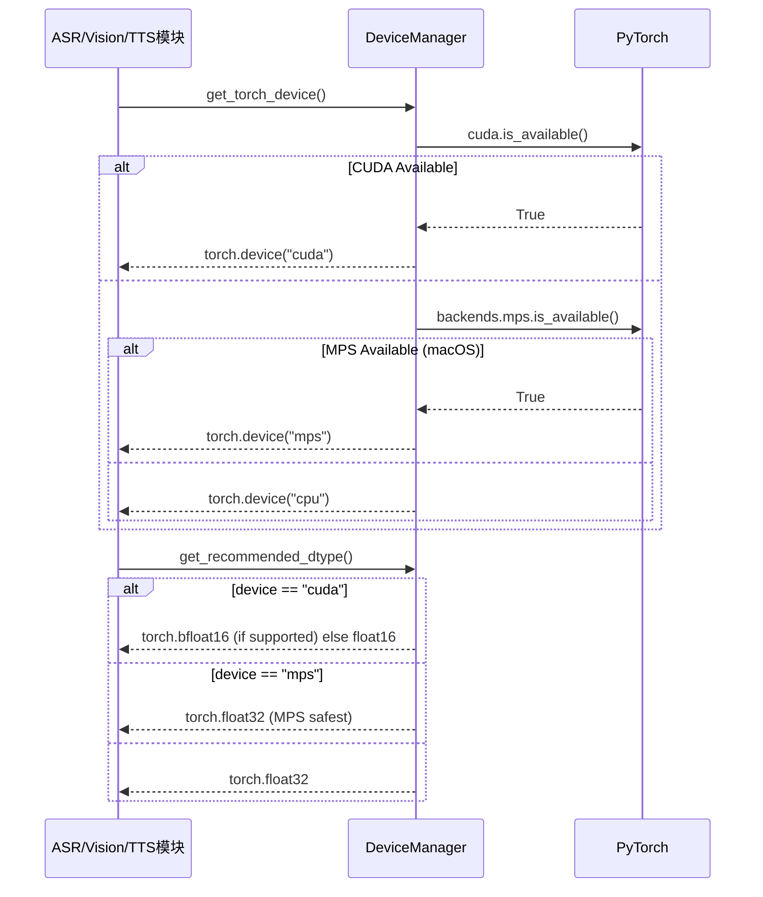
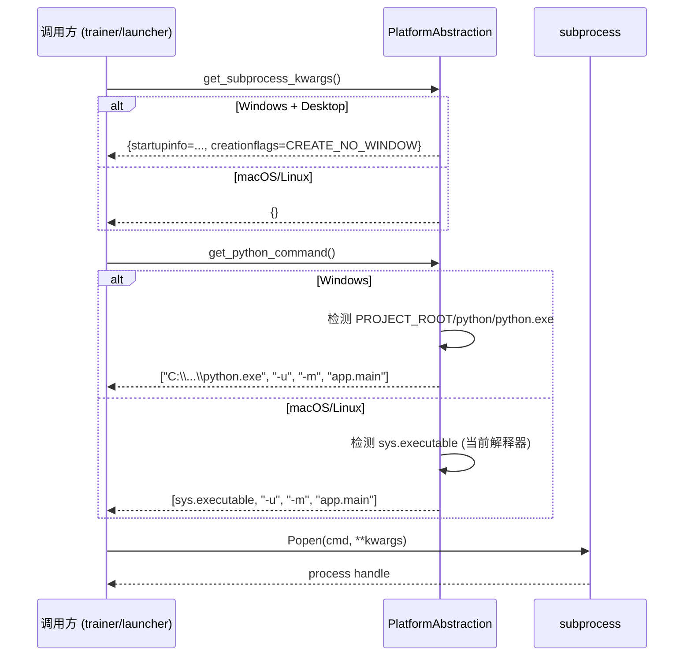
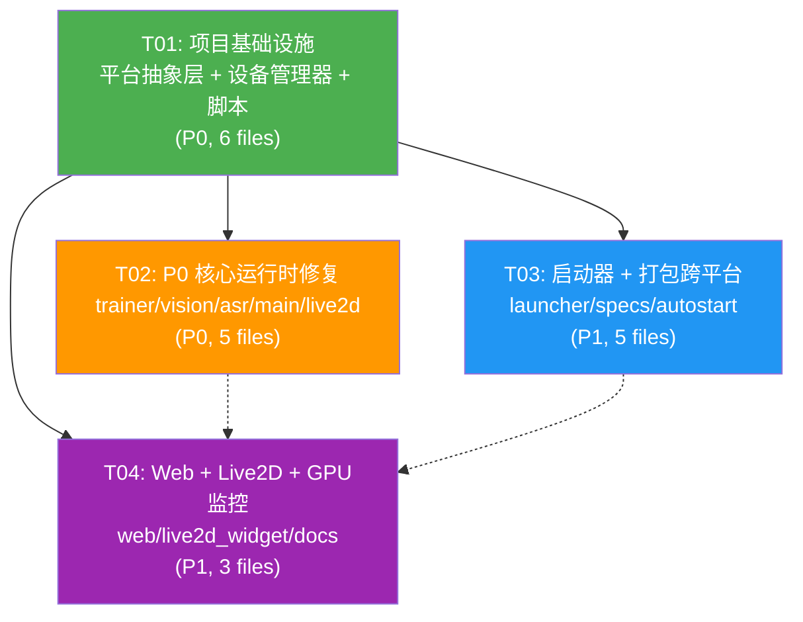

# 咕咕嘎嘎 AI VTuber — 跨平台桌面适配系统设计

> 设计版本: v2.0 | 作者: Bob (Architect) | 日期: 2025-07-09
> 范围: Phase 1 — macOS (Apple Silicon + Intel) + Ubuntu Linux 22.04+

---

## 目录

- [Part A: 系统设计](#part-a-系统设计)
  - [1. 实现方案与框架选型](#1-实现方案与框架选型)
  - [2. 文件列表](#2-文件列表)
  - [3. 数据结构与接口](#3-数据结构与接口)
  - [4. 程序调用流程](#4-程序调用流程)
  - [5. 不明确点](#5-不明确点)
- [Part B: 任务分解](#part-b-任务分解)
  - [6. 所需依赖包](#6-所需依赖包)
  - [7. 任务列表](#7-任务列表)
  - [8. 共享知识](#8-共享知识)
  - [9. 任务依赖关系图](#9-任务依赖关系图)

---

## Part A: 系统设计

### 1. 实现方案与框架选型

#### 1.1 核心挑战

通过全面审计，发现以下 P0 阻塞项阻止 Mac/Linux 运行：

| # | 严重度 | 位置 | 问题 |
|---|--------|------|------|
| 1 | P0 崩溃 | `app/trainer/manager.py:67` | `PYTHON = r"C:\Users\x\AppData\..."` 硬编码 |
| 2 | P0 崩溃 | `app/vision/__init__.py:559,668,707` | 多处 `.cuda()` 写死，无 CUDA 直接 `AttributeError` 崩溃 |
| 3 | P0 无法启动 | `launcher/launcher.spec` | `hiddenimports` 引用 `webview.platforms.winforms` + `pystray._win32`（仅 Windows） |
| 4 | P0 打包失败 | `native/gugu.spec:82-90` | 显式列出 `Qt6*.dll`（Windows DLL 命名） |
| 5 | P0 构建失败 | `native/build.bat` | 纯 Windows Batch 脚本 |
| 6 | P0 无法启动 | 缺少脚本 | 无 macOS/Linux 启动脚本 (`.sh`) |

#### 1.2 架构决策

**A. Live2D 策略：双轨制**

当前项目有两套 Live2D 实现：

| 方案 | 文件 | 技术栈 | 平台 |
|------|------|--------|------|
| 原生方案 | `native/gugu_native/widgets/live2d_widget.py` | live2d-py v3 C 扩展 + QOpenGLWidget | Windows only（C .pyd 无可移植 .so） |
| Web 方案 | `app/live2d/__init__.py` | pixi.js v7 + pixi-live2d + QWebEngineView | 天然跨平台 |

**决策**：Phase 1 采用 **Web 方案作为主方案**，在 `app/main.py` 中增加平台检测：
- **Windows** → 尝试 live2d-py 原生（性能更好），fallback 到 Web 方案
- **macOS/Linux** → 直接使用 Web 方案（`app/live2d/__init__.py`）

这样做的好处：
- 无需为 Mac/Linux 编译 live2d-py 的 .so/.dylib（复杂且无保证）
- pixi.js WebGL 在 Qt6 QWebEngineView 上三平台均原生支持
- 已有完整实现，零额外开发成本

**B. GPU 策略：统一设备管理层**

```
优先级: CUDA (NVIDIA) → MPS (Apple Silicon) → CPU
```

创建 `app/device_manager.py`，所有子模块（ASR/Vision/TTS/LLM）统一从此获取设备，移除所有 `"cuda"` 硬编码。

**C. 打包策略：继续 PyInstaller**

- macOS: PyInstaller → `.app` Bundle（配合 `--windowed`）
- Linux: PyInstaller → 目录分发 → AppImage（后续）
- Windows: 保持现有 PyInstaller 方案不变

**D. UI 框架：保留 PySide6**

PySide6/Qt6 天然跨平台（Windows/macOS/Linux），不在此阶段替换。

#### 1.3 架构模式

采用 **分层抽象** 模式：

```
┌──────────────────────────────────────────────┐
│  应用层 (app/main.py, launcher/launcher.py)     │
├──────────────────────────────────────────────┤
│  平台抽象层 (app/platform_abstraction.py)       │
│  ┌────────────┬────────────┬────────────────┐ │
│  │ process    │ system     │ ui             │ │
│  │ (subprocess│ (mutex,    │ (autostart,    │ │
│  │  mgmt,     │  message   │  tray,         │ │
│  │  kill)     │  box)      │  shortcuts)    │ │
│  └────────────┴────────────┴────────────────┘ │
├──────────────────────────────────────────────┤
│  设备管理层 (app/device_manager.py)            │
│  ┌────────┬────────┬────────────────────────┐ │
│  │ CUDA   │ MPS    │ CPU                    │ │
│  └────────┴────────┴────────────────────────┘ │
├──────────────────────────────────────────────┤
│  业务模块层 (ASR/LLM/TTS/Vision/Live2D/...)    │
└──────────────────────────────────────────────┘
```

---

### 2. 文件列表

#### 2.1 新建文件

| # | 文件路径 | 用途 |
|---|----------|------|
| 1 | `app/platform_abstraction.py` | 统一平台抽象层：子进程管理、互斥锁、进程终止、消息弹窗、自启管理 |
| 2 | `app/device_manager.py` | 统一 GPU/设备管理器：CUDA→MPS→CPU 自动检测与选择 |
| 3 | `scripts/start.sh` | macOS/Linux 通用启动脚本（替代 `go.bat`） |
| 4 | `scripts/build.sh` | macOS/Linux 通用构建脚本（替代 `native/build.bat`） |
| 5 | `scripts/setup_mac.sh` | macOS 环境初始化脚本（依赖安装、模型缓存预置） |
| 6 | `scripts/setup_linux.sh` | Ubuntu 22.04+ 环境初始化脚本 |
| 7 | `docs/CROSS_PLATFORM_GUIDE.md` | 跨平台开发者指南 + 各平台差异说明 |

#### 2.2 修改文件（按优先级）

| # | 文件路径 | 修改原因 | 优先级 |
|---|----------|----------|--------|
| 1 | `app/shared_config.py` | 跨平台互斥锁名、`PROJECT_DIR` pathlib 化、`unblock_dlls` 平台守卫 | P0 |
| 2 | `app/trainer/manager.py` | L67 硬编码 `C:\Users\x\...\python.exe` → 动态检测 | P0 |
| 3 | `app/vision/__init__.py` | L559/L668/L707 `.cuda()` → `device_manager` | P0 |
| 4 | `app/asr/__init__.py` | L461 `device: "cuda"` 默认 → `device_manager` | P0 |
| 5 | `app/main.py` | L69-81 `_win_subprocess_args()` → `platform_abstraction` | P0 |
| 6 | `app/live2d/__init__.py` | 跨平台模型路径增强 | P1 |
| 7 | `launcher/launcher.py` | L229/L802 `taskkill` + subprocess → `platform_abstraction` | P1 |
| 8 | `launcher/launcher.spec` | 移除 `winforms`/`pystray._win32` 仅 Win hiddenimports | P1 |
| 9 | `native/gugu.spec` | `Qt6*.dll` → 平台感知二进制收集 | P1 |
| 10 | `native/gugu_native/widgets/autostart_manager.py` | `winreg` → `platform_abstraction` | P1 |
| 11 | `native/gugu_native/widgets/live2d_widget.py` | 平台检测 + 优雅降级（非 Windows 提示用 Web 方案） | P1 |
| 12 | `app/web/__init__.py` | L3541 `nvidia-smi` → `platform_abstraction` GPU 监控 | P1 |
| 13 | `native/build.bat` | 添加跨平台提示，指向 `scripts/build.sh` | P2 |
| 14 | `app/requirements.txt` | 添加/更新跨平台依赖 | P1 |

---

### 3. 数据结构与接口



---

### 4. 程序调用流程

#### 4.1 应用启动流程（跨平台）



#### 4.2 GPU 推理设备选择流程



#### 4.3 子进程启动流程（跨平台）



---

### 5. 不明确点

| # | 问题 | 假设/备注 |
|---|------|-----------|
| 1 | **Linux 目标发行版** | 假设 Ubuntu 22.04+ 为主要目标。Wayland vs X11：优先 X11 fallback（`QT_QPA_PLATFORM=xcb`） |
| 2 | **macOS 代码签名** | Phase 1 不要求签名（开发者手动右键打开）。Phase 1 产出为开发版 `.app`，签名/公证推迟到 P1-05 |
| 3 | **live2d-py for Mac/Linux** | 不计划编译 `.so`/`.dylib`。Phase 1 默认使用 Web Live2D 方案，Windows 保留原生方案作为可选 |
| 4 | **GPT-SoVITS 训练** | Mac/Linux 仅提供 CPU 推理（`device=cpu`），训练面板在非 CUDA 平台上显示"需要 NVIDIA GPU"提示 |
| 5 | **PySide6 qfluentwidgets Mac 兼容性** | 假设 qfluentwidgets 在 Qt6 macOS/Linux 上基本可用，但样式可能需要微调。不在此阶段替换 |
| 6 | **pystray 跨平台** | pystray 支持 Darwin (PyObjC) 和 Linux (GTK/libappindicator)，不需要 _win32 后端，但需验证 |

---

## Part B: 任务分解

### 6. 所需依赖包

以下为跨平台适配需要新增/确认的第三方依赖：

```
# 已有依赖（确认跨平台版本）
- PySide6@^6.5.0: Qt6 Python 绑定（Windows/macOS/Linux 全支持）
- QFluentWidgets@^1.7.0: Fluent Design 组件库（需验证 macOS 兼容性）
- live2d-py@^0.7.0: Live2D 原生渲染（可选，仅 Windows）

# 新增依赖
- psutil@^5.9.0: 跨平台进程管理（已有但需确认版本）
- pywebview@^5.0: 桌面窗口容器（需 macOS/Linux 后端）
- pystray@^0.19.0: 系统托盘（需验证 pyobjc 依赖）

# 平台特定（仅对应平台安装）
# macOS:
- pyobjc-framework-Cocoa@^10.0: pystray macOS 后端
# Linux:
- pygobject@^3.46: pystray Linux 后端（Gtk）
```

### 7. 任务列表

> ⚠️ **硬性约束**：最多 5 个任务，每个任务至少包含 3 个相关文件。

---

#### T01: 项目基础设施 — 平台抽象层 + 设备管理器 + 脚本

| 属性 | 值 |
|------|-----|
| **Task ID** | T01 |
| **任务名称** | 项目基础设施：平台抽象层 + 设备管理器 + 跨平台脚本 |
| **优先级** | P0 |
| **依赖** | 无 |
| **预估** | 3-5天 |

**源文件**：

| 文件 | 操作 | 说明 |
|------|------|------|
| `app/platform_abstraction.py` | **新建** | 核心平台抽象层。封装：子进程管理（`get_subprocess_kwargs`/`get_python_command`/`kill_process_tree`）、互斥锁（Windows Named Mutex / Unix fcntl）、消息弹窗、自启管理工厂、系统监控工厂、应用目录路径 |
| `app/device_manager.py` | **新建** | 统一设备管理器。`get_torch_device()` → CUDA → MPS → CPU 自动检测，`get_recommended_dtype()`，`get_gpu_stats()` 跨平台 GPU 监控（nvidia-smi / powermetrics / psutil） |
| `app/shared_config.py` | **修改** | (1) `MUTEX_NAME_BASE` 从 `"Local\\..."` 改为 `"GuguGagaAI-VTuber"` 通用名（`platform_abstraction` 内部加平台前缀）；(2) `PROJECT_DIR` 统一为 `Path` 对象；(3) `unblock_dlls()` 加 `sys.platform != "win32"` 提前返回守卫 |
| `scripts/start.sh` | **新建** | macOS/Linux 通用启动脚本：检测 Python 3.11、设置环境变量（`QT_QPA_PLATFORM`、`HF_HOME`）、启动 `app.main` |
| `scripts/build.sh` | **新建** | macOS/Linux 构建脚本：检测依赖、调用 PyInstaller、打包为 `.app`（macOS）/ 目录分发（Linux） |
| `app/requirements.txt` | **修改** | 添加跨平台依赖：`psutil>=5.9.0`、`pywebview>=5.0`、区分平台的可选依赖注释（`pyobjc` for macOS etc.） |

**产出物**：可导入的 `PlatformAbstraction` 和 `DeviceManager` 模块，可通过 `scripts/start.sh` 启动应用。

---

#### T02: P0 核心运行时修复 — 移除 Windows-only 代码阻塞点

| 属性 | 值 |
|------|-----|
| **Task ID** | T02 |
| **任务名称** | P0 核心运行时修复：移除硬编码路径、CUDA 强依赖、Windows subprocess |
| **优先级** | P0 |
| **依赖** | T01（需要 `platform_abstraction` 和 `device_manager`） |
| **预估** | 2-4天 |

**源文件**：

| 文件 | 操作 | 说明 |
|------|------|------|
| `app/trainer/manager.py` | **修改** | L67 `PYTHON = r"C:\Users\x\..."` → `from app.platform_abstraction import PlatformAbstraction; PYTHON = PlatformAbstraction.get_python_command()[0]`。同时加 `_resolve_python()` 动态检测函数 |
| `app/vision/__init__.py` | **修改** | L559/L668/L707 所有 `.cuda()` 调用 → `from app.device_manager import DeviceManager; dev = DeviceManager.get_torch_device()`，用 `.to(dev)` 替代 `.cuda()`。同时守卫 `torch.cuda.is_available()` 分支 |
| `app/asr/__init__.py` | **修改** | L461 `device = self.config.get("device", "cuda")` → `device = self.config.get("device") or DeviceManager.detect_device()`。移除 `"cuda"` 默认值 |
| `app/main.py` | **修改** | L69-81 `_win_subprocess_args()` → 替换所有调用点为 `PlatformAbstraction.get_subprocess_kwargs()`。L86-90 模型缓存路径使用 `pathlib` |
| `app/live2d/__init__.py` | **修改** | `is_available()` 中增强跨平台模型路径检测（已使用 `pathlib`，主要增强 `sys.frozen` 分支）；`start_server()` 确保 Unix 兼容 |

**产出物**：应用可在无 CUDA 的 Mac/Linux 上启动到 HTTP 服务就绪状态。

---

#### T03: 启动器 + 打包系统跨平台适配

| 属性 | 值 |
|------|-----|
| **Task ID** | T03 |
| **任务名称** | 启动器 + PyInstaller 打包规范 + 自启管理跨平台适配 |
| **优先级** | P1 |
| **依赖** | T01（需要 `platform_abstraction`） |
| **预估** | 3-5天 |

**源文件**：

| 文件 | 操作 | 说明 |
|------|------|------|
| `launcher/launcher.py` | **修改** | (1) `_get_python_cmd()` L258 → `PlatformAbstraction.get_python_command()`；(2) `stop()` L229 `taskkill` → `PlatformAbstraction.kill_process_tree()`；(3) `_kill_port_occupants()` L802 `taskkill` 同样替换；(4) `_acquire_single_instance_lock()` L814-869 → `PlatformAbstraction.acquire_single_instance()`；(5) `_subprocess_startupinfo()` → `PlatformAbstraction.get_subprocess_kwargs()`；(6) `_show_error_box()` Linux 用 `zenity`/`notify-send`，macOS 用 `osascript` |
| `launcher/launcher.spec` | **修改** | `hiddenimports` 移除 `webview.platforms.winforms` 和 `pystray._win32`，改为条件导入或通用名称。macOS/Linux 不打包这些 |
| `native/gugu.spec` | **修改** | L82-90 `Qt6*.dll` → 平台感知二进制收集（Windows: `.dll`，macOS: `.dylib` 在 `PySide6/` 框架中，Linux: `.so`）。PyInstaller 在 macOS/Linux 上自动收集 `.dylib`/`.so`，移除显式 DLL 列表 |
| `native/gugu_native/widgets/autostart_manager.py` | **修改** | `winreg` → `PlatformAbstraction.get_autostart()`。保留现有 `AutoStartManager` 类签名，内部委托给平台实现 |
| `native/build.bat` | **修改** | 保留但缩小范围（仅 Windows 构建），添加注释指向 `scripts/build.sh` 用于 macOS/Linux |

**产出物**：启动器可在 macOS/Linux 上运行，构建系统可在三平台产出可分发包。

---

#### T04: Web 层 + Live2D 桌面组件 + GPU 监控跨平台适配

| 属性 | 值 |
|------|-----|
| **Task ID** | T04 |
| **任务名称** | Web 服务层、Live2D 原生组件降级、GPU 监控跨平台适配 |
| **优先级** | P1 |
| **依赖** | T01（需要 `platform_abstraction` 和 `device_manager`） |
| **预估** | 2-3天 |

**源文件**：

| 文件 | 操作 | 说明 |
|------|------|------|
| `app/web/__init__.py` | **修改** | L3535-3541 `nvidia-smi` 硬编码 → `DeviceManager.get_gpu_stats()`。Windows 可继续用 nvidia-smi 子进程获取详细数据，macOS/Linux 回退到 `psutil` + `DeviceManager` |
| `native/gugu_native/widgets/live2d_widget.py` | **修改** | 顶部增加平台检测：非 Windows 平台时 `_live2d_available = False` 并给出明确日志 `"Live2D native not available on this platform, use Web Live2D instead"`。确保 Widget 优雅降级而非崩溃 |
| `docs/CROSS_PLATFORM_GUIDE.md` | **新建** | 跨平台开发者指南：(1) 各平台依赖安装（Homebrew/apt）；(2) 已知差异（GPU 支持、Live2D 方案、训练限制）；(3) 调试技巧（环境变量、日志位置）；(4) 打包命令 |

**产出物**：Web 服务和 GPU 监控在三平台正常工作，Live2D 原生组件在非 Windows 平台优雅降级，开发者文档就绪。

---

### 8. 共享知识

以下是跨文件约定，Engineer 实现时必须遵守：

```
1. 【路径规范】所有文件系统路径统一使用 pathlib.Path，禁止字符串拼接路径。
   禁止: path = base + "\\" + name
   正确: path = Path(base) / name

2. 【平台检测】使用 sys.platform 判断平台：
   - "win32" → Windows
   - "darwin" → macOS
   - "linux" → Linux
   禁止使用 os.name（不够精确）。

3. 【设备获取】所有 GPU 相关代码必须通过 DeviceManager 获取设备：
   禁止: device = "cuda"
   正确: from app.device_manager import DeviceManager
         device = DeviceManager.detect_device()

4. 【子进程启动】所有 subprocess 调用必须通过 PlatformAbstraction：
   禁止: subprocess.run(cmd, startupinfo=..., creationflags=...)
   正确: from app.platform_abstraction import PlatformAbstraction as PA
         subprocess.run(cmd, **PA.get_subprocess_kwargs())

5. 【进程终止】禁止直接 taskkill/kill：
   禁止: subprocess.run(["taskkill", "/F", "/PID", str(pid)])
   正确: PA.kill_process_tree(pid)

6. 【环境变量】GUGUGAGA_DESKTOP=1 环境变量在三平台保持一致，
   用于标识桌面模式（非 Web-only 模式）。

7. 【Python 版本】Phase 1 目标 Python 3.11。macOS/Linux 使用系统 Python 或 pyenv。
   不在此阶段引入嵌入式 Python for Unix。

8. 【GPU 监控】get_gpu_stats() 返回统一 Dict 格式：
   {"vram_used": int, "vram_total": int, "gpu_temp": int, "gpu_memory": float}
   无 GPU 时返回 {"vram_used": 0, "vram_total": 0, "gpu_temp": 0, "gpu_memory": 0}

9. 【Live2D 选择】app/main.py 中根据平台选择 Live2D 后端：
   - Windows: 尝试 native/live2d_widget.py (可选)，fallback app/live2d/__init__.py
   - macOS/Linux: 直接使用 app/live2d/__init__.py (Web 方案)
```

---

### 9. 任务依赖关系图



**说明**：
- **实线箭头** = 强依赖（必须等待前序任务完成）
- **虚线箭头** = 弱依赖（建议顺序，但可并行）
- T02、T03、T04 均可并行开发（它们都只依赖 T01 提供的 `platform_abstraction` 和 `device_manager` 接口）
- 推荐开发顺序：T01 → T02 → T03 → T04（按 P0→P1 优先级递减）

---

> **设计完成**。本文件是 Phase 1 跨平台桌面适配的完整架构设计和任务分解。
> 下一步：Engineer 按 T01→T02→T03→T04 顺序实施。
