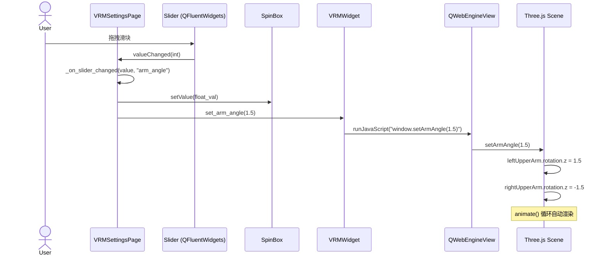
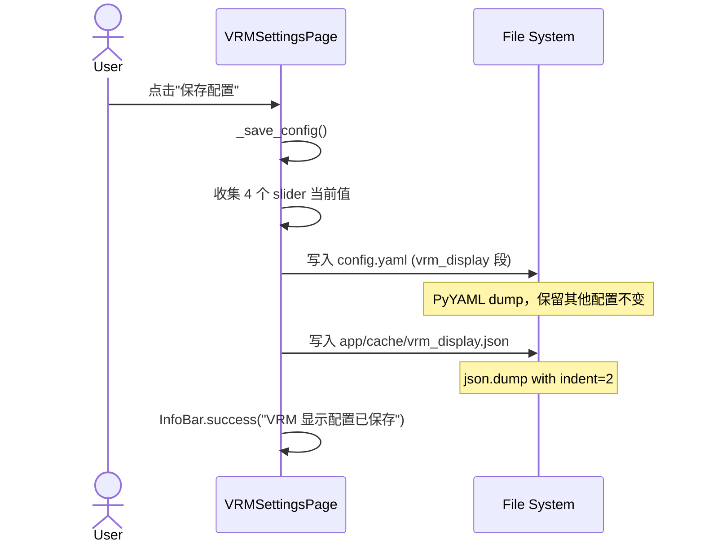
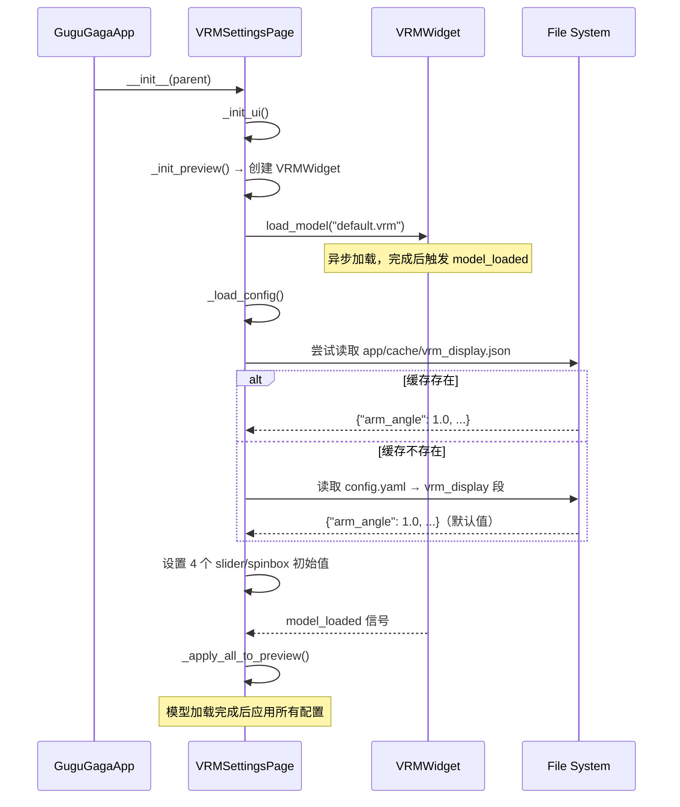
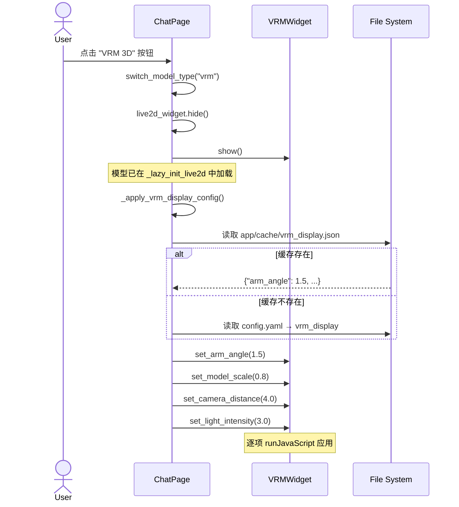
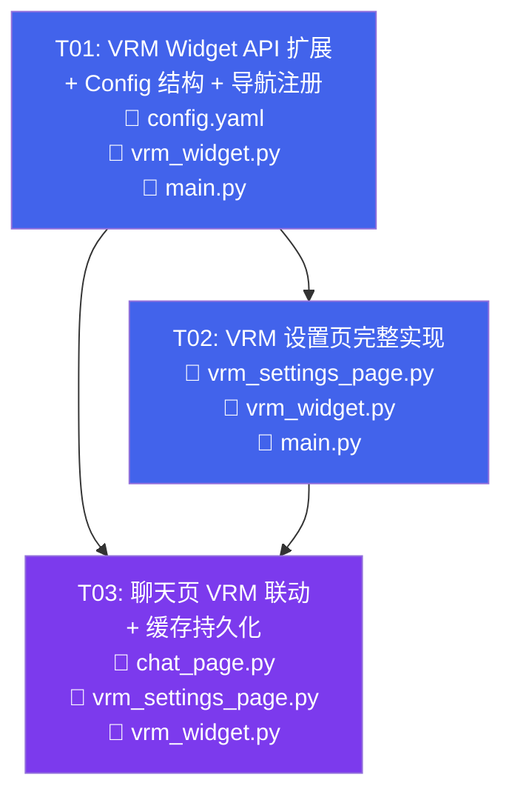

# VRM 模型设置页 — 系统架构设计

> **版本**: v1.0  
> **作者**: Bob (Architect)  
> **日期**: 2025-05-24  
> **技术栈**: Python 3.11 + PySide6/Qt6 + QFluentWidgets + QWebEngineView

---

## Part A: 系统设计

### 1. 实现方案与框架选型

#### 1.1 核心技术挑战

| 挑战 | 分析 | 方案 |
|------|------|------|
| **VRM 实时参数调节** | VRMWidget 通过 `runJavaScript()` 调用 Three.js 场景 API，需新增 4 个 JS 函数并暴露全局状态变量 | 在 `_VRM_TEMPLATE` 中添加 `setArmAngle` / `setModelScale` / `setCameraDistance` / `setLightIntensity` JS 函数；将 `_spherical` / `_orbitTarget` 提升为 `window._vrmState` 全局对象 |
| **滑块实时预览联动** | Python Slider → VRMWidget → QWebEngineView → Three.js，链路需低延迟 | 使用 `Slider.valueChanged` 信号直连 VRMWidget 方法，每次拖拽立即调用 `runJavaScript()`，Three.js 端 60fps 动画循环确保即时渲染 |
| **配置持久化双写** | 需同时写入 `config.yaml`（后端可读）和 `app/cache/vrm_display.json`（快速读写） | 复用 settings_page.py 模式：保存时双写，加载时优先读 cache（更快），fallback 到 config.yaml |
| **聊天页联动** | 用户在设置页修改参数后，切换到聊天页的 VRM 模式需自动生效 | ChatPage 在 `switch_model_type("vrm")` 时读取 `vrm_display.json`，通过 `VRMWidget.apply_display_config()` 一次性应用所有参数 |
| **Idle 动画兼容** | VRM idle 动画修改 `rotation.x`（前后摆动），arm angle 修改 `rotation.z`（下垂角度），两者在不同轴，不冲突 | 无需特殊处理，两个轴独立 |

#### 1.2 框架和库选择

| 组件 | 选择 | 理由 |
|------|------|------|
| **UI 框架** | PySide6 + QFluentWidgets | 与现有代码库完全一致，复用 `Slider`、`InfoBar`、`CardWidget` 等组件 |
| **VRM 渲染** | QWebEngineView + three.js + three-vrm | 复用现有 `VRMWidget`，无需引入新依赖 |
| **配置存储** | YAML (config.yaml) + JSON (cache) | 遵循现有双存储模式（settings_page.py 先例） |
| **页面布局** | `QWidget` + `QSplitter` | 参考 memory_page.py 的 splitter 布局，左侧预览 + 右侧控件 |

#### 1.3 架构模式

```
┌──────────────────────────────────────────────────────────────┐
│                    VRMSettingsPage (QWidget)                  │
│  ┌─────────────────────┐  ┌────────────────────────────────┐ │
│  │   左侧: VRM 预览     │  │   右侧: 参数控制面板            │ │
│  │                     │  │                                │ │
│  │  ┌───────────────┐  │  │  🎯 手臂角度  [====o====] 1.0 │ │
│  │  │  VRMWidget    │  │  │  📏 模型缩放  [====o====] 1.0 │ │
│  │  │  (QWebEngine) │  │  │  📷 相机距离  [====o====] 3.0 │ │
│  │  │               │  │  │  💡 光照强度  [====o====] 2.5 │ │
│  │  │  three.js     │  │  │                                │ │
│  │  │  + three-vrm  │  │  │  [保存配置]  [重置默认]        │ │
│  │  └───────────────┘  │  │                                │ │
│  └─────────────────────┘  └────────────────────────────────┘ │
└──────────────────────────────────────────────────────────────┘
         │ runJavaScript()                        │
         ▼                                        ▼
┌─────────────────┐                    ┌──────────────────────┐
│  Three.js Scene │                    │  config.yaml          │
│  - camera       │                    │  app/cache/           │
│  - keyLight     │                    │    vrm_display.json   │
│  - vrm.scene    │                    └──────────────────────┘
└─────────────────┘
```

---

### 2. 完整文件列表

| 操作 | 相对路径 | 说明 |
|------|----------|------|
| **新建** | `native/gugu_native/pages/vrm_settings_page.py` | VRM 设置页主体（~350行） |
| **修改** | `native/gugu_native/widgets/vrm_widget.py` | 新增 4 个 JS 函数 + 4 个 Python API 方法 + 全局状态提升 |
| **修改** | `native/main.py` | 导入注册 VRMSettingsPage 到导航栏 + backend_ready 通知 |
| **修改** | `app/config.yaml` | 新增 `vrm_display` 配置段 |
| **修改** | `native/gugu_native/pages/chat_page.py` | `switch_model_type` 时自动应用 VRM 显示配置 |
| **新建（运行时）** | `app/cache/vrm_display.json` | 首次保存时自动创建，运行时缓存 |

---

### 3. 关键数据结构与接口

#### 3.1 类图

```mermaid
classDiagram
    class VRMSettingsPage {
        -_backend: AIVTuber
        -_vrm_widget: VRMWidget
        -_preview_loaded: bool
        -_slider_arm_angle: Slider
        -_slider_model_scale: Slider
        -_slider_camera_dist: Slider
        -_slider_light_intensity: Slider
        -_spin_arm_angle: SpinBox
        -_spin_model_scale: SpinBox
        -_spin_camera_dist: SpinBox
        -_spin_light_intensity: SpinBox
        +__init__(parent)
        +on_backend_ready()
        +refresh_theme()
        -_init_ui()
        -_init_preview()
        -_create_slider_group(label, icon, min, max, default, step) QWidget
        -_on_slider_changed(value, param_name)
        -_apply_to_preview(param_name, value)
        -_apply_all_to_preview()
        -_save_config()
        -_load_config() dict
        -_load_from_cache() dict
        -_save_to_cache(config)
        -_reset_defaults()
        -_show_info(title, content)
    }

    class VRMWidget {
        +model: bool
        +model_path: str
        +model_loaded: Signal(str)
        -_web_view: QWebEngineView
        -_web_page: QWebEnginePage
        -_channel: QWebChannel
        -_bridge: _VRMBridge
        -_page_ready: bool
        -_server: _VRMStaticServer
        +load_model(path) bool
        +set_mouth_open(value: float)
        +set_expression(name: str, value: float)
        +set_arm_angle(value: float)
        +set_model_scale(value: float)
        +set_camera_distance(value: float)
        +set_light_intensity(value: float)
        +apply_display_config(config: dict)
        -_force_canvas_resize()
        -_on_page_ready()
        -_on_model_loaded(name)
    }

    class _VRMBridge {
        +model_loaded_signal: Signal(str)
        +page_ready_signal: Signal()
        +model_error_signal: Signal(str)
        +onModelLoaded(name: str)
        +onPageReady()
        +onModelError(msg: str)
    }

    class ChatPage {
        -_vrm_widget: VRMWidget
        -_current_model_type: str
        +switch_model_type(type: str)
        +_load_default_vrm_model()
        +_apply_vrm_display_config()
        -_load_vrm_display_config() dict
    }

    class AnimationController {
        -_widget: Live2DWidget | VRMWidget
        +set_mouth_open(value)
        +trigger_emotion(name)
        +start()
        +stop()
    }

    VRMSettingsPage --> VRMWidget : 左侧预览
    ChatPage --> VRMWidget : 模型显示
    ChatPage --> AnimationController : 动画同步
    VRMWidget --> _VRMBridge : QWebChannel
    VRMWidget ..|> "AnimationController\n兼容接口" : set_mouth_open\nset_expression
```

#### 3.2 数据模型

```yaml
# config.yaml 新增段
vrm_display:
  arm_angle: 1.0          # float, 范围 [0.0, 2.0], 默认 1.0
  model_scale: 1.0        # float, 范围 [0.5, 3.0], 默认 1.0
  camera_distance: 3.0    # float, 范围 [0.5, 10.0], 默认 3.0
  light_intensity: 2.5    # float, 范围 [0.5, 5.0], 默认 2.5
```

```json
// app/cache/vrm_display.json 运行时缓存
{
  "arm_angle": 1.0,
  "model_scale": 1.0,
  "camera_distance": 3.0,
  "light_intensity": 2.5
}
```

#### 3.3 VRMWidget 新增 API

| Python 方法 | JS 函数 | 参数 | 说明 |
|------------|---------|------|------|
| `set_arm_angle(value)` | `window.setArmAngle(v)` | `float 0.0~2.0` | 设置上臂 Z 轴旋转（左右臂对称反向） |
| `set_model_scale(value)` | `window.setModelScale(v)` | `float 0.5~3.0` | 设置 VRM 模型整体缩放 |
| `set_camera_distance(value)` | `window.setCameraDistance(v)` | `float 0.5~10.0` | 设置相机到模型中心的球面半径 |
| `set_light_intensity(value)` | `window.setLightIntensity(v)` | `float 0.5~5.0` | 设置主方向光强度 |
| `apply_display_config(config)` | — | `dict` | 一次性应用全部 4 个参数（便捷方法） |

#### 3.4 JS 全局状态重构

原有 `_VRM_TEMPLATE` 中 `_spherical` 和 `_orbitTarget` 是 `init3D()` 内部局部变量，需提升为全局以支持 `setCameraDistance`：

```javascript
// 新增：全局状态对象（在 <script> 顶部、init3D 之前声明）
window._vrmState = {
  spherical: null,
  orbitTarget: new THREE.Vector3(0, 1, 0)
};

// init3D() 内部改为：
_spherical = new THREE.Spherical().setFromVector3(
  camera.position.clone().sub(window._vrmState.orbitTarget)
);
window._vrmState.spherical = _spherical;
window._vrmState.orbitTarget.set(0, 1, 0);
```

---

### 4. 程序调用流程

#### 4.1 设置页滑块实时预览（高频路径）



#### 4.2 保存配置流程



#### 4.3 页面初始化 + 加载已保存配置



#### 4.4 聊天页切换 VRM 联动



---

### 5. 待明确事项

| # | 事项 | 当前假设 |
|---|------|----------|
| 1 | **VRM 变体兼容**：切换 cow/jacket/swim 变体时，display 参数是否独立存储？ | **假设**：所有变体共享同一套 display 参数。如需独立存储，后续可扩展为 `vrm_display.{variant}.param` 结构 |
| 2 | **设置页 VRM 模型选择**：预览区使用哪个 VRM 模型文件？ | **假设**：使用 `app/web/static/assets/model/default.vrm`（与聊天页默认一致）。如需切换，后续可加模型选择下拉框 |
| 3 | **参数精度**：slider 步长是否需要支持小数？ | **假设**：arm_angle 步长 0.05，model_scale 步长 0.05，camera_distance 步长 0.1，light_intensity 步长 0.1。使用 `SpinBox` 配合精确输入 |
| 4 | **config.yaml 写回策略**：直接覆盖还是仅追加？ | **假设**：使用 `ruamel.yaml` 或手动读取-修改-写回，保留 YAML 注释和格式。如不可行，降级为 PyYAML dump（可能丢失注释） |
| 5 | **后台色切换 P2**：是否需要本次实现？ | **假设**：P2 功能暂不实现，可在后续版本添加 `window.setBackgroundColor(hex)` JS API |

---

## Part B: 任务分解

### 6. 依赖包列表

> 本项目无需新增任何第三方依赖包。所有功能复用现有依赖：
> - `PySide6` ≥ 6.x（已安装）
> - `PySide6-Fluent-Widgets`（已安装）
> - `PyYAML`（已安装，config.yaml 读写）
> - `three.js` + `three-vrm`（已内嵌在 vrm_widget.py 的 HTML 模板中，通过本地 HTTP 服务加载）

---

### 7. 任务列表（按实现顺序排列）

| 任务ID | 任务名 | 涉及文件 | 依赖 | 优先级 |
|--------|--------|----------|------|--------|
| **T01** | VRM Widget API 扩展 + Config 结构 + 导航注册 | `app/config.yaml`<br>`native/gugu_native/widgets/vrm_widget.py`<br>`native/main.py` | 无 | **P0** |
| **T02** | VRM 设置页完整实现 | `native/gugu_native/pages/vrm_settings_page.py`<br>`native/gugu_native/widgets/vrm_widget.py`<br>`native/main.py` | T01 | **P0** |
| **T03** | 聊天页 VRM 配置联动 + 缓存持久化 | `native/gugu_native/pages/chat_page.py`<br>`native/gugu_native/pages/vrm_settings_page.py`<br>`native/gugu_native/widgets/vrm_widget.py` | T01, T02 | **P1** |

#### T01: VRM Widget API 扩展 + Config 结构 + 导航注册（P0）

**目标**：建立 VRM 显示参数的底层基础设施——配置存储结构、JS 渲染 API、页面导航入口。

**具体工作**：

1. **`app/config.yaml`** — 新增 `vrm_display` 配置段：
   ```yaml
   vrm_display:
     arm_angle: 1.0
     model_scale: 1.0
     camera_distance: 3.0
     light_intensity: 2.5
   ```
   位置：放在 `live2d` 段之后。

2. **`native/gugu_native/widgets/vrm_widget.py`** — JS 模板扩展 + Python API：
   - **JS 模板修改**（`_VRM_TEMPLATE` 字符串）：
     - 在 `<script>` 顶部新增 `window._vrmState = { spherical: null, orbitTarget: new THREE.Vector3(0,1,0) }` 全局对象
     - 修改 `init3D()` 中 `_spherical` / `_orbitTarget` 的声明，改为赋值到 `window._vrmState`
     - 新增 4 个 JS 函数：`setArmAngle(v)`, `setModelScale(v)`, `setCameraDistance(v)`, `setLightIntensity(v)`
   - **Python 方法新增**：
     - `set_arm_angle(self, value: float)` — `runJavaScript("window.setArmAngle(...)")`
     - `set_model_scale(self, value: float)` — `runJavaScript("window.setModelScale(...)")`
     - `set_camera_distance(self, value: float)` — `runJavaScript("window.setCameraDistance(...)")`
     - `set_light_intensity(self, value: float)` — `runJavaScript("window.setLightIntensity(...)")`
     - `apply_display_config(self, config: dict)` — 便捷方法，批量调用上面 4 个

3. **`native/main.py`** — 添加导航注册桩代码：
   ```python
   # 在 import 区域添加（带容错）
   try:
       from gugu_native.pages.vrm_settings_page import VRMSettingsPage
   except ImportError:
       VRMSettingsPage = None
   
   # 在 _create_pages() 中添加（带条件判断）
   if VRMSettingsPage is not None:
       self.vrm_settings_page = VRMSettingsPage(self)
       self.addSubInterface(
           self.vrm_settings_page,
           FluentIcon.VIEW,  # 或使用合适的图标
           "VRM 设置"
       )
   ```

**产出检查**：
- `config.yaml` 含完整的 `vrm_display` 默认配置
- VRMWidget 可被外部调用 `set_arm_angle(1.5)` 且 JS 端正确响应
- main.py 编译通过（即使 vrm_settings_page.py 尚不存在也不会崩溃）

---

#### T02: VRM 设置页完整实现（P0）

**目标**：实现 `VRMSettingsPage`，包含左侧 VRM 实时预览 + 右侧 4 参数滑块控制面板。

**具体工作**：

1. **`native/gugu_native/pages/vrm_settings_page.py`** — 新建文件（~350行）：
   - **类定义**：`class VRMSettingsPage(QWidget)`，`setObjectName("vrmSettingsPage")`
   - **布局结构**（`_init_ui`）：
     ```
     QHBoxLayout (main)
     ├── QSplitter (horizontal)
     │   ├── Left: VRMWidget preview (stretch=5)
     │   └── Right: QScrollArea → QWidget (stretch=3)
     │       └── QVBoxLayout
     │           ├── TitleLabel("VRM 显示设置")
     │           ├── SliderGroup("手臂角度", "🎯", 0.0, 2.0, 1.0, 0.05)
     │           ├── SliderGroup("模型缩放", "📏", 0.5, 3.0, 1.0, 0.05)
     │           ├── SliderGroup("相机距离", "📷", 0.5, 10.0, 3.0, 0.1)
     │           ├── SliderGroup("光照强度", "💡", 0.5, 5.0, 2.5, 0.1)
     │           ├── QHBoxLayout
     │           │   ├── PushButton("保存配置") → _save_config
     │           │   └── PushButton("重置默认") → _reset_defaults
     │           └── Stretch
     ```
   - **SliderGroup 组件**（`_create_slider_group`）：
     - 横向：`CaptionLabel(图标+名称)` + `Slider` + `SpinBox`（数值显示/精确输入）
     - Slider 范围映射：int 表示（如 0~200 映射到 0.0~2.0），或直接用浮点 Slider
   - **实时预览**（`_on_slider_changed`）：
     - 每个 slider 的 `valueChanged` 连接到一个统一回调，通过 `param_name` 分发
     - 调用对应的 `self._vrm_widget.set_xxx(value)` 方法
     - 同步更新 SpinBox 显示值
   - **模型加载**（`_init_preview`）：
     - 创建 VRMWidget，默认隐藏（等模型加载完成后显示）
     - 加载 `app/web/static/assets/model/default.vrm`
     - 连接 `model_loaded` 信号 → `_apply_all_to_preview()`
   - **配置加载**（`_load_config`）：
     - 优先读 `app/cache/vrm_display.json`
     - fallback 读 `config.yaml` 的 `vrm_display` 段
     - fallback 使用硬编码默认值
     - 返回 `dict` 设置所有 slider/spinbox 初始值
   - **保存配置**（`_save_config`）：
     - 收集 4 个当前值 → dict
     - 写入 `config.yaml`（通过 backend.config 或直接 YAML 操作）
     - 写入 `app/cache/vrm_display.json`
     - InfoBar.success 提示
   - **重置默认**（`_reset_defaults`）：
     - 将所有 slider 设回默认值（arm_angle=1.0, model_scale=1.0, camera_distance=3.0, light_intensity=2.5）
     - 立即应用到预览
     - InfoBar.info 提示
   - **Backend 访问**：`self.window().backend`（延迟初始化 pattern）
   - **主题刷新**（`refresh_theme`）：重建卡片/按钮样式（与 memory_page 同 pattern）

2. **`native/gugu_native/widgets/vrm_widget.py`** — 微调：
   - 确保 `_on_page_ready` 中 `window._vrmState` 初始化正确
   - 确保 `set_camera_distance` 在页面未就绪时容错（缓存调用，就绪后执行）

3. **`native/main.py`** — 微调：
   - 在 `_on_backend_ready` 的通知列表中添加 `self.vrm_settings_page`
   - 在 SettingsPage 的 `refresh_theme` 循环中添加 `vrm_settings_page`

**产出检查**：
- VRM 预览区显示 3D 模型
- 拖拽任意滑块，预览区实时响应（手臂角度/缩放/相机距离/光照）
- 点击保存，config.yaml 和 cache JSON 均更新
- 关闭重开页面，滑块恢复上次保存的值
- 点击重置默认，所有滑块回到默认值

---

#### T03: 聊天页 VRM 配置联动 + 缓存持久化（P1）

**目标**：用户在聊天页切换到 VRM 模式时，自动应用设置页保存的显示参数。

**具体工作**：

1. **`native/gugu_native/pages/chat_page.py`** — 添加 VRM 配置应用：
   - 在 `switch_model_type("vrm")` 方法末尾（`self._vrm_widget.show()` 之后），调用 `self._apply_vrm_display_config()`
   - 新增方法 `_apply_vrm_display_config(self)`：
     ```python
     def _apply_vrm_display_config(self):
         """从缓存/config读取VRM显示参数并应用到当前VRM模型"""
         if self._vrm_widget is None:
             return
         config = self._load_vrm_display_config()
         self._vrm_widget.apply_display_config(config)
     ```
   - 新增方法 `_load_vrm_display_config(self) -> dict`：
     - 优先读 `app/cache/vrm_display.json`
     - fallback 读 `config.yaml` 的 `vrm_display` 段
     - 返回 `{"arm_angle": 1.0, "model_scale": 1.0, ...}`
   - 考虑到 `switch_model_type` 调用时模型可能还未加载完成，需要在 VRMWidget 的 `model_loaded` 信号上也连接 `_apply_vrm_display_config`（一次性连接，在 `_lazy_init_live2d` 中建立）

2. **`native/gugu_native/pages/vrm_settings_page.py`** — 缓存文件初始化：
   - `_save_config` 方法确保 `app/cache/` 目录存在（`os.makedirs(exist_ok=True)`）
   - `_load_config` 方法处理缓存文件不存在的首次启动场景

3. **`native/gugu_native/widgets/vrm_widget.py`** — 信号集成：
   - 确保 `apply_display_config` 在 `_page_ready` 为 False 时暂存配置，页面就绪后自动应用
   - 或：确保 `apply_display_config` 内部对每个 `runJavaScript` 调用做容错

**产出检查**：
- 在设置页将手臂角度设为 1.5，保存
- 切换到聊天页，点击 VRM 3D 按钮
- VRM 模型的手臂角度显示为 1.5（而非默认 1.0）
- 修改设置页参数后保存，再次切换聊天页 VRM，参数生效
- 首次启动（无缓存文件）时使用 config.yaml 默认值

---

### 8. 共享知识（跨文件约定）

```
- 配置读取顺序: app/cache/vrm_display.json → app/config.yaml → 硬编码默认值
- 所有 VRM 参数值类型: float
- VRMWidget.runJavaScript() 调用前不检查 _page_ready（内部已容错）
- 配置保存使用 os.makedirs(..., exist_ok=True) 确保目录存在
- 遵循现有 backend 访问模式: self.window().backend（延迟初始化）
- 遵循现有主题刷新模式: refresh_theme() 方法 + get_colors() 动态取值
- Slider 使用 int 映射 float: slider_value / 100 → 实际值（避免浮点精度问题）
- 所有文件使用 UTF-8 编码
- 导入路径遵循 KI-005 规范: 先本地计算 PROJECT_DIR → sys.path → from app.shared_config import PROJECT_DIR
```

---

### 9. 任务依赖图



**依赖说明**：
- **T01** 是纯基础设施，无依赖，必须最先完成
- **T02** 依赖 T01（需要 vrm_widget.py 的新 API 和 main.py 的注册桩代码）
- **T03** 依赖 T01（vrm_widget.py API）和 T02（vrm_settings_page.py 的缓存 I/O 模式可参考）
- T02 和 T03 可在 T01 完成后并行开发

---

### 附录：JS 模板新增函数详细设计

```javascript
// ===== 新增：全局状态提升（init3D 之前） =====
window._vrmState = {
  spherical: null,
  orbitTarget: new THREE.Vector3(0, 1, 0)
};

// ===== 修改：init3D() 中的轨道变量声明 =====
// 原: var _orbitTarget = new THREE.Vector3(0, 1, 0);
// 改为直接使用 window._vrmState.orbitTarget
// 原: var _spherical = ...
// 改为: _spherical = ... ; window._vrmState.spherical = _spherical;

// ===== 新增 JS API（在 animate() 之后） =====

// 1. 手臂角度（Z 轴旋转，左右对称反向）
window.setArmAngle = function(v) {
  var angle = Number(v);
  if (isNaN(angle)) return;
  if (currentVrm && currentVrm.humanoid && currentVrm.humanoid.getBoneNode) {
    var lArm = currentVrm.humanoid.getBoneNode('leftUpperArm');
    if (lArm) lArm.rotation.z = angle;
    var rArm = currentVrm.humanoid.getBoneNode('rightUpperArm');
    if (rArm) rArm.rotation.z = -angle;
  }
};

// 2. 模型缩放
window.setModelScale = function(v) {
  var s = Number(v);
  if (isNaN(s) || s <= 0) return;
  if (currentVrm && currentVrm.scene) {
    currentVrm.scene.scale.set(s, s, s);
  }
};

// 3. 相机距离
window.setCameraDistance = function(v) {
  var dist = Number(v);
  if (isNaN(dist) || dist <= 0) return;
  if (window._vrmState.spherical && camera) {
    window._vrmState.spherical.radius = dist;
    camera.position.copy(window._vrmState.orbitTarget).add(
      new THREE.Vector3().setFromSpherical(window._vrmState.spherical)
    );
    camera.lookAt(window._vrmState.orbitTarget);
  }
};

// 4. 光照强度
window.setLightIntensity = function(v) {
  var intensity = Number(v);
  if (isNaN(intensity) || intensity < 0) return;
  if (_keyLight) {
    _keyLight.intensity = intensity;
  }
};
```
